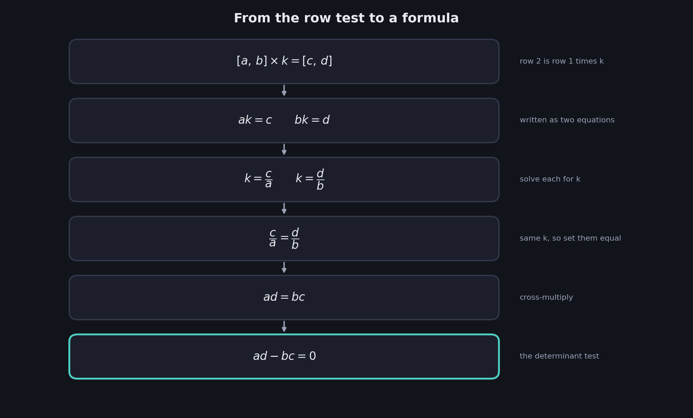
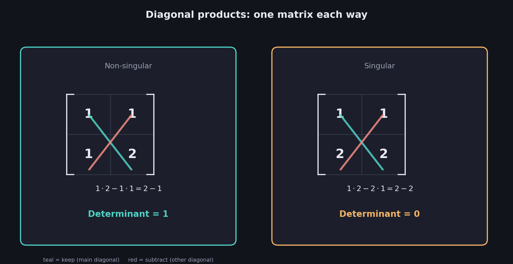
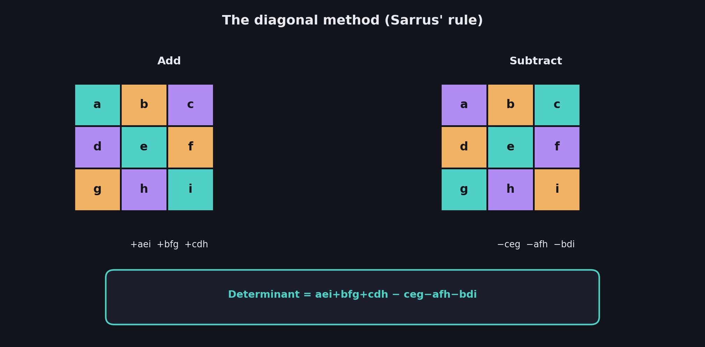
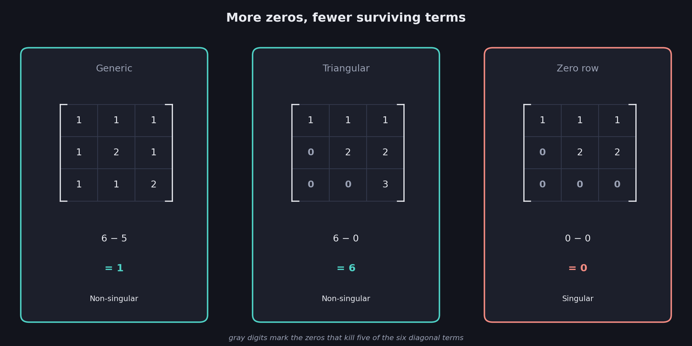
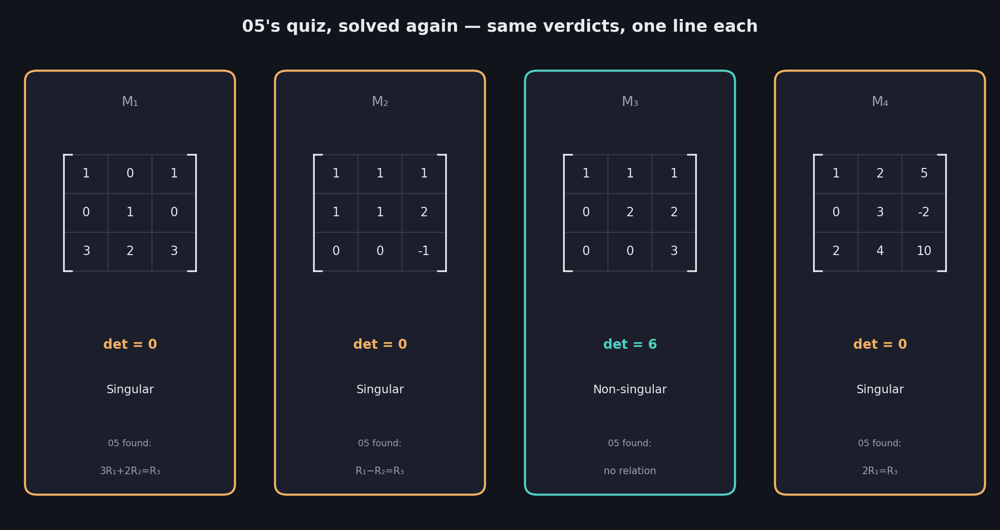

# What You Should Know About The Determinant

> **Prerequisites:** the row-multiple test for singularity is in 05 §2. The matrix and "system singular ⟺ matrix singular" are in 04. Singular and non-singular themselves go all the way back to 01.
>
> **This is the payoff file.** Every earlier file in this series asked you to *check* for singularity by hand — comparing rows, hunting for combinations. This file turns that hunt into a single number.

05 ended with a warning: checking whether one row is a multiple of another works for two rows, but for three or more you have to test every possible combination by hand. That doesn't scale. This file fixes it. The **determinant** is one number, computed directly from a matrix, that tells you instantly whether it's singular — no row-hunting required.

These notes cover: deriving the 2×2 determinant directly from 05's row-multiple test, the singular-if-and-only-if-zero rule, a worked 2×2 example and quiz, the diagonal method for 3×3 matrices, why triangular matrices skip almost all the arithmetic, why a zero row instantly forces a zero determinant, and a full-circle return to 05's quiz — now solved in one line each instead of by hand.

---

# 1. From a test to a formula

Recall the 2×2 singularity test from 05 §2, for a general matrix with top row $a,b$ and bottom row $c,d$:

| | |
|---|---|
| $a$ | $b$ |
| $c$ | $d$ |

The rows are dependent exactly when row 2 is row 1 times some number $k$:

$$
[a,b]\times k = [c,d]
$$

Written out, that's two equations:

$$
ak=c \qquad\qquad bk=d
$$

Solve each for $k$:

$$
k=\frac{c}{a} \qquad\qquad k=\frac{d}{b}
$$

Both equal the same $k$, so they equal each other:

$$
\frac{c}{a}=\frac{d}{b}
$$

Cross-multiply to clear the fractions:

$$
\boxed{ad=bc}
$$

$$
\boxed{ad-bc=0}
$$

This is exactly 05's row-multiple test — nothing new has been assumed — just carried through to its algebraic conclusion. The test that used to require *comparing* two rows has become a single expression that equals zero exactly when they're dependent.

---

# 2. The determinant, formally

That expression gets a name, for the matrix with top row $a,b$ and bottom row $c,d$ set up in §1:

$$
\boxed{\text{Determinant} = ad-bc}
$$

## How to see it: diagonals

Multiply along the **main diagonal** ($a$ times $d$), then subtract the product along the **other diagonal** ($b$ times $c$):

$$
\boxed{\text{Determinant} = (\text{top-left}\times\text{bottom-right}) - (\text{top-right}\times\text{bottom-left})}
$$

$a$ sits top-left, $d$ sits bottom-right — multiply those and keep the result. $b$ sits top-right, $c$ sits bottom-left — multiply those and subtract.

## The payoff

$$
\boxed{\text{Matrix is singular} \iff \text{Determinant is zero}}
$$

This is a genuine **if-and-only-if** — it runs both directions. A zero determinant guarantees a singular matrix, and a singular matrix guarantees a zero determinant. Neither side can happen without the other.

---

# 3. Worked example: the familiar pair

Reuse the two matrices from 04 and 05 one last time — now solved in one line instead of by hand.

**Non-singular**, rows $[1,1]$ and $[1,2]$:

$$
1\cdot 2 - 1\cdot 1 = 2-1 = \boxed{1}
$$

Nonzero — confirms non-singular, matching every earlier check.

**Singular**, rows $[1,1]$ and $[2,2]$:

$$
1\cdot 2 - 2\cdot 1 = 2-2 = \boxed{0}
$$

Zero — confirms singular, matching 05's discovery that row 2 is row 1 doubled.

## The most common mistake

Forgetting the order. The determinant is $ad-bc$, not $ab-cd$ or $ac-bd$ — it is specifically the product of the diagonal you'd draw from top-left to bottom-right, minus the product of the other diagonal. Mixing up rows and diagonals is the single most common arithmetic slip here.

---

# 4. Worked example: the quiz

**Problem.** Find the determinant of each matrix and state whether it is singular.

**Matrix 1**

| | |
|---|---|
| 5 | 1 |
| -1 | 3 |

$$
\det = 5\cdot 3 - 1\cdot(-1) = 15+1 = \boxed{16}
$$

Nonzero — **non-singular**.

**Matrix 2**

| | |
|---|---|
| 2 | -1 |
| -6 | 3 |

$$
\det = 2\cdot 3 - (-1)\cdot(-6) = 6-6 = \boxed{0}
$$

Zero — **singular**. (Check it against 05's test too: row 2 is row 1 times $-3$, since $2\times(-3)=-6$ and $-1\times(-3)=3$ — the determinant agrees with the row-multiple test exactly as it must.)

## The sign trap

$-1\times(-6)$ is **positive** $6$, not $-6$. Losing track of a double negative here is the second-most common mistake, right behind mixing up the diagonals.

---

# 5. Scaling to 3×3: the diagonal method

The same diagonal idea extends to 3×3, with one twist: there are now **three** diagonals to add and **three** to subtract, and the "other" diagonals wrap around the edges of the grid.

$$
\boxed{\text{Add three diagonal products, subtract the other three}}
$$

## The three you add

Starting from each entry in the top row, walk down-and-right, wrapping back to the top when you fall off the edge:

- Main diagonal: top-left $\to$ middle $\to$ bottom-right
- Starting from the top-middle entry, wrapping to the bottom-left
- Starting from the top-right entry, wrapping to the middle-left

## The three you subtract

Same idea, walking down-and-*left* instead:

- Top-right $\to$ middle $\to$ bottom-left
- Starting from the top-middle entry, wrapping to the bottom-right
- Starting from the top-left entry, wrapping to the middle-right

## The general formula

Label a general 3×3 matrix by row:

| | | |
|---|---|---|
| $a$ | $b$ | $c$ |
| $d$ | $e$ | $f$ |
| $g$ | $h$ | $i$ |

$$
\boxed{\text{Determinant} = aei+bfg+cdh \;-\; ceg-afh-bdi}
$$

Six products, three terms each, added or subtracted according to which way the diagonal leans.

---

# 6. Worked example: a generic 3×3

| | | |
|---|---|---|
| 1 | 1 | 1 |
| 1 | 2 | 1 |
| 1 | 1 | 2 |

**Add:**

$$
\underbrace{1\cdot2\cdot2}_{4} \;+\; \underbrace{1\cdot1\cdot1}_{1} \;+\; \underbrace{1\cdot1\cdot1}_{1} \;=\; 6
$$

**Subtract:**

$$
\underbrace{1\cdot2\cdot1}_{2} \;+\; \underbrace{1\cdot1\cdot1}_{1} \;+\; \underbrace{1\cdot1\cdot2}_{2} \;=\; 5
$$

$$
\boxed{\text{Determinant} = 6-5 = 1}
$$

Nonzero — non-singular, exactly matching this matrix's verdict everywhere it has appeared since 04.

---

# 7. The triangular shortcut

| | | |
|---|---|---|
| 1 | 1 | 1 |
| 0 | 2 | 2 |
| 0 | 0 | 3 |

Every entry **below** the main diagonal is zero — this is a **triangular matrix**. Watch what that does to the six terms.

**Add:** the main diagonal survives in full: $1\cdot2\cdot3=6$. But the other two add-terms each reach into the zero region: $1\cdot2\cdot0=0$ and $1\cdot0\cdot0=0$.

**Subtract:** all three subtract-diagonals cross into the zero region at some point: $1\cdot2\cdot0=0$, $1\cdot2\cdot0=0$, $1\cdot0\cdot3=0$.

$$
\boxed{\text{Determinant} = (6+0+0)-(0+0+0) = 6}
$$

And $6=1\times2\times3$ — exactly the product of the diagonal.

$$
\boxed{\text{For a triangular matrix, the determinant is just the product of the diagonal entries}}
$$

## Why this always happens

Every wraparound diagonal — every term besides the main one — has to dip below the main diagonal *somewhere* to complete its path across the grid. In a triangular matrix, that region is solid zero, so five of the six products vanish automatically. Only the main diagonal survives untouched.

This is exactly the matrix flagged back in 05 §5 — its "staircase of leading zeros" was the tell that made it obviously independent even before a single combination was tried. Now you know precisely why: the determinant shortcut and the "obviously independent" instinct are the same fact.

---

# 8. The zero-row corollary

Push the triangular example one step further — replace the bottom-right $3$ with $0$, so the entire bottom row is now all zeros:

| | | |
|---|---|---|
| 1 | 1 | 1 |
| 0 | 2 | 2 |
| 0 | 0 | 0 |

Every one of the six diagonal products passes through row 3 somewhere, and row 3 is nothing but zeros. Every single term is now $0$:

$$
\boxed{\text{Determinant} = (0+0+0)-(0+0+0) = 0}
$$

$$
\boxed{\text{A matrix with an all-zero row is always singular}}
$$

This should feel obvious once you translate it back to 05's language: a row of all zeros says "$0a+0b+0c=0$" — true for *any* values whatsoever. It contributes nothing, exactly like the most extreme possible case of one equation repeating information the others already gave. Of course it's singular; that row was never carrying any information to begin with.

---

# 9. Full circle: 05's quiz, revisited

05 §5 solved four matrices by hand, hunting for row combinations. Here are their determinants, computed directly:

| Matrix | Rows | Determinant | Verdict | Matches 05? |
|---|---|---|---|---|
| $M_1$ | $[1,0,1],[0,1,0],[3,2,3]$ | $0$ | Singular | ✓ ($3R_1+2R_2=R_3$) |
| $M_2$ | $[1,1,1],[1,1,2],[0,0,-1]$ | $0$ | Singular | ✓ ($R_1-R_2=R_3$) |
| $M_3$ | $[1,1,1],[0,2,2],[0,0,3]$ | $6$ | **Non-singular** | ✓ (no relation found) |
| $M_4$ | $[1,2,5],[0,3,-2],[2,4,10]$ | $0$ | Singular | ✓ ($2R_1=R_3$) |

Every verdict matches — because they were always describing the same fact. 05 found dependence by searching for a combination; this file finds the exact same dependence by computing one number. The determinant did not discover anything 05 didn't already know; it just made the discovery **automatic**.

---

# Most Important Definitions and Distinctions to Remember

## The 2×2 determinant

$$
\boxed{\text{Determinant} = ad-bc}
$$

Top-left times bottom-right, minus top-right times bottom-left.

## The 3×3 determinant

$$
\boxed{\text{Determinant} = aei+bfg+cdh-ceg-afh-bdi}
$$

Three diagonals added, three subtracted — the diagonal method.

## The central fact

$$
\boxed{\text{Determinant} = 0 \iff \text{Matrix is singular}}
$$

An if-and-only-if: each side guarantees the other.

## Two shortcuts

$$
\boxed{\text{Triangular matrix} \Rightarrow \text{determinant} = \text{product of the diagonal}}
$$

$$
\boxed{\text{Any all-zero row (or column)} \Rightarrow \text{determinant} = 0}
$$

---

# Main Rules to Put in Your Notebook

| Situation | Rule |
|---|---|
| 2×2 matrix | $\det = ad-bc$ |
| 3×3 matrix | $\det = aei+bfg+cdh-ceg-afh-bdi$ |
| Determinant $=0$ | Singular |
| Determinant $\neq 0$ | Non-singular |
| Triangular matrix | $\det$ = product of the diagonal |
| A row (or column) of all zeros | $\det = 0$ automatically |

$$
\boxed{\text{One number. Compute it. Zero means singular, anything else means non-singular.}}
$$

The biggest idea is:

**Everything since 04 has been building toward this: singularity, which started as a fact you could only discover by comparing rows and hunting for combinations, collapses into a single computable number. The determinant isn't a new idea bolted onto the course — it's the row-multiple test from 05, followed through algebraically until "is one row a multiple of another" turns into "does this expression equal zero." Diagonal products, added and subtracted; if the result is zero, the rows were dependent all along, and now you never have to search for the combination by hand again.**

---

# Where This Series Has Gone

This file closes the loop that opened in 01. The same idea has now worn six different outfits:

| File | The same idea, dressed as… |
|---|---|
| 01 | A sentence repeating what another sentence already said |
| 02 | An equation with no new information, or two equations that conflict |
| 03 | Lines or planes that coincide or run parallel instead of crossing |
| 04 | A matrix whose rows encode that repetition — singularity lives in the coefficients, never the constants |
| 05 | A row that turns out to be a combination of the others |
| 06 | A single number, computed directly from the matrix, that equals zero exactly when all of the above are true |

$$
\boxed{\text{Singular, all along, was always the same fact — this file just gave you the fastest way to check it}}
$$

## Where a next course would pick this up

- **Rank** — counting exactly how much independent information a matrix carries, foreshadowed since 01 §5's "count information, not sentences"
- **Row reduction** — the "compare and subtract" move used informally in 02's price puzzles, made systematic
- **The inverse matrix** — exists exactly when the determinant is nonzero, which is why this file matters far beyond just checking singularity
- **Null space** — the solution set of a homogeneous system (04 §5), studied as an object in its own right
- **Larger matrices** — $4\times4$ and beyond, where the diagonal method stops being practical and a recursive definition takes over
