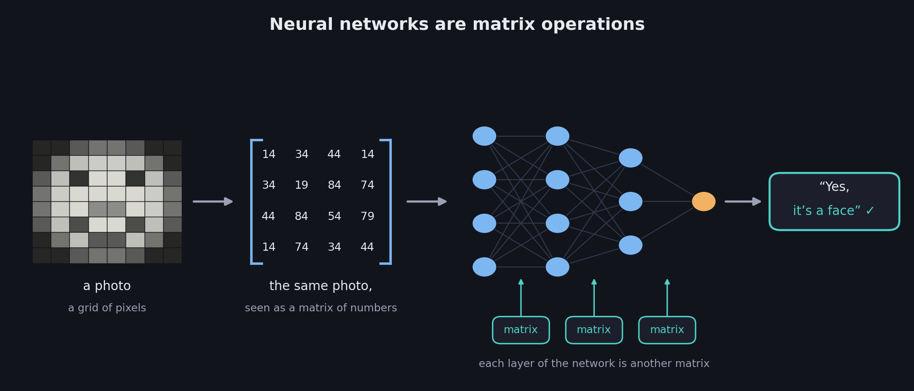
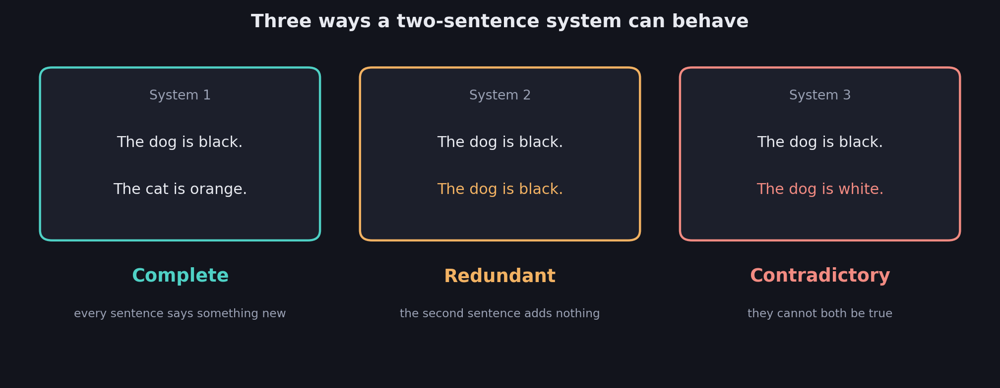
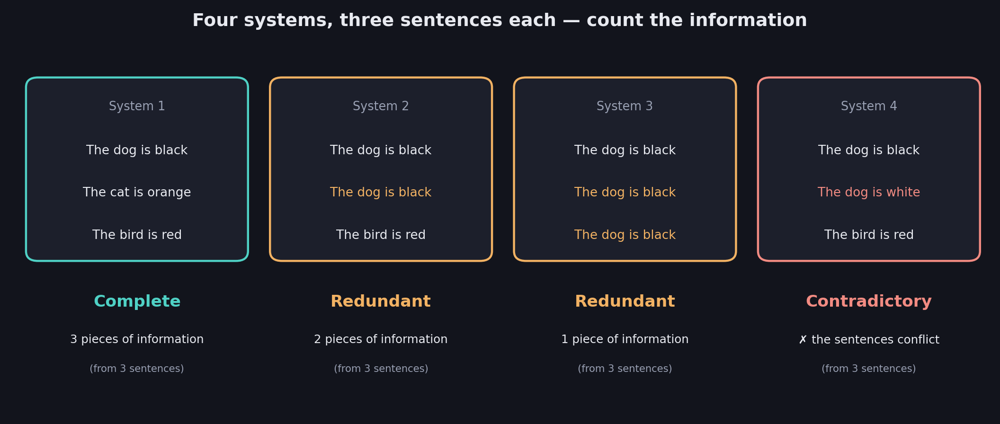
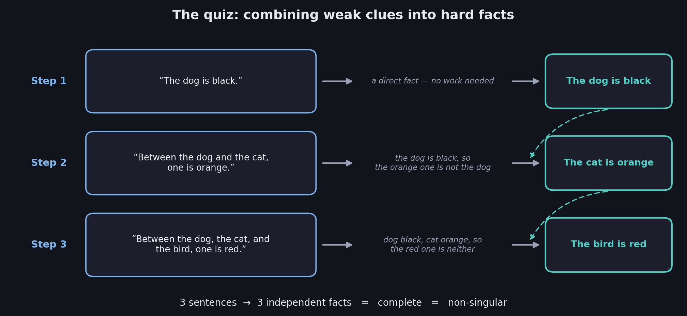

# What You Should Know About Systems of Sentences

> **This file is the entry point of the linear algebra series.** It introduces the two most important words of the whole course — **singular** and **non-singular** — using plain sentences about dogs, cats, and birds, before a single equation appears. The equations arrive in 02.
>
> **Prerequisites:** none.

Linear algebra is the mathematics of machine learning, and systems of linear equations are the front door to linear algebra. But an equation is really just a sentence about numbers, so the gentlest possible entry point is a system made of ordinary sentences. Every idea met here transfers word for word to equations, and later to matrices.

These notes cover: why machine learning motivates all of this, what a system of sentences is, the three kinds of systems — **complete**, **redundant**, and **contradictory** — why sentences and information are not the same thing, the first definition of **singular** versus **non-singular**, and a worked quiz showing that information can hide across sentences.

---

# 1. Why bother: machine learning runs on matrices

Consider image recognition: getting a computer to look at a photo and answer "yes, it's a face."

To the computer, the photo is not a picture. It is a **grid of numbers** — one number per pixel describing how bright it is. A grid of numbers is called a **matrix**, so the image itself already is one.

A neural network then processes that grid layer by layer, and each layer of the network is *also* a matrix. The whole computation, from photo to "yes, it's a face," is a chain of matrix operations.

$$
\boxed{\text{An image is a matrix. A neural network is a chain of matrix operations.}}
$$

To understand matrices, you need to understand where they come from — and matrices come from **systems of linear equations**. That is why the course starts there, and why this series does too.

## The route these notes take

Numbers can distract from ideas, so the first meeting happens with no numbers at all: systems of plain sentences. The vocabulary built here — complete, redundant, contradictory, singular, non-singular — is the exact vocabulary used for equations in 02 and for matrices in 04. Nothing learned in this file gets thrown away.

---

# 2. A system of sentences

A **system** is a collection of statements considered **together, as one package**.

$$
\boxed{\text{A system of sentences} = \text{several statements taken jointly, not one at a time}}
$$

The running example: someone is telling you the colors of their pets, and your job is to work out as much as you can.

**System 1**

- The dog is black.
- The cat is orange.

Two sentences, and each tells you something you did not already know. After hearing them you know the color of the dog **and** the color of the cat: two sentences, two facts.

That is what a good system does — every sentence **carries information**. The interesting cases are the systems where this breaks down.

---

# 3. Three ways a two-sentence system can behave

Keep the number of sentences fixed at two and vary what they say.

### System 1 — every sentence adds something new

- The dog is black.
- The cat is orange.

Two sentences, two pieces of information. This system is called **complete**.

### System 2 — a sentence repeats what you already knew

- The dog is black.
- The dog is black.

The second sentence is true, but it teaches you nothing — you already knew it. Two sentences, only **one** piece of information. This system is called **redundant**.

### System 3 — the sentences cannot both be true

- The dog is black.
- The dog is white.

Now the sentences are not repeating each other; they are **fighting** each other. There is no way both can hold at once, so you cannot even say what color the dog is. This system is called **contradictory**.

## Two warnings about these labels

**Redundant does not mean wrong.** Everything a redundant system says is true. Its defect is inefficiency: it spends sentences without delivering information.

**Contradictory is a different failure from redundant.** A redundant system delivers *less* than promised. A contradictory system is *broken* — its statements cannot coexist. Both are defective, but for opposite reasons: one repeats itself, the other fights itself.

---

# 4. The same three behaviors with three sentences

Nothing about this depends on having two sentences. Here are the deck's four three-sentence systems:

| | System 1 | System 2 | System 3 | System 4 |
|---|---|---|---|---|
| Sentence 1 | The dog is black | The dog is black | The dog is black | The dog is black |
| Sentence 2 | The cat is orange | The dog is black | The dog is black | The dog is white |
| Sentence 3 | The bird is red | The bird is red | The dog is black | The bird is red |
| Verdict | **Complete** | **Redundant** | **Redundant** | **Contradictory** |

**System 1** pins down all three animals: three sentences, three facts.

**System 2** wastes its second sentence on a repeat: three sentences, two facts (the dog and the bird; the cat is never mentioned).

**System 3** is the same failure taken to the extreme: three sentences, and all you ever learn is one fact about one dog.

**System 4** contains a fight — the dog cannot be both black and white — so the package as a whole cannot stand, even though the bird sentence looks innocent.

---

# 5. Count information, not sentences

All four systems above have exactly **three sentences**. They do not all carry three pieces of information.

| System | Sentences | Pieces of information | Verdict |
|---|---|---|---|
| 1 | 3 | 3 | Complete |
| 2 | 3 | 2 | Redundant |
| 3 | 3 | 1 | Redundant |
| 4 | 3 | — the sentences conflict | Contradictory |

$$
\boxed{\text{Sentences are what you were told. Information is what you actually learned.}}
$$

Notice that redundancy comes in **degrees**: System 3 is more wasteful than System 2, even though both get the same label. Counting exactly how many genuine pieces of information a system carries turns out to be one of the deepest ideas in linear algebra — it eventually gets its own name, the **rank**, which the course title slide promises for a later week. For now, the counting itself is enough.

---

# 6. Singular versus non-singular

Here is the vocabulary the entire course is built on.

$$
\boxed{\text{Complete} \;\Rightarrow\; \textbf{NON-SINGULAR} \qquad\qquad \text{Redundant or contradictory} \;\Rightarrow\; \textbf{SINGULAR}}
$$

In words: a **non-singular** system is one where every sentence pulls its weight and everything gets determined. A **singular** system is defective in one of the two ways just seen — it repeats itself or it fights itself.

Checking the four systems from section 4:

| System | Verdict | Singular? |
|---|---|---|
| 1 | Complete | **Non-singular** |
| 2 | Redundant | Singular |
| 3 | Redundant | Singular |
| 4 | Contradictory | Singular |

## Why such a strange word

In everyday English, "singular" means remarkable or unique. In mathematics it means nearly the opposite: **degenerate — a broken special case**. Do not fight the word; it is completely standard, and it is about to follow you everywhere:

- In 02 it describes systems of **equations**
- In 04 it becomes a property of a **matrix**, and the constants on the right-hand side will turn out not to matter
- In 05 the *cause* of singularity gets a name: **linear dependence** between rows
- In 06 singularity gets a one-number **test**: the determinant

## The most common mistake

Treating singularity as a property of an individual sentence. It is not. "The dog is black" sits inside the non-singular System 1 *and* inside the singular Systems 2, 3, and 4 — the same sentence, four different verdicts.

$$
\boxed{\text{Singular and non-singular describe the SYSTEM as a whole, never a single sentence}}
$$

The next section shows just how much this "judge the whole package" rule matters.

---

# 7. Worked example: information hiding across sentences

This is the quiz from the deck. Given this system:

- Between the dog, the cat, and the bird, one is red.
- Between the dog and the cat, one is orange.
- The dog is black.

**Problem 1:** What color is the bird?
**Problem 2:** Is this system singular or non-singular?

## Why this one is interesting

Look how weak the sentences are on their own. The first narrows "red" down to three candidates. The second narrows "orange" down to two. Only the third pins anything down at all. Judged one at a time, this system looks vague.

## The deduction chain

**Step 1.** The third sentence is direct: **the dog is black**.

**Step 2.** The second sentence says one of {dog, cat} is orange. The dog is black, so it is not the dog. Therefore **the cat is orange**.

**Step 3.** The first sentence says one of {dog, cat, bird} is red. The dog is black and the cat is orange, so it is neither of them. Therefore **the bird is red**.

## Answers

**Problem 1:** The bird is red.

**Problem 2:** Three sentences produced three independent facts — dog black, cat orange, bird red. Every sentence contributed, everything got determined. The system is complete, therefore:

$$
\boxed{\text{Non-singular}}
$$

## What the quiz teaches

$$
\boxed{\text{Information can be spread across sentences and only appear when they are combined}}
$$

No single sentence told you the bird's color, yet the system as a whole did. This is the deepest reason the labels apply to whole systems: information lives in the *combination*. Extracting it — turning vague joint statements into hard individual facts — is exactly what **solving** will mean when the sentences become equations in 02.

---

# Most Important Definitions and Distinctions to Remember

## System of sentences

$$
\boxed{\text{A system} = \text{several statements considered together as one package}}
$$

Judged as a whole, never sentence by sentence.

---

## The three types

$$
\boxed{\text{Complete: every sentence adds new information, and everything is determined}}
$$

$$
\boxed{\text{Redundant: at least one sentence repeats what the others already said}}
$$

$$
\boxed{\text{Contradictory: the sentences cannot all be true at the same time}}
$$

---

## Singular versus non-singular

$$
\boxed{\text{Non-singular} = \text{complete} \qquad\qquad \text{Singular} = \text{redundant or contradictory}}
$$

| | Non-singular | Singular |
|---|---|---|
| System type | Complete | Redundant or contradictory |
| Information delivered | Full — everything determined | Reduced, or broken by conflict |
| Every sentence useful? | Yes | No — repeats or fights |

---

## Sentences versus information

$$
\boxed{\text{Count the information a system carries, not the sentences it contains}}
$$

Redundancy comes in degrees, and that count will later be called the rank.

---

# Main Rules to Put in Your Notebook

| The system looks like | Label | Singular? |
|---|---|---|
| Every sentence says something new | Complete | **Non-singular** |
| A sentence repeats what others already said | Redundant | Singular |
| The sentences cannot all hold at once | Contradictory | Singular |

$$
\boxed{\text{Non-singular} = \text{complete}}
$$

$$
\boxed{\text{Singular} = \text{redundant or contradictory}}
$$

$$
\boxed{\text{Judge the whole system, not individual sentences}}
$$

$$
\boxed{\text{Sentences} \neq \text{information}}
$$

The biggest idea is:

**A system is a package of statements judged together. A non-singular system is one where every statement pulls its weight, so the package determines everything. A singular system is defective — it either repeats itself or contradicts itself, so the package delivers less than it promises. Everything that follows in this course — solutions of equations, dependence between rows, the determinant — is this one idea wearing progressively more mathematical clothing.**

---

# Where This Goes Next

| Idea from this file | Where it is used |
|---|---|
| Sentences become equations about numbers | **02 — Systems of Linear Equations** |
| Complete / redundant / contradictory become unique / infinitely many / no solutions | **02**, and geometrically in **03** |
| Singular vs non-singular becomes a property of a matrix | **04 — Singular vs Non-Singular Matrices** |
| Redundancy between sentences becomes linear dependence between rows | **05 — Linear Dependence and Independence** |
| A one-number test for singularity | **06 — The Determinant** |
| Counting pieces of information | The rank, a later week |
| Images and networks as matrices | The motivation running under the whole course |
