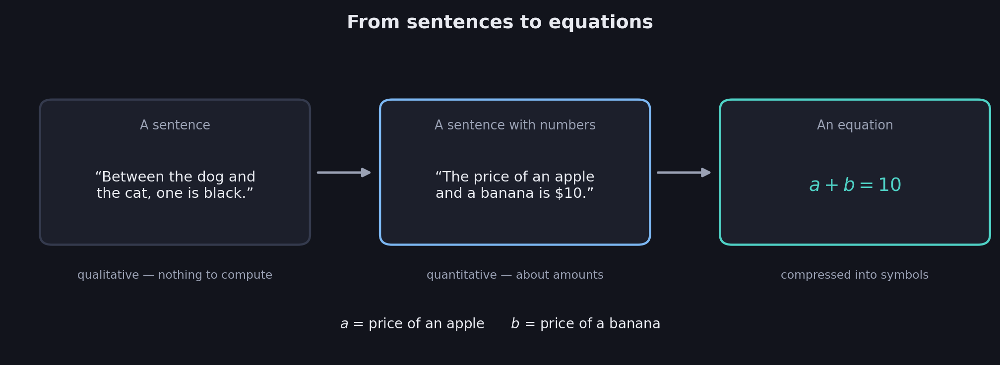
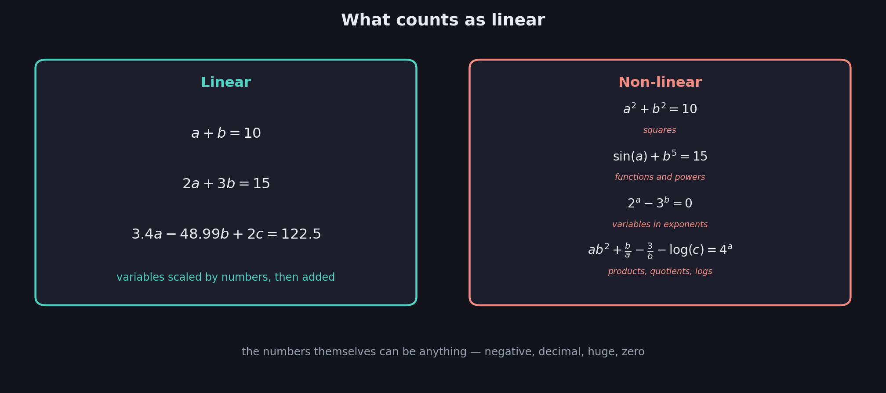
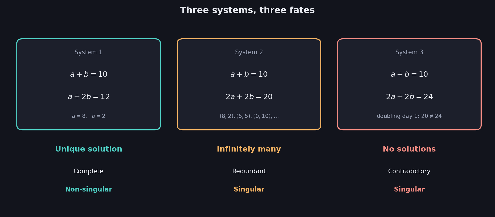
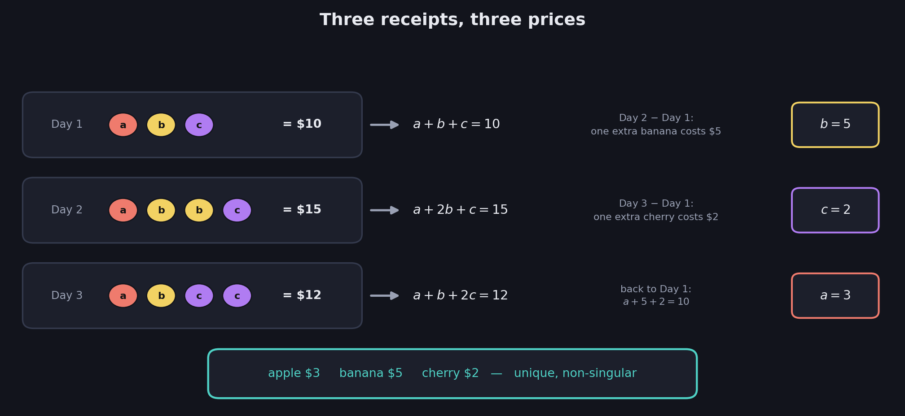

# What You Should Know About Systems of Linear Equations

> **Prerequisites:** the words **complete**, **redundant**, **contradictory**, **singular**, and **non-singular** are all defined in 01, using systems of sentences. This file replaces the sentences with equations — and nothing else changes.
>
> The new payoffs are the idea of a **solution** and the discovery that every linear system meets exactly one of **three fates**.

An equation is just a sentence about numbers. That single observation carries the entire vocabulary of 01 into mathematics: systems of equations can be complete, redundant, or contradictory, and therefore singular or non-singular, for exactly the same reasons systems of sentences could.

These notes cover: how sentences become equations, what makes an equation **linear**, what a solution actually is, three price puzzles that end three different ways, the dictionary connecting solution counts to the 01 vocabulary, and the same story retold with three variables.

---

# 1. From sentences to equations

The deck's translation happens in three steps:

| Sentences | Sentences with numbers | Equations |
|---|---|---|
| Between the dog and the cat, one is black. | The price of an apple and a banana is \$10. | $a+b=10$ |

**Step 1 → 2.** Move from qualitative statements to statements about *quantities*. "One is black" cannot be calculated with; "costs \$10" can.

**Step 2 → 3.** Give the unknown quantities names — $a$ for the price of an apple, $b$ for the price of a banana — and the sentence compresses into symbols:

$$
a+b=10
$$

$$
\boxed{\text{An equation is a sentence about numbers}}
$$

Nothing was lost in translation. The equation *says* exactly what the sentence said; it just says it in a form you can compute with.

---

# 2. What "linear" means

Not every equation gets into this course. The course is about **linear** equations, and the deck defines them by contrast:

### Linear

$$
a+b=10
$$

$$
2a+3b=15
$$

$$
3.4a-48.99b+2c=122.5
$$

### Non-linear

$$
a^2+b^2=10
$$

$$
\sin(a)+b^5=15
$$

$$
2^a-3^b=0
$$

$$
ab^2+\frac{b}{a}-\frac{3}{b}-\log(c)=4^a
$$

## The ingredient rule

Look at what the linear column allows. Each variable appears **once, multiplied by a plain number**, and the results are **added**. That is the whole recipe:

$$
\boxed{\text{Linear} = (\text{number})\times(\text{variable}) + (\text{number})\times(\text{variable}) + \cdots = \text{number}}
$$

The numbers can be anything — negative, decimal, enormous, zero. $3.4a-48.99b+2c=122.5$ is as linear as $a+b=10$.

Everything in the non-linear column breaks the recipe in some way: variables **squared** ($a^2$), variables raised to **powers** ($b^5$), variables **inside functions** ($\sin$, $\log$), variables sitting **in an exponent** ($2^a$, $4^a$), and variables **multiplying or dividing each other** ($ab^2$, $\frac{b}{a}$, $\frac{3}{b}$).

$$
\boxed{\text{Variables may only be scaled by numbers and added. Nothing else.}}
$$

## Why restrict to linear?

Two reasons, both coming soon. First, linear equations have clean geometry — a linear equation *is* a line, or a plane (03) — and that geometry makes them completely understandable. Second, their solution behavior is astonishingly tame, which is the discovery of section 5. The wild non-linear world is a different course; this one earns its power by staying linear.

---

# 3. What a solution is

$$
\boxed{\text{A solution} = \text{values for the variables that make EVERY equation true at once}}
$$

Take the system

$$
a+b=10 \qquad\qquad a+2b=12
$$

**Check $a=8$, $b=2$:** the first equation reads $8+2=10$ ✓ and the second reads $8+2(2)=12$ ✓. Both hold, so $(8,2)$ is a solution.

**Check $a=5$, $b=5$:** the first equation reads $5+5=10$ ✓ but the second reads $5+2(5)=15\neq12$ ✗. One failure is enough: $(5,5)$ is **not** a solution of the system, even though it satisfies an equation in it.

This "all at once" requirement is the equation version of a lesson from 01: the system is a **package**. And *solving* — squeezing the package until the individual values fall out — is exactly the information-extraction game played in the quiz of 01 §7, now with numbers.

---

# 4. Three puzzles, three endings

The deck poses the same shopping puzzle three times, changing one number. You visit a store two days in a row and want the price of an apple ($a$) and a banana ($b$).

## Puzzle 1 — it works

- **Day 1:** an apple and a banana cost \$10 → $a+b=10$
- **Day 2:** an apple and two bananas cost \$12 → $a+2b=12$

Compare the days. Day 2 differs from Day 1 by **exactly one extra banana**, and costs **exactly \$2 more**. So the banana costs \$2, and then Day 1 gives $a=10-2=8$:

$$
\boxed{b=2 \qquad a=8 \qquad\text{a unique solution}}
$$

That "compare the days" move — subtracting one equation from another to cancel what they share — is the engine of everything. It gets a formal name (**row reduction**) in a later week, but you just used it.

## Puzzle 2 — every day says the same thing

- **Day 1:** an apple and a banana cost \$10 → $a+b=10$
- **Day 2:** two apples and two bananas cost \$20 → $2a+2b=20$

Day 2 is Day 1 **doubled** — buy twice the fruit, pay twice the money. It is true, but it teaches nothing new. One piece of information, two unknowns, so the prices never get pinned down:

$$
(8,2),\quad (5,5),\quad (8.3,\,1.7),\quad (0,10),\quad\ldots
$$

Every pair with $a+b=10$ works.

$$
\boxed{\text{Infinitely many solutions}}
$$

This is System 2 of 01 wearing numbers: "the dog is black, the dog is black."

## Puzzle 3 — the days disagree

- **Day 1:** an apple and a banana cost \$10 → $a+b=10$
- **Day 2:** two apples and two bananas cost \$24 → $2a+2b=24$

Doubling Day 1 says two apples and two bananas must cost **\$20**. Day 2 insists on **\$24**. Both cannot hold, at any prices:

$$
\boxed{\text{Contradiction — no solutions}}
$$

Notice you cannot blame either equation individually; each is perfectly reasonable alone. The *package* is broken — the 01 lesson again.

---

# 5. The three possible outcomes

Lining up the three systems, exactly as the deck does:

| | System 1 | System 2 | System 3 |
|---|---|---|---|
| Equations | $a+b=10$   $a+2b=12$ | $a+b=10$   $2a+2b=20$ | $a+b=10$   $2a+2b=24$ |
| Solutions | Unique: $a=8,\ b=2$ | Infinitely many | None |
| Verdict | Complete | Redundant | Contradictory |
| | **Non-singular** | **Singular** | **Singular** |

## The tameness theorem

Here is the remarkable pattern, and it is not an accident of these examples:

$$
\boxed{\text{A linear system has exactly one solution, infinitely many, or none. Nothing else is possible.}}
$$

Never exactly two. Never exactly five. The moment a linear system has a second solution, it has infinitely many. The reason becomes *visually obvious* in 03, where solutions are intersections of lines — so hold the question until then.

For contrast, the non-linear world has no such tameness: $a^2=4$ has **exactly two** solutions, $a=2$ and $a=-2$. This tame trichotomy is one of the privileges you purchase by staying linear.

---

# 6. The dictionary

The vocabulary of 01 and the solution counts of this file are two descriptions of the same three situations:

| Information language (01) | Solution language (02) | Singularity |
|---|---|---|
| Complete — every equation contributes | Exactly **one** solution | **Non-singular** |
| Redundant — an equation repeats the others | **Infinitely many** solutions | Singular |
| Contradictory — the equations conflict | **No** solutions | Singular |

$$
\boxed{\text{Non-singular} \iff \text{a unique solution}}
$$

## The most common mistake

Reading "singular" as "unsolvable." It does not mean that. A singular system can have **infinitely many** solutions — more than you could ever want — or none at all. The two failure modes are opposites in solution count, yet both are singular, because both fail the same underlying test: the system does not carry enough independent information to pin everything down uniquely.

$$
\boxed{\text{Singular} \neq \text{no solutions.} \quad \text{Singular} = \text{no UNIQUE solution.}}
$$

---

# 7. Three variables: apples, bananas, cherries

Nothing so far depends on having two unknowns. The deck's 3-variable quiz: three days at the store, now buying apples ($a$), bananas ($b$), and cherries ($c$).

- **Day 1:** an apple, a banana, and a cherry cost \$10 → $a+b+c=10$
- **Day 2:** an apple, two bananas, and a cherry cost \$15 → $a+2b+c=15$
- **Day 3:** an apple, a banana, and two cherries cost \$12 → $a+b+2c=12$

## Solving by comparing days

**Day 2 vs Day 1:** the only difference is one extra banana, for \$5 more. So $b=5$.

**Day 3 vs Day 1:** the only difference is one extra cherry, for \$2 more. So $c=2$.

**Back to Day 1:** $a+5+2=10$, so $a=3$.

$$
\boxed{a=3 \qquad b=5 \qquad c=2}
$$

Three equations, three genuinely different pieces of information, one solution: complete, non-singular. The same subtraction engine from Puzzle 1 did all the work.

## The three siblings

The deck then classifies three more 3-variable systems. Work through the verdicts:

| | System 2 | System 3 | System 4 |
|---|---|---|---|
| Equations | $a+b+c=10$   $a+b+2c=15$   $a+b+3c=20$ | $a+b+c=10$   $a+b+2c=15$   $a+b+3c=18$ | $a+b+c=10$   $2a+2b+2c=20$   $3a+3b+3c=30$ |
| What comparing gives | Each step adds one cherry for \$5: $c=5$, then $a+b=5$ | 1st vs 2nd forces $c=5$; 2nd vs 3rd forces $c=3$ | Every equation is the first one, rescaled |
| Solutions | Infinitely many: $(0,5,5),(1,4,5),(2,3,5),\ldots$ | **None** | Infinitely many: any $a,b,c$ with $a+b+c=10$, like $(0,0,10),(2,7,1),\ldots$ |
| Verdict | Redundant — **singular** | Contradictory — **singular** | Redundant — **singular** |

$$
\boxed{\text{The vocabulary does not care how many variables there are}}
$$

## Two different sizes of "infinitely many"

Look closely at Systems 2 and 4 — both redundant, but not equally so.

**System 2** still pins down the cherry ($c=5$) and constrains the rest ($a+b=5$): its solutions form a **one-parameter family** — choose $a$, and everything else follows.

**System 4** carries only one piece of information ($a+b+c=10$) despite its three equations: its solutions form a **two-parameter family** — choose $a$ *and* $b$ freely.

More redundancy leaves more freedom. This is the "redundancy comes in degrees" observation from 01 §5, now visible in the *size of the solution set* — and it is precisely what the **rank** will measure when it arrives in a later week.

---

# Most Important Definitions and Distinctions to Remember

## Linear equation

$$
\boxed{(\text{number})\times(\text{variable}) + \cdots = \text{number}}
$$

No squares, no powers, no variables in exponents, no variables multiplying or dividing each other, no functions of variables.

---

## Solution

$$
\boxed{\text{Values that satisfy ALL equations of the system simultaneously}}
$$

Satisfying some of the equations counts for nothing.

---

## The three outcomes

$$
\boxed{\text{Exactly one solution} \qquad \text{infinitely many} \qquad \text{none}}
$$

A linear system has no fourth option — in particular, never exactly two.

---

## The dictionary

| 01 said | 02 says | Singularity |
|---|---|---|
| Complete | Unique solution | **Non-singular** |
| Redundant | Infinitely many | Singular |
| Contradictory | No solutions | Singular |

---

## The warning

$$
\boxed{\text{Singular does NOT mean unsolvable — it means no unique solution}}
$$

---

# Main Rules to Put in Your Notebook

$$
\boxed{\text{An equation is a sentence about numbers}}
$$

$$
\boxed{\text{Linear: variables scaled by numbers and added — nothing else}}
$$

$$
\boxed{\text{A solution must satisfy every equation at once}}
$$

$$
\boxed{\text{Linear systems: } 1,\ \infty,\ \text{or } 0 \text{ solutions — never exactly } 2}
$$

$$
\boxed{\text{Non-singular} \iff \text{unique solution}}
$$

$$
\boxed{\text{Subtracting one equation from another cancels shared content and exposes new facts}}
$$

| See this | Conclude |
|---|---|
| Every equation adds new information | Complete → unique solution → non-singular |
| An equation is a rescaled or repeated version of others | Redundant → infinitely many → singular |
| Equations that cannot all hold | Contradictory → no solutions → singular |

The biggest idea is:

**An equation is a sentence about numbers, so everything from 01 transfers: complete, redundant, and contradictory systems of equations exist for the same reasons as systems of sentences. What is new is that outcomes can be counted — and linear systems are astonishingly tame, offering only three fates: one solution, infinitely many, or none. Complete systems deliver the unique solution and are called non-singular; redundant and contradictory ones fail in opposite directions, but both fail to deliver uniqueness, and both are called singular.**

---

# Where This Goes Next

| Idea from this file | Where it is used |
|---|---|
| Each linear equation drawn as a picture | **03 — Systems as Lines and Planes**: equations become lines and planes, solutions become intersections |
| Why $1$, $\infty$, or $0$ is the complete list | **03**: the trichotomy becomes visually obvious |
| Singular vs non-singular, freed from the constants on the right | **04 — Singular vs Non-Singular Matrices** |
| "Day 2 is Day 1 doubled" — equations carrying repeated information | **05 — Linear Dependence and Independence** |
| A single number that detects singularity | **06 — The Determinant** |
| Comparing and subtracting equations, done systematically | Row reduction, a later week |
| The size of the solution family and degrees of redundancy | The rank, a later week |
