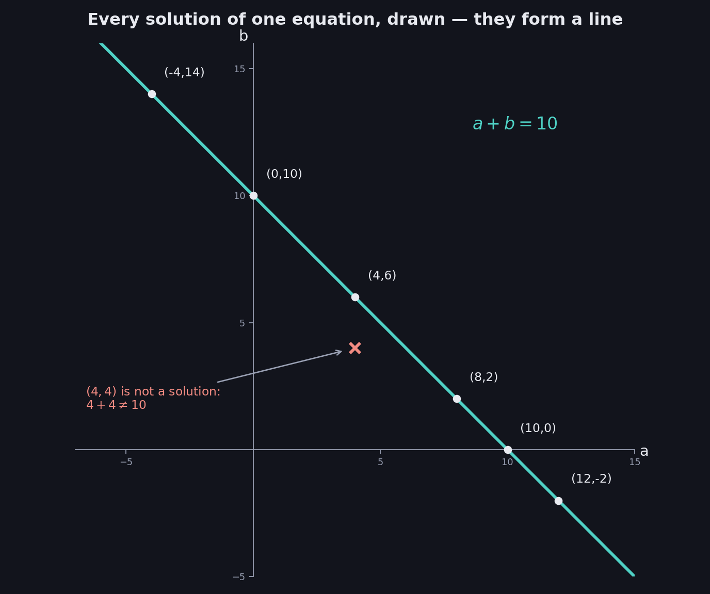
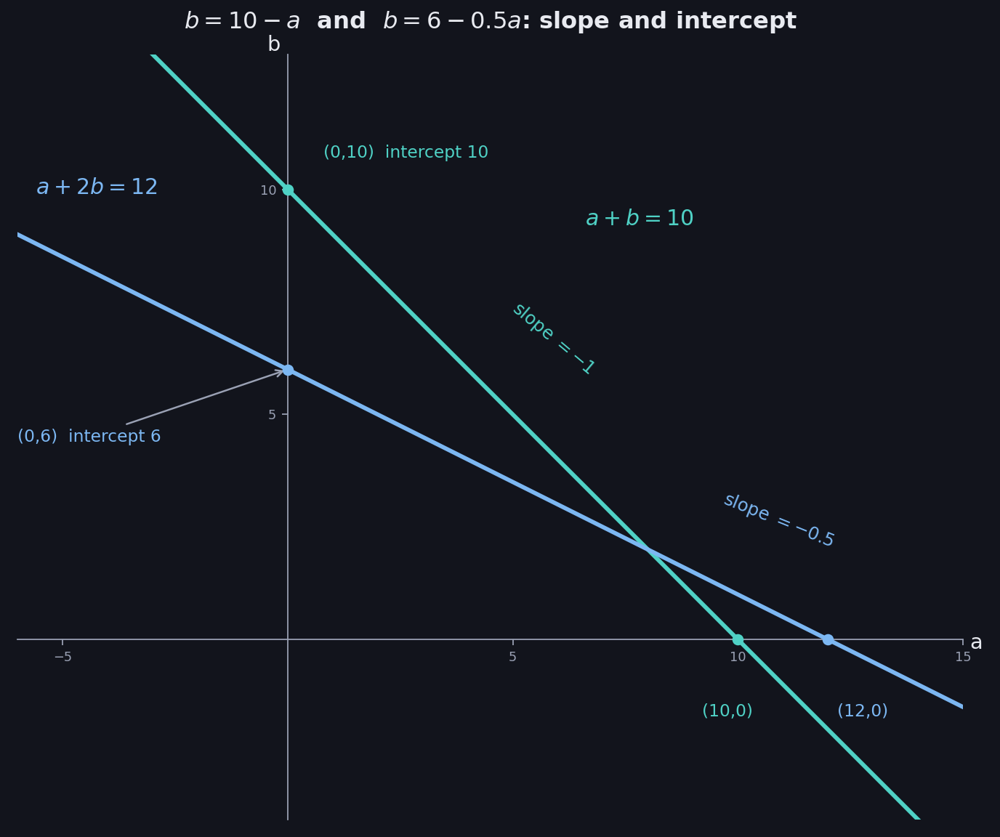
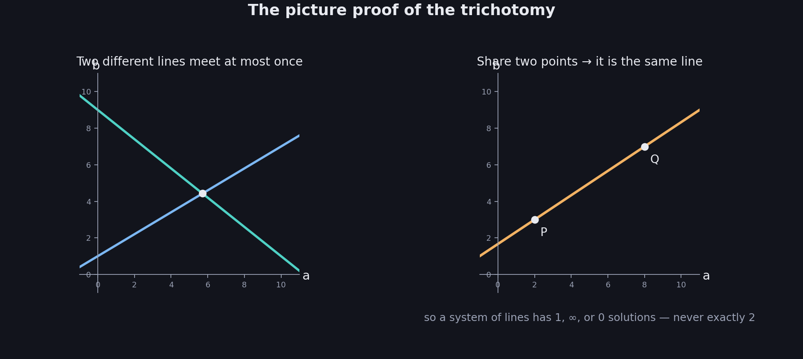
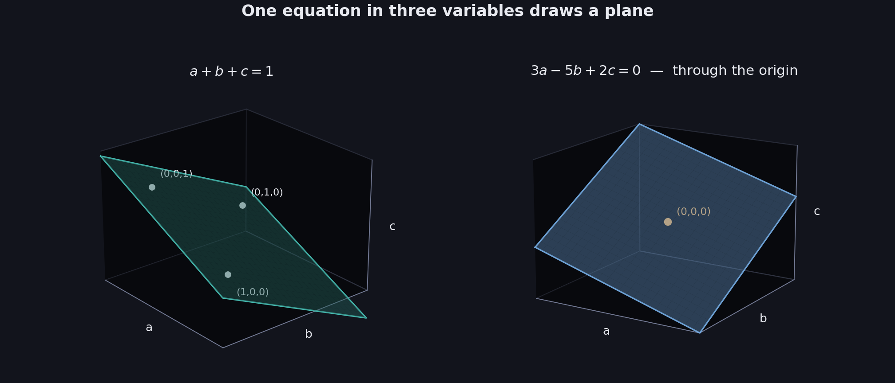
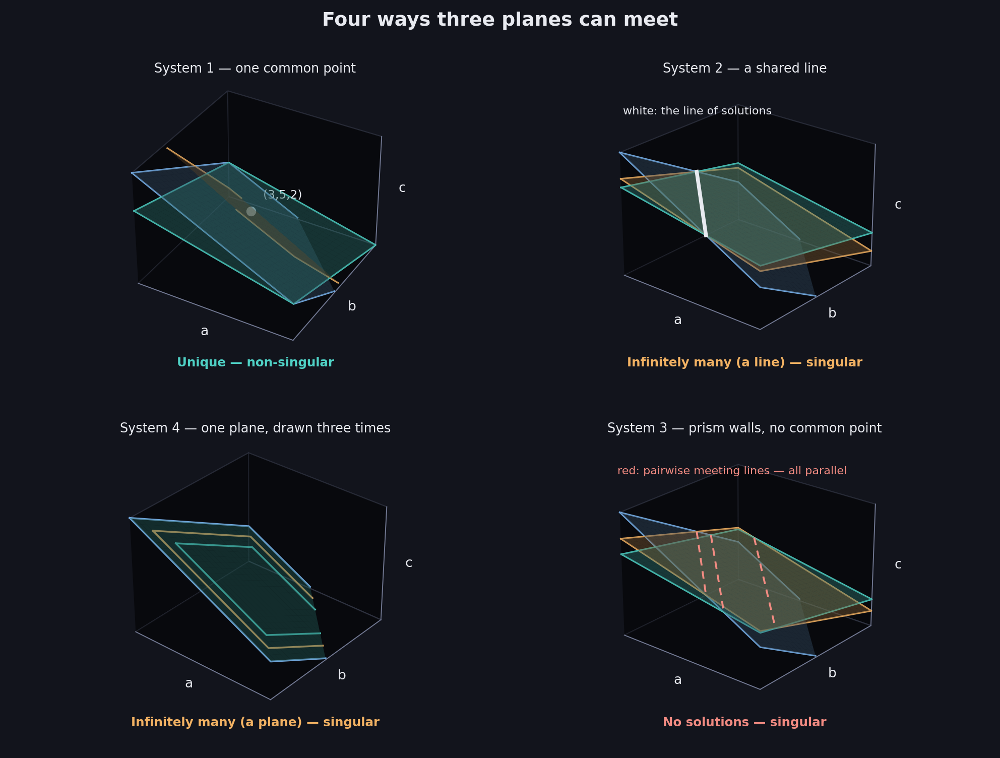

# What You Should Know About Systems as Lines and Planes

> **Prerequisites:** what a solution is and the three outcomes (unique, infinitely many, none) are in 02. The words singular and non-singular are in 01 and 02.
>
> This is the file where the algebra grows pictures. Every claim from 02 becomes something you can **see** — including the promised proof that a linear system has only three possible fates.

A linear equation does not just *have* solutions; its solutions form a **shape**. With two variables the shape is a line, with three it is a plane, and a system's solutions are wherever those shapes **overlap**. Once you see that, the whole classification of 01 and 02 turns into three unmistakable pictures.

These notes cover: why the solutions of one equation form a line, how to read slope and intercept, systems as collections of lines, solutions as intersections, the three pictures, the proof that $1$, $\infty$, or $0$ is the complete list, a worked quiz, planes for three variables, and the four ways planes can meet.

---

# 1. One equation already has infinitely many solutions

Take a single equation and hunt for solutions:

$$
a+b=10
$$

$(10,0)$ works. So do $(0,10)$, $(4,6)$, $(8,2)$, $(12,-2)$, and $(-4,14)$ — negative values are fine; an equation does not care about shopping realism.

Now plot every pair you found, with $a$ on the horizontal axis and $b$ on the vertical. They line up. Literally:

$$
\boxed{\text{The solutions of one linear equation in two variables form a LINE}}
$$

Be precise about what the picture is. The line is not a drawing of the equation; it is a drawing of the equation's **solution set**. A point on the line is a solution; a point off the line, like $(4,4)$ with $4+4=8\neq10$, is not. The line and the solution set are the same object.

And the count makes sense: one equation is **one piece of information** (01 §5), which is not enough to pin down **two unknowns**. Something one-dimensional has to survive — and it does: a line of possibilities.

---

# 2. Reading a line: slope and intercept

To see which line an equation draws, solve for $b$:

$$
a+b=10 \quad\Longrightarrow\quad b=10-a
$$

$$
a+2b=12 \quad\Longrightarrow\quad b=6-0.5\,a
$$

Two numbers now describe each line completely:

**The slope** — how much $b$ changes when $a$ increases by 1. The first line has slope $-1$; the second has slope $-0.5$, so it falls half as steeply.

**The intercept** — the value of $b$ when $a=0$: where the line crosses the vertical axis. The first line crosses at $10$, the second at $6$. (The deck's axes are $a$ horizontal and $b$ vertical, so its "y-intercept" is the $b$-intercept.)

$$
\boxed{b = (\text{slope})\,a + (\text{intercept}) \qquad \text{— two numbers pin down the whole line}}
$$

That last remark is the key to everything in section 4: two equations describe the **same line** exactly when they match in *both* slope and intercept, and **parallel lines** are the ones that match in slope but differ in intercept.

---

# 3. A system is several lines at once

From 02 §3, a solution of a system must satisfy **every** equation simultaneously. Each equation demands "sit on my line," so:

$$
\boxed{\text{A solution of the system} = \text{a point lying on ALL the lines} = \text{an intersection}}
$$

Check it on System 1: the point $(8,2)$ sits on the line of $a+b=10$ (since $8+2=10$) *and* on the line of $a+2b=12$ (since $8+4=12$). It is where the two lines cross.

$$
\boxed{\text{Solving a system} = \text{finding where its lines meet}}
$$

---

# 4. The three pictures

Draw the three systems of 02 §5 and the three fates appear as three geometries.

### System 1 — the lines cross

$$
a+b=10 \qquad a+2b=12
$$

Slopes $-1$ and $-0.5$: different slopes, so the lines are not parallel and must cross — once. The crossing is $(8,2)$.

**Unique solution.** Complete, non-singular.

### System 2 — the lines coincide

$$
a+b=10 \qquad 2a+2b=20
$$

Both lines pass through $(0,10)$ and $(10,0)$ — same slope $-1$, same intercept $10$. Two equations, but only **one line**: the second equation drew nothing new. Every point of that shared line satisfies both equations.

**Infinitely many solutions.** Redundant, singular — and now you can *see* the redundancy: a whole equation added no ink to the picture.

### System 3 — the lines are parallel

$$
a+b=10 \qquad 2a+2b=24
$$

The second line is $a+b=12$: slope $-1$ again, but intercept $12$ instead of $10$. Same direction, different position — the lines run side by side forever and never touch. No point lies on both.

**No solutions.** Contradictory, singular — the contradiction *is* the gap between the parallel lines.

| | System 1 | System 2 | System 3 |
|---|---|---|---|
| Picture | Lines cross once | One line, drawn twice | Parallel lines |
| Solutions | Unique: $(8,2)$ | Infinitely many | None |
| Verdict | Complete — **non-singular** | Redundant — singular | Contradictory — singular |

---

# 5. Why the list stops at three

02 §5 promised that a linear system can have exactly $1$, $\infty$, or $0$ solutions and nothing else. Here is the picture proof.

**Two different lines can share at most one point.** Suppose two lines shared *two* points, $P$ and $Q$. Through two given points there passes exactly one straight line — so both "lines" are the line through $P$ and $Q$, meaning they were the same line all along, not two different ones.

So for two equations in two unknowns there are only the three geometries of section 4:

$$
\boxed{\text{Different lines that cross: } 1 \qquad \text{The same line: } \infty \qquad \text{Parallel lines: } 0}
$$

A fourth option — say, exactly two solutions — would require two straight lines meeting at exactly two points, which the argument above forbids. That is the whole proof.

The slope version of the same argument: **different slopes** force exactly one crossing; **equal slopes** make the lines parallel, leaving either $0$ solutions (different intercepts) or $\infty$ (same line). Curves are what make multiple isolated meetings possible — a line and a circle can meet twice — which is exactly why the non-linear column of 02 §2 was expelled from the course.

---

# 6. Worked example: the quiz

**Problem.** Which plot corresponds to this system, and is the system singular or non-singular?

$$
3a+2b=8 \qquad 2a-b=3
$$

## Sketch each line from its intercepts

**Line 1:** $3a+2b=8$. At $a=0$: $b=4$, giving $(0,4)$. At $b=0$: $a=\frac{8}{3}$, giving $\left(\frac{8}{3},0\right)$. Solving for $b$: $b=4-1.5a$, so the slope is $-1.5$.

**Line 2:** $2a-b=3$. At $a=0$: $b=-3$, giving $(0,-3)$. At $b=0$: $a=\frac{3}{2}$, giving $\left(\frac{3}{2},0\right)$. Solving for $b$: $b=2a-3$, so the slope is $+2$ — this line goes *uphill*.

## Classify before computing

Slopes $-1.5$ and $+2$ are different, so the lines must cross exactly once. Without finding the point, the verdict is already in:

$$
\boxed{\text{Unique solution} \;\Rightarrow\; \text{non-singular}}
$$

## Find the crossing

$$
4-1.5a = 2a-3 \quad\Longrightarrow\quad 7 = 3.5a \quad\Longrightarrow\quad a=2,\; b=1
$$

Check: $3(2)+2(1)=8$ ✓ and $2(2)-1=3$ ✓. The lines cross at $(2,1)$, matching the deck's plot (a).

---

# 7. Three variables: an equation is a plane

Add a third variable and the same story climbs one dimension.

$$
a+b+c=1
$$

Solutions now are **triples**: $(1,0,0)$ works since $1+0+0=1$, and so do $(0,1,0)$ and $(0,0,1)$. Plot all solutions in 3D space — one axis per variable — and they form a flat sheet: a **plane** tilted so it slices through those three points.

A second example from the deck: $3a-5b+2c=0$ is also a plane, and since $3(0)-5(0)+2(0)=0$, it is a plane passing through the **origin** $(0,0,0)$.

$$
\boxed{2 \text{ variables} \rightarrow \text{a line} \qquad 3 \text{ variables} \rightarrow \text{a plane}}
$$

The count logic repeats: one equation is one piece of information against three unknowns, so a **two**-dimensional family of solutions survives. And the pattern continues past what can be drawn: an equation in $n$ variables carves out an $(n-1)$-dimensional flat sheet called a **hyperplane**. The pictures stop at 3D; the algebra never notices.

---

# 8. How planes can meet: the four configurations

A 3-variable system is several planes, and its solutions are the points on **all** of them. Take the four systems of 02 §7 and look at their geometry.

### System 1 — three planes, one common point

$$
a+b+c=10 \qquad a+2b+c=15 \qquad a+b+2c=12
$$

Two planes generically meet along a line; the third plane cuts that line in a single point. Here that point is $(3,5,2)$ — the prices found in 02.

**Unique solution.** Complete, non-singular.

### System 2 — the planes share a whole line

$$
a+b+c=10 \qquad a+b+2c=15 \qquad a+b+3c=20
$$

All three planes contain the entire line $c=5,\ a+b=5$ — the points $(t,\,5-t,\,5)$. The solution set from 02, $(0,5,5),(1,4,5),(2,3,5),\ldots$, was exactly this line, listed one point at a time.

**Infinitely many solutions — a line of them.** Redundant, singular.

### System 4 — the "three" planes are one plane

$$
a+b+c=10 \qquad 2a+2b+2c=20 \qquad 3a+3b+3c=30
$$

Rescaling an equation does not move its plane. All three equations draw the *same* sheet, so the solution set is that entire plane: "any three numbers adding to 10."

**Infinitely many solutions — a plane of them.** Redundant, singular.

Look at Systems 2 and 4 together: the two sizes of "infinitely many" from 02 §7 are now literal shapes — a **line** of solutions versus a **plane** of solutions. More redundancy leaves a bigger surviving shape.

### System 3 — no point on all three

$$
a+b+c=10 \qquad a+b+2c=15 \qquad a+b+3c=18
$$

Here is a genuinely three-dimensional novelty. **No two of these planes are parallel** — every pair meets along a line (the first two force $c=5$, the last two force $c=3$, the outer two force $c=4$). But those three lines are parallel to each other, so the planes form the walls of an endless triangular prism: each pair touches, yet no point lies on all three at once. In 2D, "no solutions" required parallel lines; in 3D it does not require parallel planes.

**No solutions.** Contradictory, singular.

| | Picture | Solutions | Verdict |
|---|---|---|---|
| System 1 | Three planes through one point | Unique: $(3,5,2)$ | Complete — **non-singular** |
| System 2 | Planes sharing a line | $\infty$ — a line of them | Redundant — singular |
| System 4 | One plane, drawn three times | $\infty$ — a plane of them | Redundant — singular |
| System 3 | Prism walls: pairwise meetings, no common point | None | Contradictory — singular |

**A note on the deck's drawings.** The deck draws these configurations with every right-hand side set to $0$, which slides all the planes so they pass through the origin. Why that replacement is *legal* — why the constants can be changed without changing singularity — is precisely where 04 begins.

---

# 9. The full dictionary, now with pictures

| Information (01) | Count (02) | Picture in 2D | Picture in 3D | Singularity |
|---|---|---|---|---|
| Complete | Unique | Lines cross at a point | Planes meet at a point | **Non-singular** |
| Redundant | Infinitely many | The same line | A shared line, or a shared plane | Singular |
| Contradictory | None | Parallel lines | Parallel planes, or prism walls | Singular |

---

# Most Important Definitions and Distinctions to Remember

## What the picture shows

$$
\boxed{\text{The line (or plane) IS the solution set of one equation}}
$$

On the shape = solution. Off the shape = not.

---

## Slope and intercept

$$
\boxed{b=(\text{slope})\,a+(\text{intercept})}
$$

Same slope and intercept: same line. Same slope, different intercept: parallel. Different slopes: one crossing, guaranteed.

---

## Solutions as intersections

$$
\boxed{\text{Solving a system} = \text{intersecting its lines or planes}}
$$

---

## The trichotomy, proved

$$
\boxed{\text{Two distinct lines share at most one point — so } 1,\ \infty,\ \text{or } 0.\ \text{Never exactly } 2.}
$$

---

## Dimensions of the solution set

$$
\boxed{\text{Non-singular: a single point.} \quad \text{Redundant: a line or plane survives.} \quad \text{Contradictory: nothing.}}
$$

The bigger the surviving shape, the more redundant the system.

---

# Main Rules to Put in Your Notebook

$$
\boxed{1 \text{ linear equation, } 2 \text{ variables} \rightarrow \text{line} \qquad 3 \text{ variables} \rightarrow \text{plane}}
$$

$$
\boxed{\text{To read a line: solve for } b \text{, then } b = (\text{slope})\,a + (\text{intercept})}
$$

$$
\boxed{\text{Solution of a system} = \text{point on every line or plane}}
$$

| See in the picture | Conclude |
|---|---|
| Lines/planes meet in exactly one point | Unique solution — non-singular |
| A line or plane drawn more than once, or a shared line | Infinitely many — redundant, singular |
| Parallel lines, parallel planes, or prism walls | No solutions — contradictory, singular |

$$
\boxed{\text{Different slopes} \Rightarrow \text{exactly one solution}}
$$

$$
\boxed{\text{Same slope} \Rightarrow \text{parallel } (0) \text{ or identical } (\infty)}
$$

The biggest idea is:

**An equation's solutions form a shape — a line for two variables, a plane for three — and solving a system means intersecting those shapes. The three fates of 02 are three geometries: shapes meeting at one point (non-singular), shapes overlapping in a whole line or plane (redundant), and shapes that never all touch (contradictory). And because two distinct straight lines can meet at most once, no fourth fate exists — the tameness of linear systems is a fact you can now literally see.**

---

# Where This Goes Next

| Idea from this file | Where it is used |
|---|---|
| Sliding the shapes to pass through the origin (setting constants to 0) | **04 — Singular vs Non-Singular Matrices**: the geometric notion of singularity |
| Coincident and shared shapes as *visible redundancy* | **05 — Linear Dependence and Independence** |
| A number that predicts crossing vs collapsing without drawing | **06 — The Determinant** |
| Hyperplanes in $n$ variables | Higher-dimensional systems in later weeks — the algebra scales even when pictures cannot |
| Intersecting shapes systematically | Row reduction, a later week |
