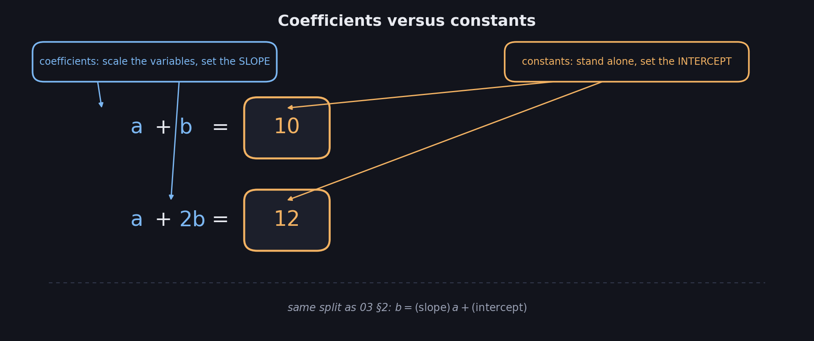
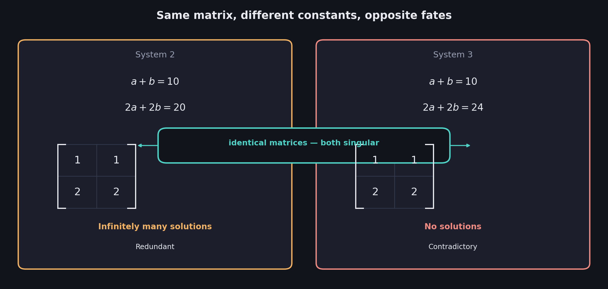
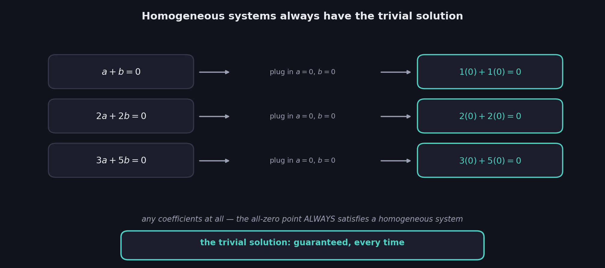
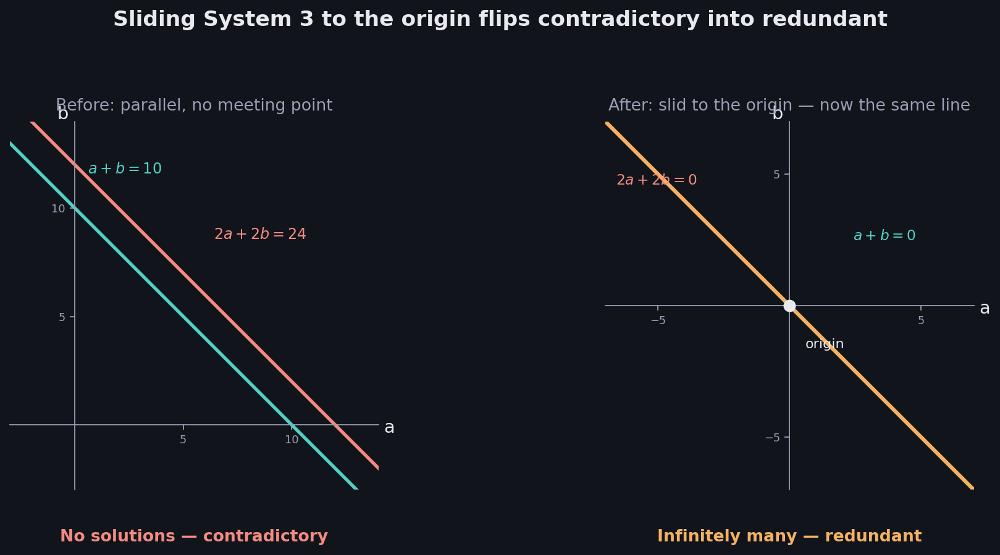
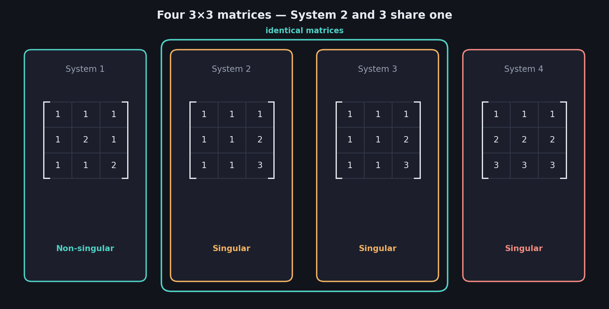

# What You Should Know About Singular vs Non-Singular Matrices

> **Prerequisites:** singular and non-singular are defined for sentences in 01 and for equations in 02. Reading slope and intercept off an equation is in 03 §2 — that skill does almost all the work in this file.
>
> **New in this file:** the word **matrix**, used formally for the first time — and the discovery of exactly which numbers in a system control singularity, and which don't.

Every linear system is built from two different kinds of numbers: the ones multiplying the variables, and the ones sitting alone on the right. This file asks a sharp question — does singularity depend on both, or only one? — and the answer turns out to be so clean that it deserves a name of its own: the **matrix**.

These notes cover: separating coefficients from constants, what a matrix is, why a system's singularity is really its matrix's singularity, what happens when two different systems share a matrix, homogeneous systems and the solution that is always free, and the geometric picture — sliding a system to the origin — that ties the whole story together.

---

# 1. Two kinds of numbers in a system

Look at System 1 from 02:

$$
a+b=10 \qquad\qquad a+2b=12
$$

Every number in it plays one of two roles.

**Coefficients** — the numbers multiplying $a$ and $b$: $1,1$ in the first equation, $1,2$ in the second.

**Constants** — the number alone on the right of each equation: $10$ and $12$.

$$
\boxed{\text{Coefficients scale the variables. Constants stand alone on the right.}}
$$

From 03 §2, an equation rewritten as $b=(\text{slope})\,a+(\text{intercept})$ splits along exactly this line: the slope comes from the coefficients, the intercept from the constant. That single fact is about to explain everything in this file.

**The question:** singularity is about whether a system's lines cross, coincide, or run parallel. Position on the page involves both slope and intercept — so does singularity need both kinds of numbers, or just one?

---

# 2. The matrix: coefficients only

Take a system and keep **only the coefficients**, arranged in a grid — one row per equation, one column per variable, dropped straight into a rectangle of brackets:

$$
\boxed{\text{Matrix} = \text{the grid of coefficients alone, with the variables and constants stripped away}}
$$

**System 1:** $a+b=10,\ \ a+2b=12$

| | |
|---|---|
| 1 | 1 |
| 1 | 2 |

**System 2:** $a+b=10,\ \ 2a+2b=20$

| | |
|---|---|
| 1 | 1 |
| 2 | 2 |

Row 1 always records the first equation's coefficients, in the same variable order every time; row 2 records the second equation's. Nothing about *which* letters were used survives — a matrix does not know whether you called your variables $a,b$ or apples and bananas. Only the pattern of numbers remains.

---

# 3. A system's singularity is its matrix's singularity

Here is where 03's slope-and-intercept split pays off.

Whether two lines **cross, coincide, or run parallel** depends only on whether their **slopes** match. And slope, from 03 §2, comes entirely from the coefficients. The constant only moves a line's **intercept** — it slides the line sideways without ever tilting it.

$$
\boxed{\text{Coefficients decide the SLOPE (orientation). Constants decide the INTERCEPT (position).}}
$$

Crossing-versus-parallel is a question about orientation alone. So:

$$
\boxed{\text{A system is singular} \iff \text{its matrix is singular}}
$$

Check it directly. System 1's matrix — rows $[1,1]$ and $[1,2]$ — has rows pointing in different directions (slopes $-1$ and $-0.5$, from 03), so its lines must cross: **non-singular**, matching 02's unique solution $(8,2)$.

System 2's matrix — rows $[1,1]$ and $[2,2]$ — has a second row that is just the first row doubled — same direction, same slope $-1$. The lines cannot cross at a single point: **singular**, matching 02's infinitely many solutions.

$$
\boxed{\text{Non-singular system} \iff \text{Non-singular matrix} \qquad \text{Singular system} \iff \text{Singular matrix}}
$$

"Singular" was defined for systems back in 01. It now has a home one level deeper — in the matrix — and the system simply inherits the label.

---

# 4. Same matrix, different constants

If singularity lives in the matrix, what's left for the constants to do? Watch closely.

**System 2:** $a+b=10,\ \ 2a+2b=20$

**System 3:** $a+b=10,\ \ 2a+2b=24$

Strip both down to matrices:

| System 2 | | System 3 | |
|---|---|---|---|
| 1 | 1 | 1 | 1 |
| 2 | 2 | 2 | 2 |

**The same matrix.** Only the constant on the second line changed — $20$ versus $24$ — yet from 02 §5, System 2 has **infinitely many** solutions and System 3 has **none**.

| | System 2 | System 3 |
|---|---|---|
| Equations | $a+b=10,\ 2a+2b=20$ | $a+b=10,\ 2a+2b=24$ |
| Matrix | rows $[1,1],[2,2]$ | rows $[1,1],[2,2]$ — identical |
| Constants | $10,\ 20$ | $10,\ 24$ |
| Solutions | Infinitely many | None |
| Verdict | Redundant | Contradictory |
| Both | **Singular** | **Singular** |

$$
\boxed{\text{The matrix decides IF a system is singular. The constants decide WHICH KIND of singular.}}
$$

Geometrically: both systems draw the exact same **direction** of line twice (same slope, from the shared matrix). System 2's second line happens to land in the *identical position* as the first — same intercept — so the two copies coincide entirely. System 3's second line is shifted to a different intercept, so the two parallel lines never touch. Same orientation, different placement, opposite fates — and both fates are singular.

## The same fact with three variables

This is not a two-variable curiosity. Recall Systems 2 and 3 from 02 §7:

$$
\text{System 2:}\ \ a+b+c=10,\ \ a+b+2c=15,\ \ a+b+3c=20
$$

$$
\text{System 3:}\ \ a+b+c=10,\ \ a+b+2c=15,\ \ a+b+3c=18
$$

| | | |
|---|---|---|
| 1 | 1 | 1 |
| 1 | 1 | 2 |
| 1 | 1 | 3 |

Identical matrix for both — only the final constant differs ($20$ versus $18$). System 2 was redundant with infinitely many solutions; System 3 was contradictory with none. Same matrix, opposite outcomes, both singular.

## The most common mistake

Assuming that changing the constants could rescue a singular system into a non-singular one, or break a non-singular one. It cannot. **No adjustment of the constants ever changes whether a system is singular** — only the coefficients can do that. Constants can turn a redundant system into a contradictory one, or the reverse, but singular stays singular and non-singular stays non-singular no matter what sits on the right-hand side.

$$
\boxed{\text{Constants can change redundant} \leftrightarrow \text{contradictory. They can NEVER change singular} \leftrightarrow \text{non-singular.}}
$$

---

# 5. Homogeneous systems and the solution that is always free

A system whose constants are **all zero** has a special name:

$$
\boxed{\text{Homogeneous system} = \text{every constant on the right equals } 0}
$$

Homogeneous systems have a remarkable property. Plug in **zero for every variable**:

$$
1(0)+1(0)=0 \quad\checkmark \qquad\qquad 2(0)+2(0)=0 \quad\checkmark
$$

Every equation reads $0=0$ — true no matter what the coefficients are. So:

$$
\boxed{\text{The all-zero point is ALWAYS a solution of a homogeneous system}}
$$

This is called the **trivial solution**, and no homogeneous system can ever be without it.

## Why this rules out "no solutions"

A system with zero solutions — contradictory — is now impossible the moment every constant is zero, because the trivial solution is sitting right there, guaranteed. That collapses the usual three-way outcome of 02 §5 down to two for homogeneous systems:

$$
\boxed{\text{A homogeneous system has EITHER exactly the trivial solution (non-singular), OR infinitely many (singular)}}
$$

Never none. "Contradictory" simply is not on the menu once the constants vanish.

---

# 6. The geometric picture: sliding to the origin

Section 5 was pure algebra. Here is why it's also completely visible.

Setting every constant to zero forces every intercept to zero — which means **every line and plane in the system is slid until it passes through the origin**. Nothing about slope changes; from §3, slope was never the constants' business to begin with. Only position moves.

Watch what this does to System 3, the contradictory pair of parallel lines from 02 §4:

**Before ($a+b=10$, $2a+2b=24$):** two parallel lines, same slope $-1$, different intercepts ($10$ and $12$, after dividing the second equation by 2). They never meet. No solutions.

**After ($a+b=0$, $2a+2b=0$):** slide both lines to pass through the origin. They still share the same slope $-1$ — the matrix never changed, so it couldn't. But now there is no room left for them to be offset: two parallel lines both anchored at the origin are not just similar, they are **the same line**.

$$
\boxed{\text{Two PARALLEL lines through the origin must coincide — there is no room to offset them}}
$$

| | Before (original constants) | After (zeroed) |
|---|---|---|
| System 1 (non-singular matrix) | Unique solution $(8,2)$ | Unique solution — the origin |
| System 2 (singular matrix) | Infinitely many | Still infinitely many |
| System 3 (singular matrix, same as System 2) | **None** — contradictory | **Infinitely many** — redundant |

## Why this is not a coincidence

Put §3, §4, and §5 together and the flip in System 3 stops being a surprise and becomes a forced conclusion:

- System 3's matrix was already singular (§3) — and constants never change that (§4's warning) — so it is still singular after zeroing.
- A homogeneous system can never be contradictory (§5).
- Singular but not contradictory leaves exactly one option: **redundant**.

$$
\boxed{\text{Zeroing preserves singular/non-singular, and forbids "no solutions" — so a contradictory system MUST turn redundant}}
$$

This is also why 03's plane pictures for 3 variables could legally be drawn with every constant set to $0$: it changes nothing about which systems are singular, only shifts everything into the tidiest possible position — through the origin, where it's easiest to see.

---

# 7. The 3×3 matrices, side by side

Applying this to all four systems of 02 §7 makes a clean table. Each matrix comes from reading off the coefficients — the constants are irrelevant to this column, exactly as §3 proved:

| System | Equations (coefficients only matter here) | Matrix rows | Verdict |
|---|---|---|---|
| 1 | $a+b+c,\ \ a+2b+c,\ \ a+b+2c$ | $[1,1,1],[1,2,1],[1,1,2]$ | **Non-singular** |
| 2 | $a+b+c,\ \ a+b+2c,\ \ a+b+3c$ | $[1,1,1],[1,1,2],[1,1,3]$ | Singular |
| 3 | $a+b+c,\ \ a+b+2c,\ \ a+b+3c$ | $[1,1,1],[1,1,2],[1,1,3]$ — identical to System 2 | Singular |
| 4 | $a+b+c,\ \ 2a+2b+2c,\ \ 3a+3b+3c$ | $[1,1,1],[2,2,2],[3,3,3]$ | Singular |

Systems 2 and 3 are listed with literally the same matrix on purpose — it is the clearest possible demonstration that the matrix, not the constants, is what "singular" describes.

---

# Most Important Definitions and Distinctions to Remember

## Coefficients versus constants

$$
\boxed{\text{Coefficients multiply variables and set slope. Constants stand alone and set intercept.}}
$$

---

## Matrix

$$
\boxed{\text{The grid of a system's coefficients — one row per equation, one column per variable}}
$$

Variable names and constants are both stripped away.

---

## Singularity lives in the matrix

$$
\boxed{\text{System singular} \iff \text{Matrix singular}}
$$

Constants can never flip this. They can only decide, among singular systems, redundant versus contradictory.

---

## Homogeneous systems

$$
\boxed{\text{All constants} = 0 \;\Rightarrow\; \text{the all-zero point is always a solution}}
$$

$$
\boxed{\text{A homogeneous system is never contradictory} \text{ — only non-singular (trivial solution alone) or singular (infinitely many)}}
$$

---

# Main Rules to Put in Your Notebook

$$
\boxed{\text{Matrix} = \text{coefficients only, arranged in rows (equations) and columns (variables)}}
$$

$$
\boxed{\text{Slope} \leftarrow \text{coefficients} \qquad \text{Intercept} \leftarrow \text{constants}}
$$

$$
\boxed{\text{System singular} \iff \text{Matrix singular}}
$$

$$
\boxed{\text{Homogeneous (all constants 0)} \Rightarrow \text{trivial solution always exists} \Rightarrow \text{never contradictory}}
$$

| If you see | Conclude |
|---|---|
| Two systems share a matrix, different constants | Same singular/non-singular status; possibly different solution counts if singular |
| Every constant is zero | No solutions is impossible; only unique-at-origin or infinitely-many |
| A contradictory system with its constants zeroed | It must become redundant — singular is preserved, contradictory is forbidden |

The biggest idea is:

**A system carries two kinds of numbers, but only one of them decides singularity: the coefficients, collected into a matrix. Constants can never turn a singular system non-singular or the reverse — their entire power is to choose, among already-singular systems, whether the result is redundant or contradictory. Set every constant to zero and that choice disappears too, because the trivial all-zero solution is then guaranteed to exist, which makes "no solutions" impossible — so a contradictory system, forced to keep its singularity but forbidden from being contradictory, has nowhere left to go but redundant.**

---

# Where This Goes Next

| Idea from this file | Where it is used |
|---|---|
| The matrix as a grid of coefficients | **05 — Linear Dependence and Independence**: naming exactly *why* a matrix is singular, by looking at its rows |
| "Singular iff matrix singular," without yet computing anything | **06 — The Determinant**: a single number, calculated from the matrix, that tests this directly |
| Homogeneous systems and the trivial solution | Null space, a later week — promised on the course's opening slide |
| Same matrix, different constants | Solving a system for several right-hand sides at once, a later topic |
| Sliding a system to the origin without changing its matrix | Row reduction, a later week |
