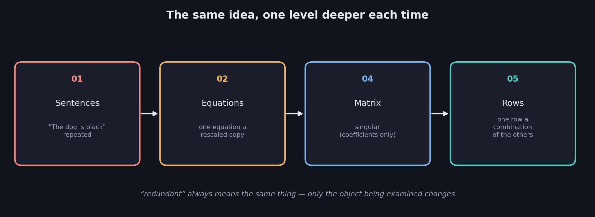
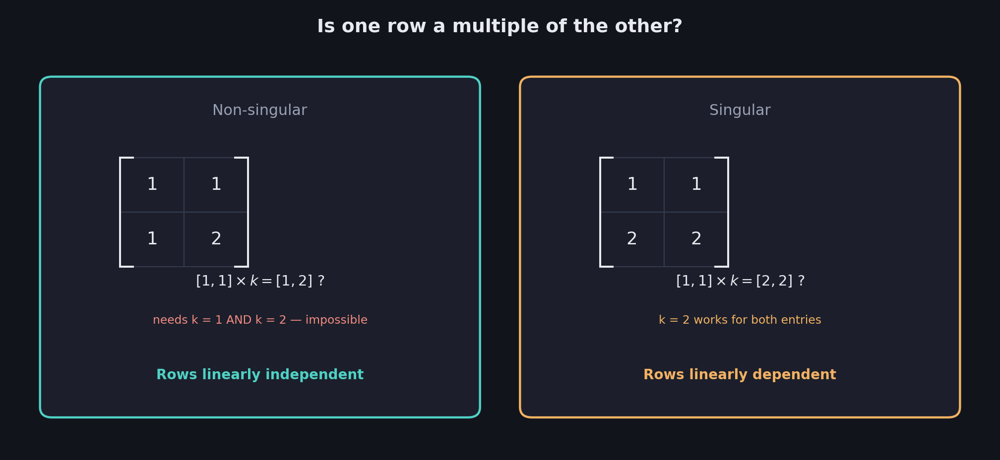
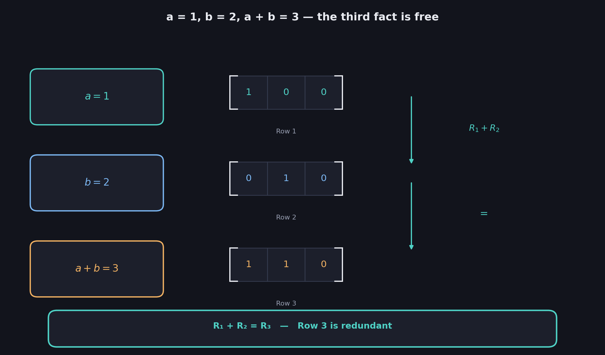
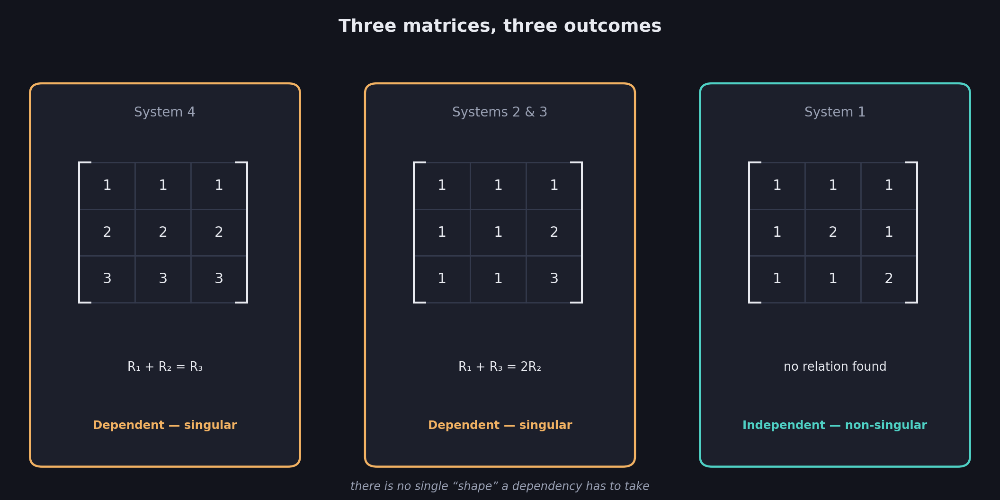
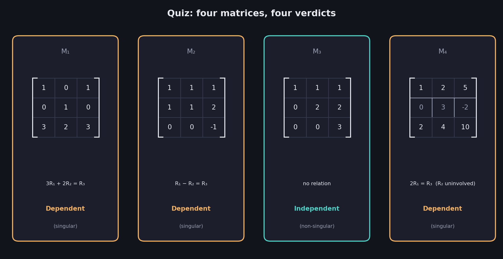

# What You Should Know About Linear Dependence and Independence

> **Prerequisites:** singular systems inherit their singularity from their matrix — that's the whole point of 04. Redundant sentences and equations are in 01 and 02.
>
> **What this file adds:** *why* a matrix ends up singular. The answer lives in its rows.

04 proved that singularity is a property of the matrix — the coefficients — and nothing else. But that just relocates the mystery: what, exactly, makes a matrix singular? This file opens the matrix up and looks at its rows. The answer turns out to be the exact same idea as 01's "redundant," just moved one level deeper.

These notes cover: why redundancy must show up in the rows of the matrix, the simplest test for two rows, what changes once there are three or more rows, two worked patterns of dependence, a full quiz across four matrices, and the vocabulary — **linearly dependent** and **linearly independent** — that names it all.

---

# 1. Redundancy, one level deeper

Trace the idea across the files so far. In 01, a system was **redundant** when a sentence repeated information the others already carried. In 04, a system's singularity was shown to depend on its **matrix alone** — the coefficients, never the constants.

Put those two facts together, and a question falls out immediately: if a redundant system's redundancy can't be hiding in the constants, it must be sitting somewhere in the coefficients. Where, exactly?

$$
\boxed{\text{Redundancy shows up as one ROW of the matrix repeating information the other rows already carry}}
$$

This phenomenon has a name:

$$
\boxed{\text{Linear dependence} = \text{one row can be built from the others}}
$$

$$
\boxed{\text{Linear independence} = \text{no row can be built from the others — every row is genuinely new}}
$$

---

# 2. The simplest test: one row a multiple of another

With just two rows, "built from the others" has the simplest possible meaning: one row is the other, **scaled**.

Recall the two matrices from 04:

**Non-singular matrix:** rows $[1,1]$ and $[1,2]$.

**Singular matrix:** rows $[1,1]$ and $[2,2]$.

Ask the same question of each: is row 2 equal to row 1 times some single number $k$?

$$
[1,1]\times 2 = [2,2] \qquad\checkmark
$$

For the singular matrix, $k=2$ works on **both** entries at once. The rows point in the same direction — one is a scaled copy of the other.

$$
[1,1]\times k = [1,2] \;\Rightarrow\; k=1 \text{ (first entry)} \ \text{ and }\ k=2 \text{ (second entry)}
$$

For the non-singular matrix, no single $k$ can satisfy both entries simultaneously — $k$ would have to be $1$ and $2$ at once. No such multiple exists.

$$
\boxed{\text{Two rows are linearly dependent} \iff \text{one is a scalar multiple of the other}}
$$

---

# 3. Rows as combinations: scaling past "multiple"

"One row is a multiple of another" is the whole story for two rows. With three or more, dependence can look different — a row can be built by **combining several others**, not just scaling one.

Here is the simplest possible illustration. Consider three facts:

$$
a=1 \qquad b=2 \qquad a+b=3
$$

Written as coefficient rows (columns for $a$, $b$, $c$, even though $c$ never appears):

$$
R_1=[1,0,0] \qquad R_2=[0,1,0] \qquad R_3=[1,1,0]
$$

Add the first two rows:

$$
R_1+R_2 = [1,0,0]+[0,1,0] = [1,1,0] = R_3
$$

$$
\boxed{R_1+R_2=R_3}
$$

This is obvious in plain English — if you already know $a=1$ and $b=2$, being told "$a+b=3$" adds nothing — and the row arithmetic says exactly the same thing. **Row 3 depends on rows 1 and 2.** The matrix is singular.

## The general definition

$$
\boxed{\text{A linear combination of rows} = \text{any sum of the rows, each first scaled by some number}}
$$

$$
c_1 R_1 + c_2 R_2 + c_3 R_3 + \cdots \qquad \text{for any numbers } c_1,c_2,c_3,\ldots
$$

$$
\boxed{\text{Rows are linearly DEPENDENT if some row equals a linear combination of the others}}
$$

$$
\boxed{\text{Rows are linearly INDEPENDENT if no row can be written as a combination of the rest}}
$$

"Scalar multiple" (§2) is just the two-row special case of this — a combination with only one other row to combine.

**A textbook phrasing worth recognizing:** many courses state this the other way around — rows are dependent if $c_1R_1+c_2R_2+\cdots=\mathbf{0}$ (the all-zero row) for some numbers $c_1,c_2,\ldots$ **not all zero**. This is the same statement rearranged: "row 3 equals a combination of the others" and "row 3 minus that same combination equals zero" say identical things.

---

# 4. Two more patterns: addition and averaging

Apply this to the systems already familiar from 02 and 04.

## Pattern 1: straightforward addition

**System 4:** $a+b+c=0,\ \ 2a+2b+2c=0,\ \ 3a+3b+3c=0$

$$
R_1=[1,1,1] \qquad R_2=[2,2,2] \qquad R_3=[3,3,3]
$$

$$
R_1+R_2=[1,1,1]+[2,2,2]=[3,3,3]=R_3
$$

Dependent, singular — matching 04's verdict, now with the mechanism made explicit.

## Pattern 2: averaging

**Systems 2 and 3's shared matrix:** $a+b+c=0,\ \ a+b+2c=0,\ \ a+b+3c=0$

$$
R_1=[1,1,1] \qquad R_2=[1,1,2] \qquad R_3=[1,1,3]
$$

Adding the outer rows: $R_1+R_3=[1,1,1]+[1,1,3]=[2,2,4]$. Halve it:

$$
\frac{R_1+R_3}{2} = [1,1,2] = R_2 \qquad\text{equivalently}\qquad R_1+R_3=2R_2
$$

$R_2$ is the **average** of $R_1$ and $R_3$ — a genuine linear combination ($\frac12 R_1 + \frac12 R_3$), not a simple multiple of a single other row. Still dependent, still singular.

## For contrast: no pattern at all

**System 1:** $a+b+c=0,\ \ a+2b+c=0,\ \ a+b+2c=0$

$$
R_1=[1,1,1] \qquad R_2=[1,2,1] \qquad R_3=[1,1,2]
$$

No combination of any two of these rows produces the third — try matching $R_3$ to $c_1R_1+c_2R_2$ and the first and third entries alone already force $c_1+c_2$ to equal both $1$ and $2$, which is impossible. **No relations between rows.** Independent, non-singular.

| System | Rows | Relationship found | Verdict |
|---|---|---|---|
| 4 | $[1,1,1],[2,2,2],[3,3,3]$ | $R_1+R_2=R_3$ | Dependent — singular |
| 2 & 3 (shared) | $[1,1,1],[1,1,2],[1,1,3]$ | $R_1+R_3=2R_2$ | Dependent — singular |
| 1 | $[1,1,1],[1,2,1],[1,1,2]$ | None | **Independent — non-singular** |

$$
\boxed{\text{There is no single "shape" a dependency has to take — only whether SOME combination reproduces a row}}
$$

---

# 5. Worked example: the full quiz

**Problem.** For each matrix, determine whether the rows are linearly dependent or independent.

**$M_1$**

| | | |
|---|---|---|
| 1 | 0 | 1 |
| 0 | 1 | 0 |
| 3 | 2 | 3 |

**$M_2$**

| | | |
|---|---|---|
| 1 | 1 | 1 |
| 1 | 1 | 2 |
| 0 | 0 | -1 |

**$M_3$**

| | | |
|---|---|---|
| 1 | 1 | 1 |
| 0 | 2 | 2 |
| 0 | 0 | 3 |

**$M_4$**

| | | |
|---|---|---|
| 1 | 2 | 5 |
| 0 | 3 | -2 |
| 2 | 4 | 10 |

## $M_1$: a two-row combination

Try $3R_1+2R_2$:

$$
3[1,0,1]+2[0,1,0] = [3,0,3]+[0,2,0] = [3,2,3] = R_3
$$

$$
\boxed{3R_1+2R_2=R_3}
$$

**Dependent — singular.**

## $M_2$: a subtraction

$$
R_1-R_2 = [1,1,1]-[1,1,2] = [0,0,-1] = R_3
$$

**Dependent — singular.**

## $M_3$: genuinely no relation

$R_1=[1,1,1]$, $R_2=[0,2,2]$, $R_3=[0,0,3]$. Notice the staircase of leading zeros — this matrix is **triangular** (everything below the diagonal is zero). Try to build $R_3=[0,0,3]$ from $R_1$ and $R_2$: matching the first entry forces $c_1(1)+c_2(0)=0$, so $c_1=0$; matching the second forces $c_2(2)=0$, so $c_2=0$; but then the combination is $[0,0,0]$, which can never reach $[0,0,3]$.

**No relation — independent, non-singular.** (This triangular shape is exactly the kind of matrix 06's shortcut will exploit.)

## $M_4$: only two of the three rows are involved

$$
2R_1 = 2[1,2,5]=[2,4,10]=R_3
$$

**Dependent — singular.** Notice what $R_2=[0,3,-2]$ is doing here: **nothing**. The dependency is entirely between rows 1 and 3; row 2 could be almost anything and the matrix would still be singular.

$$
\boxed{\text{Only ONE dependency, anywhere among the rows, is enough to make the whole matrix singular}}
$$

The uninvolved rows don't get to vote the matrix back to non-singular. This mirrors 01 exactly: a redundant sentence sinks the whole system even if every other sentence is perfectly informative.

| Matrix | Relationship | Verdict |
|---|---|---|
| $M_1$ | $3R_1+2R_2=R_3$ | Dependent (singular) |
| $M_2$ | $R_1-R_2=R_3$ | Dependent (singular) |
| $M_3$ | None | **Independent (non-singular)** |
| $M_4$ | $2R_1=R_3$ ($R_2$ uninvolved) | Dependent (singular) |

---

# 6. The vocabulary, and the dictionary

"Linearly dependent" and "linearly independent" describe **rows**. They plug into every dictionary built so far:

| Sentences (01) | Equations (02) | Matrix (04) | Rows (05) |
|---|---|---|---|
| Complete | Unique solution | Non-singular | **Linearly independent** |
| Redundant | Infinitely many | Singular | **Linearly dependent** |

$$
\boxed{\text{Matrix singular} \iff \text{its rows are linearly dependent}}
$$

$$
\boxed{\text{Matrix non-singular} \iff \text{its rows are linearly independent}}
$$

## The most common mistake

Checking only whether one row is a **multiple** of another and stopping there. That test is complete for two rows, but for three or more it catches only part of the story — §4's averaging example ($R_1+R_3=2R_2$) is a real dependency that no single "row times a number" comparison would ever find. The full test is whether **any** linear combination of some rows reproduces another — multiples are just the simplest case of that.

$$
\boxed{\text{"Is one row a multiple of another?" is not the full test once there are 3+ rows — check ALL combinations}}
$$

---

# Most Important Definitions and Distinctions to Remember

## Linear combination

$$
\boxed{c_1R_1+c_2R_2+c_3R_3+\cdots \quad \text{for any numbers } c_1,c_2,c_3,\ldots}
$$

## Linear dependence and independence

$$
\boxed{\text{Dependent: some row} = \text{a combination of the others} \qquad \text{Independent: no row can be}}
$$

## The two-row special case

$$
\boxed{\text{With only 2 rows, dependent simply means one row is a scalar multiple of the other}}
$$

## One dependency is enough

$$
\boxed{\text{A single dependent row makes the WHOLE matrix singular, no matter how independent the rest look}}
$$

---

# Main Rules to Put in Your Notebook

$$
\boxed{\text{Rows linearly dependent} \iff \text{matrix singular}}
$$

$$
\boxed{\text{Rows linearly independent} \iff \text{matrix non-singular}}
$$

| Rows | Test | If it matches |
|---|---|---|
| 2 rows | Is $R_2 = k\,R_1$ for some number $k$? | Dependent |
| 3+ rows | Is any row $= c_1R_1+c_2R_2+\cdots$ (a combination of some others)? | Dependent |
| Any count | No such $k$ or combination exists anywhere | Independent |

The biggest idea is:

**Redundancy has to live somewhere, and once 04 proved it can't be in the constants, it has to be in the rows of the matrix. Linear dependence is that idea made precise: a matrix is singular exactly when one of its rows can be rebuilt from the others, whether by a simple multiple or by a more general combination like a sum or an average. It only takes one such relationship anywhere among the rows to make the entire matrix singular — the other rows don't get a vote.**

---

# Where This Goes Next

| Idea from this file | Where it is used |
|---|---|
| Checking combinations by hand, row by row | **06 — The Determinant**: a single calculation that tests dependence automatically |
| Triangular matrices ($M_3$) having an obviously nonzero determinant | **06**: the diagonal-product shortcut |
| "Only one dependency needed, anywhere" | **06**: why the determinant is exactly zero in that case, not just small |
| Linear combinations of rows | Row reduction and rank, later weeks |
| Rows that are independent spanning all the "directions" a matrix can reach | Column space and rank, later weeks |
