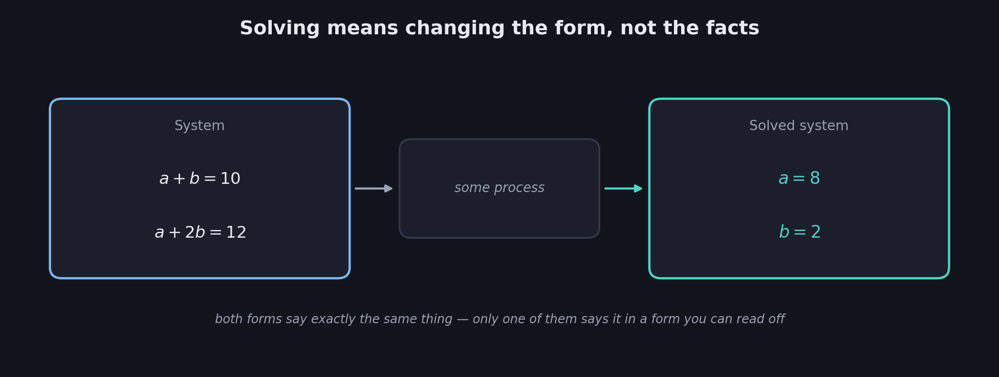
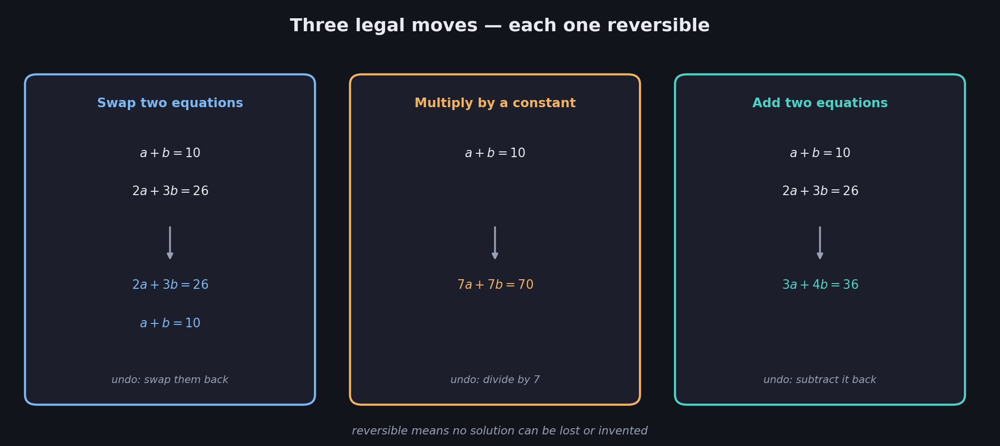
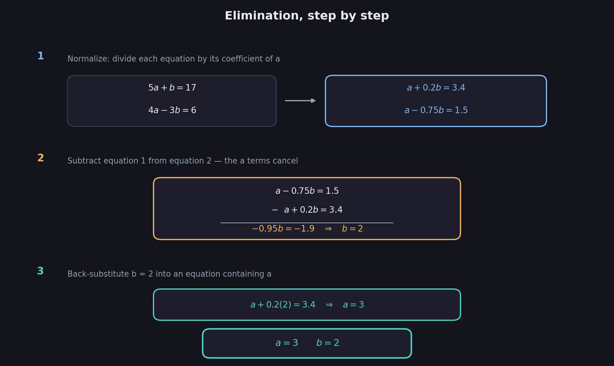
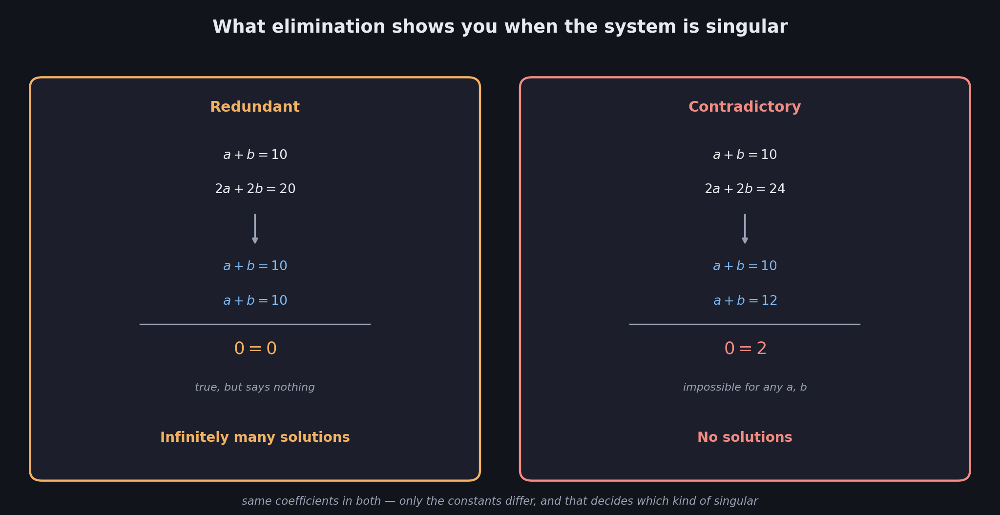
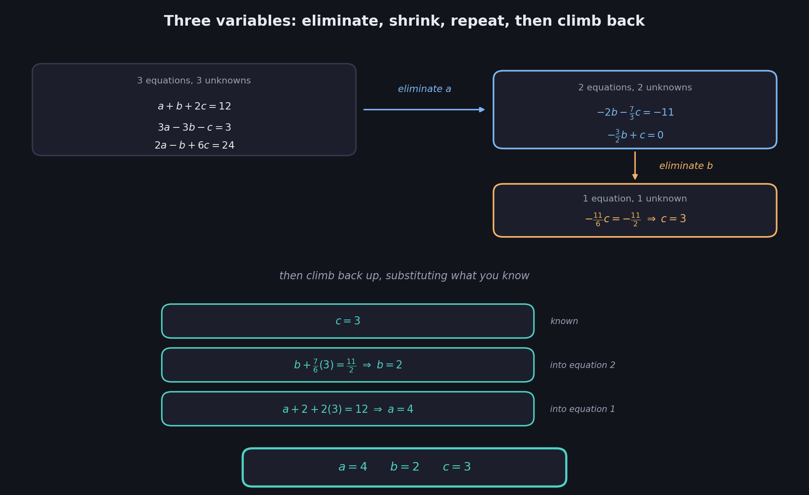

# What You Should Know About Solving Systems by Elimination

> **This file opens Week 2.** Week 1 (files 01–06) was about *diagnosing* systems: telling singular from non-singular, and knowing in advance how many solutions to expect. This file is about actually **getting the numbers out**.
>
> **Prerequisites:** the three outcomes and what a solution is are in 02. Singular vs non-singular is in 01, 02, and 04. Nothing from 05 or 06 is needed yet.

Week 1 could tell you a system had exactly one solution without ever finding it. That's a real skill, but at some point you want the answer. **Elimination** is the method: a short list of legal moves on equations, applied in a fixed order, that strips a system down until each variable stands alone.

These notes cover: the three legal manipulations and why they're safe, the elimination method worked in full for two variables, what to do when a coefficient is zero, what elimination *looks like* when the system turns out to be singular, and the same method scaled up to three variables.

---

# 1. The goal: from a system to a solved system

Every system has two forms, and solving means getting from one to the other.

**The system** — what you're given:

$$
a+b=10 \qquad\qquad a+2b=12
$$

**The solved system** — what you want:

$$
a=8 \qquad\qquad b=2
$$

$$
\boxed{\text{Solving} = \text{transforming the system into a solved system}}
$$

Both forms say exactly the same thing about $a$ and $b$. The difference is that the second one says it in a form you can just *read*. Everything in this file is about the process in between.

## The apple-and-banana version

This is System 1 from 02, and it can be solved by pure reasoning: Day 2 buys one extra banana and costs \$2 more, so the banana costs \$2; then Day 1 forces the apple to \$8. That reasoning works, but it doesn't scale — it relies on noticing that the two days differ by exactly one item. **Elimination** is that same idea turned into a procedure that works every time.

---

# 2. Three legal manipulations

You are allowed to change the equations, as long as you don't change the **solution set**. Three moves qualify:

$$
\boxed{\text{1. Swap two equations} \qquad \text{2. Multiply an equation by a constant} \qquad \text{3. Add two equations}}
$$

## Multiplying by a constant

$$
a+b=10 \quad\xrightarrow{\ \times 7\ } \quad 7a+7b=70
$$

Every value of $a$ and $b$ satisfying the first also satisfies the second, and vice versa — this is just the "Day 2 is Day 1 doubled" observation from 02, now used deliberately as a tool instead of spotted as a defect.

**One restriction:** the constant must not be zero. Multiplying by $0$ turns any equation into $0=0$, which is true but says nothing — you'd have destroyed information rather than rewritten it.

## Adding two equations

$$
a+b=10
$$
$$
\underline{+\quad 2a+3b=26}
$$
$$
3a+4b=36
$$

Add left sides to left sides and right sides to right sides. If both original equations hold, the sum must hold too.

## Why these are safe

Each move is **reversible**. Multiplied by 7? Divide by 7 to get back. Added equation 1 to equation 2? Subtract it back. Swapped two equations? Swap them again.

$$
\boxed{\text{A move is safe if you can undo it — reversible moves cannot lose or invent solutions}}
$$

This is the entire justification, and it's worth holding onto: in 08 these same three moves reappear as **row operations** on a matrix, with a second justification via the determinant.

---

# 3. The elimination method, worked

$$
5a+b=17 \qquad\qquad 4a-3b=6
$$

The strategy has a name for a reason: **eliminate** one variable from one equation, so that equation contains only the other variable and can be solved on the spot.

## Step 1: divide each equation by its coefficient of $a$

$$
5a+b=17 \quad\xrightarrow{\ \div 5\ }\quad a+0.2b=3.4
$$

$$
4a-3b=6 \quad\xrightarrow{\ \div 4\ }\quad a-0.75b=1.5
$$

Now **both** equations start with a bare $a$. That's the whole point of this step — it sets up the subtraction.

## Step 2: subtract equation 1 from equation 2

$$
a-0.75b=1.5
$$
$$
\underline{-\quad a+0.2b=3.4}
$$
$$
0a-0.95b=-1.9
$$

The $a$ terms cancel exactly, because they were made identical in step 1. What's left has **one variable**:

$$
-0.95b=-1.9 \quad\Longrightarrow\quad b=2
$$

## Step 3: back-substitute

Put $b=2$ into either equation containing $a$:

$$
a+0.2(2)=3.4 \quad\Longrightarrow\quad a+0.4=3.4 \quad\Longrightarrow\quad a=3
$$

$$
\boxed{a=3 \qquad b=2}
$$

Check both originals: $5(3)+2=17$ ✓ and $4(3)-3(2)=6$ ✓.

$$
\boxed{\text{Normalize} \rightarrow \text{subtract to eliminate} \rightarrow \text{solve} \rightarrow \text{back-substitute}}
$$

---

# 4. When a coefficient is zero

Step 1 says "divide by the coefficient of $a$." What if that coefficient is $0$?

$$
5a+b=17 \qquad\qquad 3b=6
$$

Dividing the second equation by $0$ is undefined — the method appears to break.

**But look at what you actually have.** The second equation already contains no $a$ at all. Elimination's entire goal is to *produce* an equation without $a$ — and one is already sitting there. There's nothing to eliminate:

$$
3b=6 \quad\Longrightarrow\quad b=2
$$

Then back-substitute as usual: $a+0.2(2)=3.4$, so $a=3$.

$$
\boxed{\text{A zero coefficient is not a failure — it means the elimination step is already done}}
$$

This is worth internalizing now, because in 10 this same situation reappears as a matrix row that already starts with a zero, and the same reasoning applies there.

---

# 5. What elimination does to a singular system

Week 1 said singular systems have either infinitely many solutions or none. Run elimination on each and watch what actually appears on the page.

## The redundant case

$$
a+b=10 \qquad\qquad 2a+2b=20
$$

Normalize both (divide the second by 2):

$$
a+b=10 \qquad\qquad a+b=10
$$

The two equations are now **identical**. Subtract:

$$
a+b=10
$$
$$
\underline{-\quad a+b=10}
$$
$$
\boxed{0=0}
$$

Not a contradiction — $0=0$ is perfectly true. But it's also perfectly useless: it constrains nothing. The second equation has dissolved, leaving one real equation for two unknowns:

$$
a+b=10 \qquad\text{and nothing else}
$$

## Degrees of freedom

With one equation and two unknowns, you can **choose** one value freely and the other follows. Let $a=x$ for any $x$ you like; then $b=10-x$:

$$
(0,10) \qquad (3,7) \qquad (8,2) \qquad (-5,15) \qquad \ldots
$$

$$
\boxed{\text{Degree of freedom} = \text{a variable you may choose freely, with the rest determined by it}}
$$

One free choice means **one** degree of freedom. This is what "infinitely many solutions" looks like from the inside: not chaos, but a solution set with a shape — here, exactly the line from 03.

## The contradictory case

$$
a+b=10 \qquad\qquad 2a+2b=24
$$

Normalize (divide the second by 2):

$$
a+b=10 \qquad\qquad a+b=12
$$

Subtract:

$$
a+b=12
$$
$$
\underline{-\quad a+b=10}
$$
$$
\boxed{0=2}
$$

**A contradiction.** $0$ is not $2$, under any values of $a$ and $b$ whatsoever. The system has no solutions.

## The tell

$$
\boxed{0=0 \;\Rightarrow\; \text{redundant, infinitely many solutions} \qquad 0=\text{nonzero} \;\Rightarrow\; \text{contradictory, no solutions}}
$$

Both singular cases produce an equation with **all variables gone**. What's left on the right-hand side is the entire difference between the two.

Notice the connection back to 04: the two systems here have the *same coefficients* and differ only in a constant. That's exactly why both are singular, and why only the right-hand side of the final line differs.

---

# 6. Three variables

Nothing about elimination is limited to two variables. It just runs longer.

$$
a+b+2c=12 \qquad 3a-3b-c=3 \qquad 2a-b+6c=24
$$

## Round 1: eliminate $a$

Divide each equation by its coefficient of $a$ ($1$, $3$, $2$):

$$
a+b+2c=12 \qquad a-b-\tfrac{1}{3}c=1 \qquad a-\tfrac{1}{2}b+3c=12
$$

Subtract the first from each of the others:

$$
-2b-\tfrac{7}{3}c=-11 \qquad\qquad -\tfrac{3}{2}b+c=0
$$

$a$ is gone from both. **Two equations, two unknowns** — a smaller version of the same problem.

## Round 2: eliminate $b$

Divide each by its coefficient of $b$:

$$
b+\tfrac{7}{6}c=\tfrac{11}{2} \qquad\qquad b-\tfrac{2}{3}c=0
$$

Subtract:

$$
-\tfrac{11}{6}c=-\tfrac{11}{2} \quad\Longrightarrow\quad c=3
$$

## Round 3: back-substitute upward

$$
b+\tfrac{7}{6}(3)=\tfrac{11}{2} \;\Longrightarrow\; b+\tfrac{7}{2}=\tfrac{11}{2} \;\Longrightarrow\; b=2
$$

$$
a+2+2(3)=12 \;\Longrightarrow\; a+8=12 \;\Longrightarrow\; a=4
$$

$$
\boxed{a=4 \qquad b=2 \qquad c=3}
$$

Check the original first equation: $4+2+2(3)=12$ ✓.

## The pattern

$$
\boxed{\text{Each round eliminates one variable and shrinks the system by one equation}}
$$

Elimination is **recursive**: three variables become a two-variable problem, which becomes a one-variable problem. Then you climb back up, substituting known values into the equations above.

The fractions are ugly — $\tfrac{7}{6}$ and $\tfrac{11}{2}$ carry no meaning, they're just what the arithmetic produced. That ugliness is a hint that this bookkeeping should be done more compactly, which is exactly the motivation for 08: strip away the letters and track only the numbers.

---

# Most Important Definitions and Distinctions to Remember

## The three legal manipulations

$$
\boxed{\text{Swap two equations} \qquad \text{Multiply an equation by a nonzero constant} \qquad \text{Add two equations}}
$$

Safe because each is reversible — reversible moves cannot lose or invent solutions.

---

## The elimination method

$$
\boxed{\text{Normalize} \rightarrow \text{subtract to eliminate a variable} \rightarrow \text{solve} \rightarrow \text{back-substitute}}
$$

---

## Zero coefficients

$$
\boxed{\text{A zero coefficient means that elimination step is already done — not that the method failed}}
$$

---

## Reading the outcome

| Final line | Meaning | Verdict |
|---|---|---|
| A real value, e.g. $b=2$ | Each variable pinned down | Non-singular, unique solution |
| $0=0$ | An equation dissolved; a variable is free | Singular, redundant, infinitely many |
| $0=\text{nonzero}$ | Impossible statement | Singular, contradictory, none |

---

## Degrees of freedom

$$
\boxed{\text{Degree of freedom} = \text{a variable you may choose freely, with the others determined by that choice}}
$$

Each $0=0$ that appears leaves one more degree of freedom in the solution set.

---

# Main Rules to Put in Your Notebook

| Step | Action |
|---|---|
| 1 | Divide each equation by its coefficient of the variable being eliminated |
| 2 | Subtract one equation from the others to cancel that variable |
| 3 | Repeat on the smaller system until one variable is alone |
| 4 | Solve it, then back-substitute upward through the earlier equations |

$$
\boxed{\text{Legal moves: swap, multiply by a nonzero constant, add}}
$$

$$
\boxed{0=0 \rightarrow \text{infinitely many} \qquad 0=\text{nonzero} \rightarrow \text{none}}
$$

$$
\boxed{\text{Each elimination round removes one variable and one equation}}
$$

The biggest idea is:

**Solving a system means transforming it into a solved system, using only moves that can be undone — swapping equations, scaling them, and adding them. Elimination applies those moves in a fixed order: make one variable's coefficients match, subtract to cancel it, and repeat until a single variable stands alone. Then climb back up. And when the system is singular, elimination doesn't fail — it announces the fact, ending in $0=0$ when a variable is left free, and in $0=\text{something}$ when the equations were never compatible at all.**

---

# Where This Goes Next

| Idea from this file | Where it is used |
|---|---|
| The three legal manipulations | **08 — Matrix Row Reduction**: the same three moves, applied to matrix rows |
| The ugly fraction bookkeeping | **08**: motivation for dropping the letters and tracking numbers only |
| A zero coefficient meaning "already eliminated" | **10 — Row Echelon Form**: a row that already starts with zero |
| $0=0$ rows and degrees of freedom | **09 — Rank of a Matrix**: counting how much real information survives |
| Normalize-subtract-repeat, done systematically | **10**: the staircase, and the name **Gaussian elimination** |
| Back-substituting upward | **11 — Reduced Row Echelon Form**: how to skip this step entirely |
