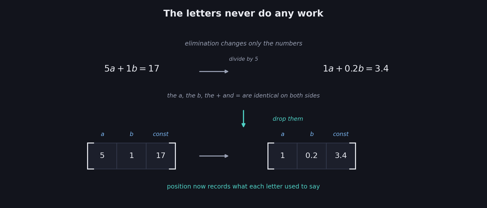
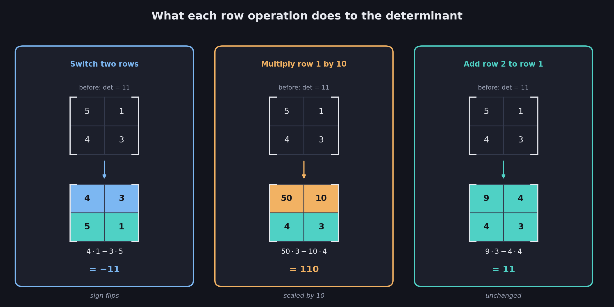
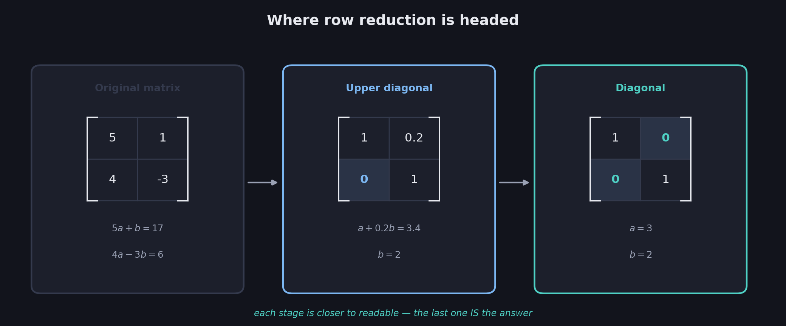

# What You Should Know About Matrix Row Reduction

> **Prerequisites:** the elimination method and its three legal moves are in 07. The matrix as a grid of coefficients is in 04. The determinant and its zero-means-singular rule are in 06.
>
> **What this file adds:** the same elimination process, done on a **matrix** instead of on equations — and a second, sharper reason why the moves are safe.

07 solved systems by manipulating equations, and the bookkeeping got ugly fast: fractions like $\tfrac{7}{6}$, repeated letters, plus signs and equals signs copied out on every line. None of those letters ever *did* anything. This file strips them away, leaving only the numbers that were doing the work — and then re-justifies every move using the determinant.

These notes cover: why the variable names are dead weight, how a system becomes a matrix, the three **row operations**, exactly what each one does to the determinant, why "preserves singularity" is the property that matters, and the vocabulary — **upper diagonal** and **diagonal** matrices — for where row reduction is heading.

---

# 1. The letters were never doing anything

Take the worked example from 07 §3 and look at what actually changed on each line:

$$
5a+b=17 \quad\longrightarrow\quad a+0.2b=3.4
$$

The $a$, the $b$, the $+$, the $=$ — all identical before and after. The only things that changed were $5,1,17$ becoming $1,0.2,3.4$.

$$
\boxed{\text{Every elimination step is arithmetic on the coefficients. The letters are along for the ride.}}
$$

So drop them. Keep the numbers in a grid where **position** records what the letter used to say: first column means "coefficient of $a$," second column means "coefficient of $b$," one row per equation.

This is exactly the **matrix** from 04 — but 04 only ever *looked* at a matrix to diagnose it. Here it becomes something you actively work on.

---

# 2. From system to matrix

$$
5a+b=17 \qquad\qquad 4a-3b=6
$$

Keeping only coefficients:

| | |
|---|---|
| 5 | 1 |
| 4 | -3 |

$$
\boxed{\text{One row per equation. One column per variable. Position replaces the variable's name.}}
$$

## What happened to the constants?

They're set aside for now. 04 proved singularity depends only on the coefficients, so the matrix alone carries everything needed to answer "is this system singular?" — which is the question this file and the next three are built around.

**But the constants still matter for *solving*.** When you want actual values rather than a diagnosis, they're carried along in an extra column, and the result is called an **augmented matrix**:

| | | |
|---|---|---|
| 5 | 1 | 17 |
| 4 | -3 | 6 |

The vertical bar usually drawn before the last column is just a reminder that it plays a different role. Every row operation in this file applies to the augmented matrix exactly as it does to the plain one — the extra column simply comes along for the ride.

---

# 3. The three row operations

07's three legal moves on equations become three **row operations** on a matrix. They are the same moves; only the notation changed.

$$
\boxed{\text{1. Switch two rows} \qquad \text{2. Multiply a row by a nonzero scalar} \qquad \text{3. Add one row to another}}
$$

07 justified these by **reversibility** — each can be undone, so no solutions are lost or invented. That argument still holds. But now there's a second, more precise justification available, because there's a number attached to every matrix that measures singularity: the **determinant** from 06.

The question worth asking of each operation is: *what exactly does it do to the determinant?*

The answers are more interesting than "nothing."

---

# 4. Operation 1: switching rows

Start with a matrix whose determinant is easy to check. Rows $[5,1]$ and $[4,3]$:

$$
\det = 5\cdot3 - 1\cdot4 = 15-4 = 11
$$

Now switch the two rows, giving $[4,3]$ and $[5,1]$:

$$
\det = 4\cdot1 - 3\cdot5 = 4-15 = -11
$$

$$
\boxed{\text{Switching two rows flips the SIGN of the determinant}}
$$

The determinant **changed**. It did not stay put. But notice what didn't change:

$$
11 \neq 0 \qquad\text{and}\qquad -11 \neq 0
$$

Both are nonzero, so both matrices are non-singular. The sign flipped; the *zero-ness* didn't.

---

# 5. Operation 2: multiplying a row by a scalar

Same starting matrix, determinant $11$. Multiply the **first row** by $10$, giving rows $[50,10]$ and $[4,3]$:

$$
\det = 50\cdot3 - 10\cdot4 = 150-40 = 110 = 10\times 11
$$

$$
\boxed{\text{Multiplying a row by } k \text{ multiplies the determinant by } k}
$$

Again the determinant changed — this time by a factor of 10. And again, zero-ness survived: $11\neq0$ and $110\neq0$.

## Why the scalar must be nonzero

Multiply a row by $0$ and the determinant becomes $0\times 11 = 0$ — the matrix would suddenly *look* singular when it wasn't. That's not a rewrite, it's destruction: you'd have replaced a real equation with the empty statement $0=0$, exactly the "you'd have destroyed information" warning from 07 §2.

$$
\boxed{k=0 \text{ is banned because it forces the determinant to zero, faking singularity}}
$$

This is the one restriction on the three operations, and this is precisely why.

---

# 6. Operation 3: adding a row to another row

Same starting matrix, determinant $11$. Add row 2 to row 1: $[5,1]+[4,3] = [9,4]$, giving rows $[9,4]$ and $[4,3]$:

$$
\det = 9\cdot3 - 4\cdot4 = 27-16 = 11
$$

$$
\boxed{\text{Adding one row to another leaves the determinant completely UNCHANGED}}
$$

Not scaled, not sign-flipped — identical. This is the gentlest of the three operations, and not coincidentally it's the one elimination leans on most heavily: every "subtract equation 1 from equation 2" step in 07 was this operation, doing its work without disturbing the determinant at all.

---

# 7. The property that actually matters

Collecting the three results:

| Operation | Effect on the determinant | Zero stays zero? |
|---|---|---|
| Switch two rows | Sign flips: $\det \rightarrow -\det$ | **Yes** |
| Multiply a row by $k\neq0$ | Scales: $\det \rightarrow k\cdot\det$ | **Yes** |
| Add one row to another | Unchanged: $\det \rightarrow \det$ | **Yes** |

Two of the three operations *do* change the determinant. So "preserves the determinant" is the wrong claim. The right one is narrower and stronger:

$$
\boxed{\text{Every row operation preserves whether the determinant is ZERO}}
$$

Check it against the table. Negating zero gives zero. Scaling zero by any $k$ gives zero. Leaving zero alone gives zero. And in the other direction, a nonzero determinant can be negated or scaled by a nonzero $k$ and stays nonzero.

$$
\boxed{\text{Row operations preserve SINGULARITY}}
$$

From 06, determinant zero ⟺ singular. So a singular matrix stays singular through any sequence of row operations, and a non-singular one stays non-singular — no matter how unrecognizable the numbers become along the way.

## Why this licenses everything that follows

This is the permission slip for files 09, 10, and 11. Those files will hammer a matrix into a completely different shape — staircases of zeros, ones down the diagonal — and the whole enterprise only makes sense because of this guarantee:

$$
\boxed{\text{You may transform a matrix as aggressively as you like; its singularity survives intact}}
$$

Which means you can answer "is the original matrix singular?" by looking at the *transformed* one, once you've reduced it to a shape where the answer is obvious. That's the entire strategy of the rest of Week 2.

## The most common mistake

Reading "preserves singularity" as "preserves the determinant." Only the third operation does that. The first two change the determinant's *value* while leaving its zero-or-not status intact — and zero-or-not is all singularity ever depended on.

$$
\boxed{\text{Preserves singularity} \neq \text{preserves the determinant}}
$$

---

# 8. Where row reduction is headed

Run 07's elimination on the matrix and watch the shape change. The system $5a+b=17$, $4a-3b=6$ went through three stages:

**Original matrix** — rows $[5,1]$ and $[4,3]$:

| | |
|---|---|
| 5 | 1 |
| 4 | -3 |

**After normalizing and eliminating** — the intermediate system $a+0.2b=3.4$, $b=2$:

| | |
|---|---|
| 1 | 0.2 |
| 0 | 1 |

Everything below the diagonal is now zero. The deck calls this an **upper diagonal matrix**; it's the triangular shape from 06 §7, and it's what 10 will call **row echelon form**.

**After finishing the job** — the solved system $a=3$, $b=2$:

| | |
|---|---|
| 1 | 0 |
| 0 | 1 |

Zeros above *and* below the diagonal — a **diagonal matrix**. This is where 11 goes, under the name **reduced row echelon form**.

$$
\boxed{\text{Original} \;\rightarrow\; \text{zeros below the diagonal} \;\rightarrow\; \text{zeros above and below}}
$$

Each stage is closer to readable. The final one is so readable it *is* the answer: row 1 says $a=3$, row 2 says $b=2$.

---

# 9. What the singular cases look like

The same progression, run on systems that don't have unique solutions.

## Redundant

$a+b=10$, $2a+2b=20$ — rows $[1,1]$ and $[2,2]$. Elimination turned the second equation into $0a+0b=0$ (07 §5), so:

| | | | | |
|---|---|---|---|---|
| 1 | 1 | → | 1 | 1 |
| 2 | 2 | | 0 | 0 |

## Also redundant, different numbers

$5a+b=11$, $10a+2b=22$ — rows $[5,1]$ and $[10,2]$:

| | | | | |
|---|---|---|---|---|
| 5 | 1 | → | 1 | 0.2 |
| 10 | 2 | | 0 | 0 |

## The extreme case

$0a+0b=0$ twice over — a matrix of nothing but zeros. Row reduction has nothing to work with, and it stays as it is:

| | |
|---|---|
| 0 | 0 |
| 0 | 0 |

## The pattern

$$
\boxed{\text{Singular matrices reduce to a form with a row of all zeros}}
$$

A zero row is the matrix version of $0=0$ from 07 §5 — an equation that dissolved because it never carried independent information. And from 06 §8, a matrix with an all-zero row has determinant zero, which is singularity confirmed a third way.

Notice too that the three examples differ in *how many* zero rows appear: one for the first two, two for the all-zeros matrix. That count is not noise — it's the beginning of **rank**, which is 09.

---

# Most Important Definitions and Distinctions to Remember

## The matrix form of a system

$$
\boxed{\text{One row per equation, one column per variable, position replaces the variable name}}
$$

An **augmented matrix** carries the constants in an extra final column.

---

## The three row operations

$$
\boxed{\text{Switch two rows} \qquad \text{Multiply a row by a nonzero scalar} \qquad \text{Add one row to another}}
$$

The same three legal moves from 07, applied to rows instead of equations.

---

## Their effect on the determinant

| Operation | Determinant becomes |
|---|---|
| Switch two rows | $-\det$ |
| Multiply a row by $k\neq0$ | $k\cdot\det$ |
| Add one row to another | $\det$ (unchanged) |

---

## The guarantee

$$
\boxed{\text{Row operations preserve whether the determinant is zero — therefore they preserve singularity}}
$$

$$
\boxed{\text{Preserving singularity is NOT the same as preserving the determinant}}
$$

---

## The shapes

$$
\boxed{\text{Upper diagonal: zeros below the diagonal} \qquad \text{Diagonal: zeros above and below}}
$$

$$
\boxed{\text{A singular matrix reduces to a form containing a row of all zeros}}
$$

---

# Main Rules to Put in Your Notebook

| Operation | Legal? | Determinant | Singularity |
|---|---|---|---|
| Switch two rows | Yes | Sign flips | Preserved |
| Multiply a row by $k\neq0$ | Yes | Multiplied by $k$ | Preserved |
| Multiply a row by $0$ | **No** | Forced to $0$ | **Destroyed** |
| Add one row to another | Yes | Unchanged | Preserved |

$$
\boxed{\text{Matrix} = \text{the system with its letters removed}}
$$

$$
\boxed{\text{Row operations may change the determinant's value, never its zero-ness}}
$$

$$
\boxed{\text{Zero row in the reduced matrix} \iff \text{singular}}
$$

The biggest idea is:

**The letters in a system never do any work — every elimination step is arithmetic on coefficients — so drop them and operate on the matrix directly. The three legal moves become row operations, and now there's a number that tracks what they do: switching rows flips the determinant's sign, scaling a row scales it, and adding one row to another leaves it alone. None of them can turn a zero determinant into a nonzero one or the reverse, which means singularity survives any amount of row reduction. That guarantee is what makes it safe to hammer a matrix into whatever shape is easiest to read.**

---

# Where This Goes Next

| Idea from this file | Where it is used |
|---|---|
| Zero rows appearing when a matrix is singular | **09 — Rank of a Matrix**: counting how many rows carry real information |
| The upper diagonal shape | **10 — Row Echelon Form**: the staircase, done properly, and **Gaussian elimination** |
| The diagonal shape | **11 — Reduced Row Echelon Form**: where the answer reads straight off the matrix |
| Row operations preserving singularity | **09, 10, 11**: the permission slip for every transformation that follows |
| The augmented matrix | **10, 11**: how the constants come along and turn into the actual solution |
