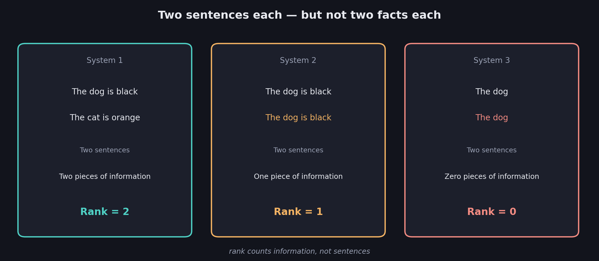
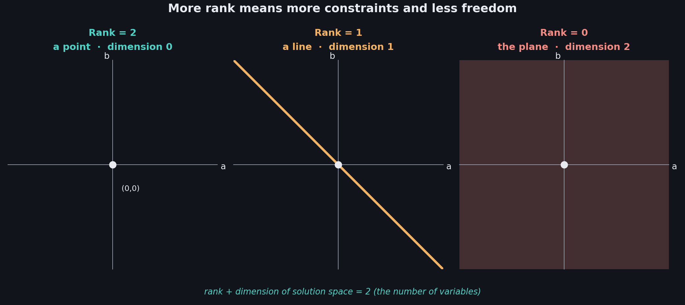
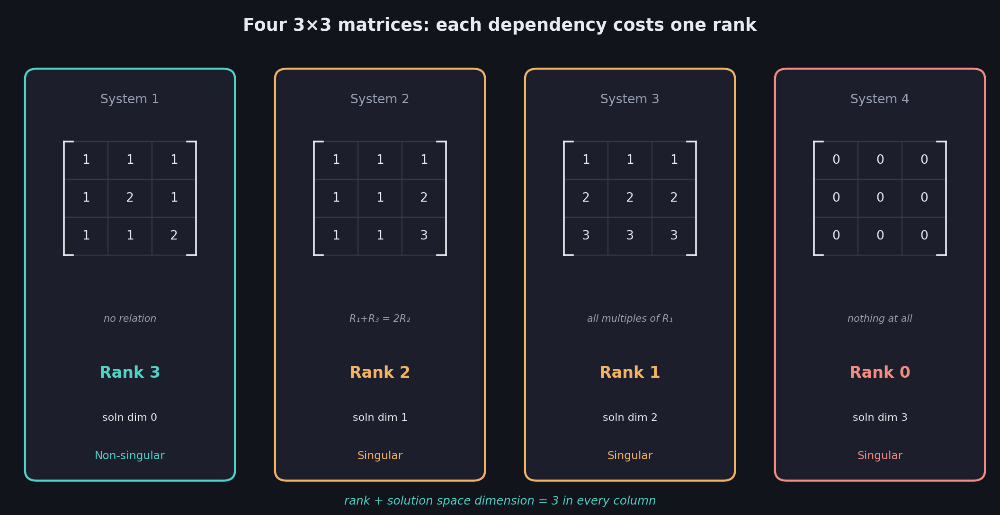

# What You Should Know About the Rank of a Matrix

> **Prerequisites:** counting information rather than sentences is in 01 §5. Linear dependence between rows is in 05. Homogeneous systems and the trivial solution are in 04 §5. Degrees of freedom are in 07 §5.
>
> **This file pays off a promise made in 01.** File 01 ended by noting that redundancy comes in degrees, and that counting exactly how much information a system carries "eventually gets its own name." This is that name.

Every file so far has treated singularity as a **yes-or-no** question. But 01 §5 already noticed that redundancy has *degrees* — a system repeating one sentence is less broken than a system repeating all of them, yet both are just "singular." **Rank** is the number that measures the difference.

These notes cover: why rank is a count of information rather than of rows, rank for sentence systems, rank for equations and matrices, the relationship between rank and the size of the solution set, how rank determines singularity, the general case for larger matrices, and the shortcut that files 10 and 11 will deliver.

---

# 1. Counting information, not rows

Take three two-sentence systems, straight from 01:

| | System 1 | System 2 | System 3 |
|---|---|---|---|
| Sentence 1 | The dog is black | The dog is black | The dog |
| Sentence 2 | The cat is orange | The dog is black | The dog |
| Sentences | Two | Two | Two |
| **Information** | **Two pieces** | **One piece** | **Zero pieces** |

All three have exactly **two sentences**. They carry two, one, and zero pieces of information respectively.

System 3 is the interesting new case. "The dog" isn't false — it's not *anything*. It's a phrase with no content at all, the linguistic equivalent of an equation that says nothing.

$$
\boxed{\text{Rank} = \text{the number of independent pieces of information the system carries}}
$$

So these three systems have **rank 2, rank 1, and rank 0**.

$$
\boxed{\text{Rank counts information, not rows. Those are different numbers whenever there is redundancy.}}
$$

---

# 2. Rank for systems of equations

Same three-way split, now with equations. Note that all constants are zero — these are **homogeneous** systems (04 §5), which is deliberate: 04 proved singularity lives entirely in the coefficients, so zeroing the constants strips away everything irrelevant to rank.

## System 1

$$
a+b=0 \qquad\qquad a+2b=0
$$

Two equations, and neither is derivable from the other. **Two pieces of information — rank 2.**

## System 2

$$
a+b=0 \qquad\qquad 2a+2b=0
$$

The second equation is the first, doubled. One genuine constraint. **One piece of information — rank 1.**

## System 3

$$
0a+0b=0 \qquad\qquad 0a+0b=0
$$

Both equations are the empty statement $0=0$ — true for every $a$ and $b$, constraining nothing. **Zero pieces of information — rank 0.**

## As matrices

Strip to coefficients (04) and the same counts apply to the rows:

| System 1 | | System 2 | | System 3 | |
|---|---|---|---|---|---|
| 1 | 1 | 1 | 1 | 0 | 0 |
| 1 | 2 | 2 | 2 | 0 | 0 |

$$
\boxed{\text{Rank } 2 \qquad\qquad \text{Rank } 1 \qquad\qquad \text{Rank } 0}
$$

$$
\boxed{\text{Rank of a matrix} = \text{the number of linearly independent rows}}
$$

That phrasing connects rank directly to 05. Rank 2 means both rows are independent. Rank 1 means one row is a combination of the other — exactly 05's linear dependence, but now **quantified** instead of merely detected.

---

# 3. Rank and the solution space

Here's what makes rank more useful than a yes/no verdict: it predicts the *shape* of the solution set.

Because these systems are homogeneous, the trivial solution $(0,0)$ always works (04 §5), so there's always at least one solution. The question is how many more.

## Rank 2 — a single point

$$
a+b=0 \qquad a+2b=0
$$

Two independent constraints on two unknowns pin everything down. Only $(0,0)$ works.

$$
\boxed{\text{Solution space} = \text{a point} \qquad \text{dimension } 0}
$$

## Rank 1 — a line

$$
a+b=0
$$

One constraint, two unknowns. Choose $a$ freely and $b=-a$ follows: this is the **degree of freedom** from 07 §5, and the solutions form a line through the origin — exactly the geometry of 03.

$$
\boxed{\text{Solution space} = \text{a line} \qquad \text{dimension } 1}
$$

## Rank 0 — the whole plane

No constraints at all. Every pair $(a,b)$ is a solution. Both variables are free.

$$
\boxed{\text{Solution space} = \text{the whole plane} \qquad \text{dimension } 2}
$$

## The relationship

| Rank | Dimension of solution space | Shape |
|---|---|---|
| 2 | 0 | A point |
| 1 | 1 | A line |
| 0 | 2 | A plane |

The two columns always sum to $2$ — the number of variables:

$$
\boxed{\text{Rank} = 2 - (\text{dimension of the solution space})}
$$

Equivalently, and more memorably:

$$
\boxed{\text{Rank} + \text{dimension of solution space} = \text{number of variables}}
$$

The intuition: every independent equation removes one degree of freedom. Start with 2 free variables, impose 2 independent constraints, and 0 freedom remains. Impose only 1, and 1 degree of freedom survives.

**This relationship has a formal name you'll meet later: the rank-nullity theorem**, where the dimension of the solution space is called the **nullity** (or the dimension of the **null space** — the topic promised on the course's very first slide). The idea is exactly what's in the table above.

---

# 4. Rank and singularity

Line up rank against the verdict from Week 1:

| Matrix rows | Rank | Solution space | Verdict |
|---|---|---|---|
| $[1,1],[1,2]$ | 2 | Dimension 0 | **Non-singular** |
| $[1,1],[2,2]$ | 1 | Dimension 1 | Singular |
| $[0,0],[0,0]$ | 0 | Dimension 2 | Singular |

$$
\boxed{\text{Non-singular} \iff \text{rank} = \text{number of rows} \qquad \text{Singular} \iff \text{rank} < \text{number of rows}}
$$

A matrix earning **full rank** — rank equal to its number of rows — has every row carrying new information, which is exactly non-singularity as defined all the way back in 01.

## What rank adds

Singular vs non-singular is one bit of information. Rank is a whole number, and it distinguishes cases that "singular" lumps together:

$$
\boxed{\text{Rank } 1 \text{ and rank } 0 \text{ are both singular — but rank } 0 \text{ is more degenerate}}
$$

That's 01's "redundancy comes in degrees" made precise. A rank-1 matrix still constrains something; a rank-0 matrix constrains nothing whatsoever.

## The most common mistake

Assuming rank equals the number of rows, or the number of nonzero rows *as written*. Neither is reliable. The matrix with rows $[1,1]$ and $[2,2]$ has two rows and no zero rows, yet its rank is 1 — because the second row carries no new information. **Rank counts independent rows, and independence isn't always visible at a glance.**

---

# 5. Worked example: the quiz

**Problem.** Find the rank of each matrix.

**Matrix 1** — rows $[5,1]$ and $[-1,3]$:

Is one row a multiple of the other? For $[5,1]\times k=[-1,3]$ you'd need $k=-\tfrac{1}{5}$ from the first entry and $k=3$ from the second. No single $k$ works, so the rows are independent (05 §2).

The only solution to the homogeneous system is $(0,0)$, so the solution space has dimension 0:

$$
\text{rank} = 2-0 = \boxed{2}
$$

Full rank, therefore **non-singular** — which agrees with 06, where this same matrix had determinant $16 \neq 0$.

**Matrix 2** — rows $[2,-1]$ and $[-6,3]$:

Check for a multiple: $[2,-1]\times(-3) = [-6,3]$ ✓ — the same $k=-3$ works on both entries. The rows are dependent, so only one carries information. The solution space is a line, dimension 1:

$$
\text{rank} = 2-1 = \boxed{1}
$$

**Singular** — agreeing with 06, where this matrix's determinant came out to exactly $0$.

---

# 6. The general case: larger matrices

Nothing about rank is specific to 2×2. Here are the four 3-variable systems, all homogeneous:

| System | Equations | Independent pieces | Rank |
|---|---|---|---|
| 1 | $a+b+c=0$, $a+2b+c=0$, $a+b+2c=0$ | 3 | **3** |
| 2 | $a+b+c=0$, $a+b+2c=0$, $a+b+3c=0$ | 2 | 2 |
| 3 | $a+b+c=0$, $2a+2b+2c=0$, $3a+3b+3c=0$ | 1 | 1 |
| 4 | $0a+0b+0c=0$ (three times) | 0 | 0 |

As matrices — these are the exact same four matrices from 04 §7 and 05 §4:

| System 1 | | | System 2 | | | System 3 | | | System 4 | | |
|---|---|---|---|---|---|---|---|---|---|---|---|
| 1 | 1 | 1 | 1 | 1 | 1 | 1 | 1 | 1 | 0 | 0 | 0 |
| 1 | 2 | 1 | 1 | 1 | 2 | 2 | 2 | 2 | 0 | 0 | 0 |
| 1 | 1 | 2 | 1 | 1 | 3 | 3 | 3 | 3 | 0 | 0 | 0 |

$$
\boxed{\text{Rank } 3 \qquad \text{Rank } 2 \qquad \text{Rank } 1 \qquad \text{Rank } 0}
$$

## Reading these against 05

05 found the dependencies by hand, and rank now counts what survived them:

- **System 1:** no relation among the rows — all 3 independent, rank 3, full rank, non-singular.
- **System 2:** $R_1+R_3=2R_2$ — one relation eats one row's worth of information, leaving 2.
- **System 3:** every row is a multiple of the first — only 1 independent row survives.
- **System 4:** nothing at all, rank 0.

$$
\boxed{\text{Each independent dependency among the rows drops the rank by one}}
$$

The relationship from §3 holds with 3 in place of 2:

$$
\boxed{\text{Rank} + \text{dimension of solution space} = \text{number of variables}}
$$

So System 2, with rank 2 and 3 variables, has a **1-dimensional** solution space — a line. That's precisely the "line of solutions" pictured in 03 §8 for this exact system. Everything lines up.

---

# 7. Is there an easier way?

Everything so far required either spotting dependencies by hand (05) or reasoning about solution spaces. Neither scales to a large matrix.

The deck poses exactly this question and answers it:

$$
\boxed{\text{Rank} = \text{the number of 1s on the diagonal of the reduced row echelon form}}
$$

That's a genuine algorithm: row-reduce the matrix into a standard shape, then count. It needs the shape to exist first, which is what **10** (row echelon form) and **11** (reduced row echelon form) are for.

And 08 already guaranteed this is legitimate: row operations preserve singularity, and — as the next two files will show — they preserve rank too. You can hammer the matrix into a readable form and count there, confident the answer applies to the original.

$$
\boxed{\text{Rank is defined by counting information, but computed by row reduction}}
$$

---

# 8. Why rank matters: image compression

The deck opens this section with a striking application. A digital image is a matrix (as in 01's neural-network motivation), and a typical photo's matrix has high rank — lots of independent rows.

**Compression works by deliberately reducing the rank.** Approximate the image matrix with a lower-rank one, and you store far fewer independent pieces of information while keeping the picture recognizable. Rank, in this setting, is a direct measure of how much data you truly need versus how much you're storing.

$$
\boxed{\text{Low rank} = \text{lots of redundancy} = \text{compressible}}
$$

Redundancy, which has been a *defect* for eight files running, turns out to be exactly what makes compression possible. Same property, opposite value judgment, depending on what you're trying to do.

---

# Most Important Definitions and Distinctions to Remember

## Rank

$$
\boxed{\text{Rank} = \text{the number of independent pieces of information} = \text{the number of linearly independent rows}}
$$

---

## Rank versus row count

$$
\boxed{\text{Rank counts INDEPENDENT rows, not rows}}
$$

A matrix with 2 rows and no zeros anywhere can still have rank 1.

---

## Full rank

$$
\boxed{\text{Full rank} = \text{rank equals the number of rows} \iff \text{non-singular}}
$$

$$
\boxed{\text{Rank} < \text{number of rows} \iff \text{singular}}
$$

---

## Rank and the solution space

$$
\boxed{\text{Rank} + \text{dimension of solution space} = \text{number of variables}}
$$

| Rank (2 variables) | Solution space | Shape |
|---|---|---|
| 2 | Dimension 0 | A point |
| 1 | Dimension 1 | A line |
| 0 | Dimension 2 | A plane |

Higher rank means more constraints and less freedom.

---

## How to compute it

$$
\boxed{\text{Rank} = \text{the number of 1s on the diagonal of the reduced row echelon form}}
$$

---

# Main Rules to Put in Your Notebook

| Question | Answer |
|---|---|
| What is rank? | The number of independent rows |
| Rank = number of rows? | Non-singular (full rank) |
| Rank < number of rows? | Singular |
| Rank 0? | The matrix carries no information at all |
| How big is the solution space? | (number of variables) − rank |
| How do I compute rank quickly? | Count the 1s on the diagonal of the reduced row echelon form |

$$
\boxed{\text{Rank counts information; row count counts rows; they differ exactly when there is redundancy}}
$$

$$
\boxed{\text{Non-singular} \iff \text{full rank}}
$$

The biggest idea is:

**Singular versus non-singular was always a yes-or-no answer to a question that deserved a number. Rank is that number: how many genuinely independent pieces of information a system carries, which is the count 01 gestured at and 05 detected one dependency at a time. Full rank means every row earns its place, and that is exactly non-singularity. Anything less is singular, but now you can say by how much — and the shortfall tells you precisely how big the solution set is, since every piece of information you fail to carry is one more degree of freedom left free.**

---

# Where This Goes Next

| Idea from this file | Where it is used |
|---|---|
| Counting 1s on a diagonal to get rank | **10 — Row Echelon Form**, then **11 — Reduced Row Echelon Form** |
| Row operations preserving rank | **10, 11**: why counting on the reduced matrix is valid |
| Dimension of the solution space (nullity) | The null space and the rank-nullity theorem, later topics |
| Rank as a measure of redundancy | Image compression, dimensionality reduction, and PCA |
| Full rank ⟺ non-singular ⟺ determinant ≠ 0 | The complete equivalence, assembled across 06 and this file |
