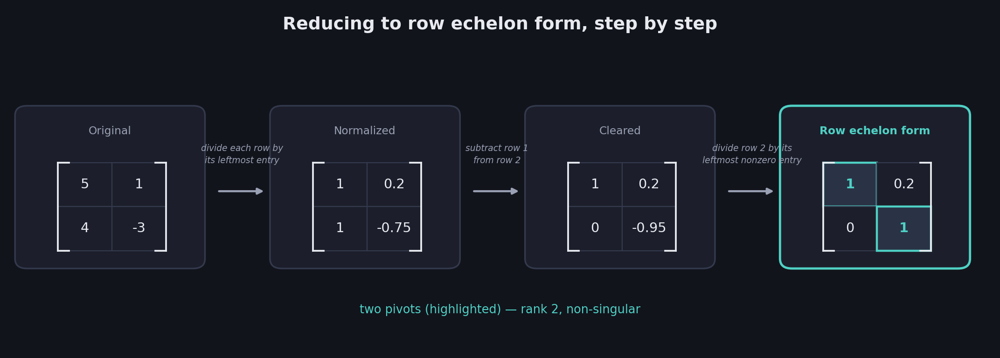
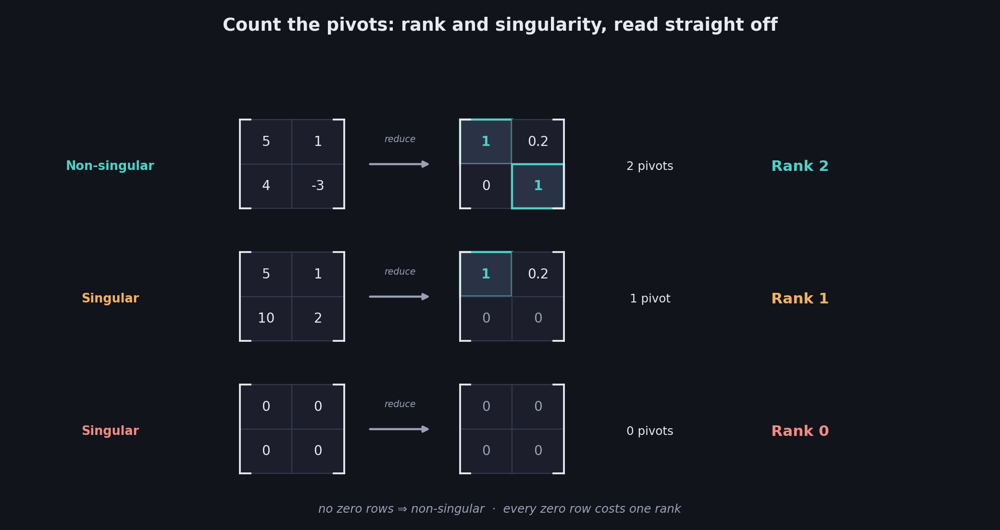
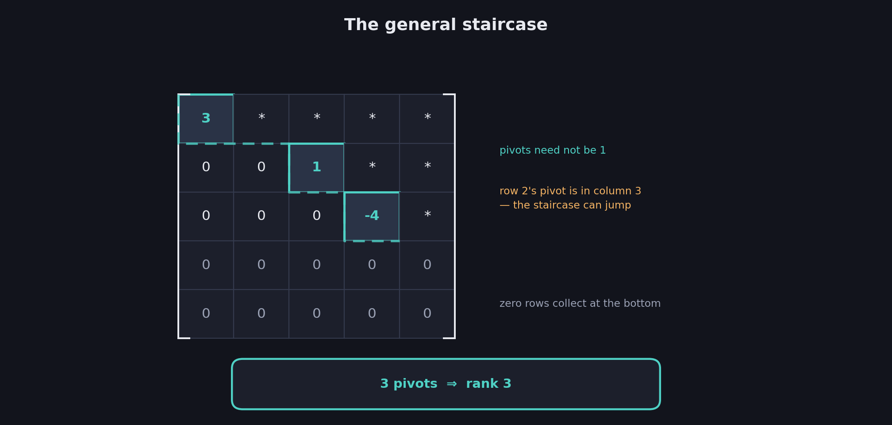

# What You Should Know About Row Echelon Form

> **Prerequisites:** the three row operations and the upper-diagonal shape are in 08. Rank is in 09. Elimination and back-substitution are in 07.
>
> **This is where the process gets its name.** Everything since 07 has been building one algorithm; this file states it properly, names the target shape, and names the algorithm: **Gaussian elimination**.

09 ended with a promise: rank can be *computed* rather than reasoned out, by row-reducing the matrix into a standard shape and counting. This file builds that shape. It's the same normalize-and-subtract process from 07, but now with a precise definition of when to stop.

These notes cover: what row echelon form is, the algorithm that produces it, worked examples for non-singular and singular matrices, why an all-zero row can't be normalized, how to read rank and singularity straight off the form, the general staircase shape for larger matrices, the crucial **pivot** vocabulary, and where the "count the 1s" shortcut breaks down.

---

# 1. The target shape

08 §8 showed row reduction heading toward a matrix with zeros below the diagonal. Row echelon form makes that precise.

$$
\boxed{\text{Row echelon form: each row starts with more zeros than the row above it, and all-zero rows sit at the bottom}}
$$

The leading entry of each row — its leftmost nonzero number — has a name:

$$
\boxed{\text{Pivot} = \text{the leftmost nonzero entry in a row}}
$$

So the definition can be restated: **each pivot sits strictly to the right of the pivot in the row above.** That's what creates the descending staircase, and it's where "echelon" (from the French for a stepped formation) comes from.

For the non-singular 2×2 case, the target looks like:

| | |
|---|---|
| 1 | 0.2 |
| 0 | 1 |

Row 1's pivot is in column 1; row 2's pivot is in column 2 — one step to the right. This is the "upper diagonal" shape from 08, now with a proper name.

---

# 2. The algorithm

$$
\boxed{\text{1. Divide each row by its leftmost coefficient} \qquad \text{2. Subtract to create zeros below} \qquad \text{3. Repeat downward}}
$$

Step 1 makes the leading entries match so they cancel; step 2 does the cancelling. That's exactly 07's normalize-then-subtract, and each move is one of 08's three row operations — so 08's guarantee applies:

$$
\boxed{\text{Row reduction changes the numbers, but never the singularity or the rank}}
$$

## The name

$$
\boxed{\text{This process — row-reduce to echelon form, then back-substitute — is GAUSSIAN ELIMINATION}}
$$

You have been doing it since 07 without the label. It is the standard algorithm for solving linear systems, and essentially every piece of software that solves them runs some refinement of it.

---

# 3. Worked example: a non-singular matrix

Rows $[5,1]$ and $[4,-3]$ — the matrix from 08.

**Step 1 — divide each row by its leftmost coefficient** ($5$ and $4$):

| | |
|---|---|
| 1 | 0.2 |
| 1 | -0.75 |

**Step 2 — subtract row 1 from row 2** to zero out the first column:

$$
[1,-0.75] - [1,0.2] = [0,-0.95]
$$

| | |
|---|---|
| 1 | 0.2 |
| 0 | -0.95 |

**Step 3 — divide row 2 by its leftmost nonzero coefficient** ($-0.95$):

| | |
|---|---|
| 1 | 0.2 |
| 0 | 1 |

$$
\boxed{\text{Row echelon form reached: two pivots, both equal to } 1}
$$

Note the wording shift in step 3: *leftmost **nonzero** coefficient*. Row 2 starts with a zero now, so "leftmost coefficient" would mean dividing by zero. You always divide by the first entry that isn't zero — which is the pivot.

---

# 4. Worked example: a singular matrix

Rows $[5,1]$ and $[10,2]$. Row 2 is row 1 doubled, so this is singular (05).

**Step 1 — divide by leftmost coefficients** ($5$ and $10$):

| | |
|---|---|
| 1 | 0.2 |
| 1 | 0.2 |

The two rows are now **identical** — the matrix version of 07 §5's "the equations became the same."

**Step 2 — subtract row 1 from row 2:**

$$
[1,0.2] - [1,0.2] = [0,0]
$$

| | |
|---|---|
| 1 | 0.2 |
| 0 | 0 |

$$
\boxed{\text{Row echelon form reached: one pivot, and one all-zero row}}
$$

## Why there's no step 3

The algorithm would say "divide row 2 by its leftmost nonzero coefficient" — but row 2 has **no** nonzero coefficient. There is nothing to divide by, and no pivot to create.

$$
\boxed{\text{An all-zero row has no pivot and cannot be normalized. It simply stays as it is, at the bottom.}}
$$

This isn't the algorithm failing. It's the algorithm reporting that this row never carried information — exactly $0=0$ from 07 §5, and exactly the dependent row from 05.

## The extreme case

A matrix of all zeros has no nonzero coefficient anywhere. Every row stays put, no pivots are ever created, and the matrix is already in row echelon form:

| | |
|---|---|
| 0 | 0 |
| 0 | 0 |

$$
\boxed{\text{Zero pivots}}
$$

---

# 5. Reading rank and singularity off the form

Line up the three examples:

| Original rows | Row echelon form | Pivots | Rank | Verdict |
|---|---|---|---|---|
| $[5,1],[4,-3]$ | $[1,0.2],[0,1]$ | 2 | 2 | **Non-singular** |
| $[5,1],[10,2]$ | $[1,0.2],[0,0]$ | 1 | 1 | Singular |
| $[0,0],[0,0]$ | $[0,0],[0,0]$ | 0 | 0 | Singular |

$$
\boxed{\text{Rank} = \text{the number of pivots} = \text{the number of nonzero rows in the row echelon form}}
$$

$$
\boxed{\text{Non-singular} \iff \text{every row has a pivot} \iff \text{no zero rows}}
$$

This is 09's promised shortcut, delivered. Rank was *defined* by counting independent information; it is *computed* by row-reducing and counting pivots. And 08's guarantee is what makes the two agree — row operations never change the rank, so the count on the reduced matrix is the count on the original.

---

# 6. The general shape

For larger matrices, the staircase can do something the 2×2 case never showed: **skip columns**. Here's a general row echelon form, with pivots marked and $*$ meaning "any value":

| | | | | |
|---|---|---|---|---|
| **3** | * | * | * | * |
| 0 | 0 | **1** | * | * |
| 0 | 0 | 0 | **−4** | * |
| 0 | 0 | 0 | 0 | 0 |
| 0 | 0 | 0 | 0 | 0 |

Three things to notice:

**Pivots need not be 1.** Here they are $3$, $1$, and $-4$. The algorithm in §2 normalizes them to 1 by dividing, but the *definition* of row echelon form only requires the staircase — any nonzero leading entry qualifies as a pivot.

**The staircase can jump.** Row 2's pivot sits in column **3**, not column 2 — it skipped a column. The rule is only that each pivot is strictly right of the one above, not exactly one step right.

**Zero rows collect at the bottom.** Rows 4 and 5 have no pivots.

$$
\boxed{\text{Pivots: } 3 \text{ of them} \;\Rightarrow\; \text{rank } 3}
$$

---

# 7. The trap: "count the 1s on the diagonal"

It's tempting to say rank is the number of 1s down the diagonal. That works for every 2×2 example in this file — and it **fails** as soon as the staircase jumps.

Take the matrix with rows $[1,1,1]$, $[1,1,2]$, $[1,1,3]$. Subtract row 1 from rows 2 and 3, then subtract twice the new row 2 from the new row 3:

| | | |
|---|---|---|
| 1 | 1 | 1 |
| 0 | 0 | 1 |
| 0 | 0 | 0 |

**Counting diagonal 1s** gives the entries at positions (1,1), (2,2), (3,3) — that is $1$, $0$, $0$ — so **one**.

**Counting pivots** gives row 1's leading $1$ and row 2's leading $1$ — so **two**.

The correct rank is **2** (this is System 2 from 09, rank 2). The pivot count is right; the diagonal count is wrong, because row 2's pivot sits in column 3, off the diagonal.

$$
\boxed{\text{Count PIVOTS, not diagonal entries. They agree only when the staircase never skips a column.}}
$$

The diagonal phrasing is a convenient shorthand for the tidy case, but pivots are the real rule.

---

# 8. Worked examples: 3×3

## Non-singular

Rows $[1,1,1]$, $[1,2,1]$, $[1,1,2]$. Subtract row 1 from rows 2 and 3:

| | | |
|---|---|---|
| 1 | 1 | 1 |
| 0 | 1 | 0 |
| 0 | 0 | 1 |

Three pivots — **rank 3**, non-singular, matching 09's verdict for this exact matrix.

## Singular, rank 2

Rows $[1,1,1]$, $[1,1,2]$, $[1,1,3]$ — the §7 example:

| | | |
|---|---|---|
| 1 | 1 | 1 |
| 0 | 0 | 1 |
| 0 | 0 | 0 |

Two pivots — **rank 2**, singular. One zero row, matching 09's "one dependency costs one rank."

## Singular, rank 1

Rows $[1,1,1]$, $[2,2,2]$, $[3,3,3]$. Subtract twice row 1 from row 2, and three times row 1 from row 3:

| | | |
|---|---|---|
| 1 | 1 | 1 |
| 0 | 0 | 0 |
| 0 | 0 | 0 |

One pivot — **rank 1**. Every row was a multiple of the first, so both others collapsed.

## Singular, rank 0

The all-zero matrix has no pivots at all — **rank 0**.

$$
\boxed{\text{Rank } 3,\ 2,\ 1,\ 0 \;\longleftrightarrow\; 0,\ 1,\ 2,\ 3 \text{ zero rows}}
$$

---

# 9. Row echelon form on a system

Everything above worked on bare coefficient matrices. Carry the constants along (08 §2's augmented matrix) and the echelon form becomes a *solved-ish* system.

The system $a+b+2c=12$, $3a-3b-c=3$, $2a-b+6c=24$ reduces to:

$$
a+b+2c=12 \qquad -6b-7c=-33 \qquad 6c=18
$$

The staircase is visible in the equations themselves: three variables, then two, then one. And the last equation solves immediately:

$$
6c=18 \;\Longrightarrow\; c=3
$$

Then **back-substitute** upward, exactly as in 07 §6, to get $b=2$ and $a=4$.

$$
\boxed{\text{Echelon form + back-substitution = the full Gaussian elimination algorithm}}
$$

That last equation solving on sight is the entire point of the staircase: each row has fewer unknowns than the one above, so the bottom row always hands you a value to start from.

## The remaining annoyance

Back-substitution still requires work — substitute $c$, solve for $b$, substitute both, solve for $a$. Three variables mean three rounds of it.

**11** removes that step entirely by pushing the reduction further, until each row states its variable's value outright and nothing needs substituting at all.

---

# Most Important Definitions and Distinctions to Remember

## Pivot

$$
\boxed{\text{Pivot} = \text{the leftmost nonzero entry of a row}}
$$

An all-zero row has no pivot.

---

## Row echelon form

$$
\boxed{\text{Each pivot sits strictly to the right of the pivot in the row above; zero rows sit at the bottom}}
$$

The result is a descending staircase of leading entries.

---

## The algorithm

$$
\boxed{\text{Divide each row by its leftmost nonzero entry, subtract to clear below, repeat downward}}
$$

$$
\boxed{\text{Row echelon form} + \text{back-substitution} = \text{Gaussian elimination}}
$$

---

## Reading the result

$$
\boxed{\text{Rank} = \text{number of pivots} = \text{number of nonzero rows}}
$$

$$
\boxed{\text{Non-singular} \iff \text{no zero rows} \iff \text{every row has a pivot}}
$$

---

## The trap

$$
\boxed{\text{Count pivots, not diagonal entries — the staircase may skip columns}}
$$

---

# Main Rules to Put in Your Notebook

| Step | Action |
|---|---|
| 1 | Divide each row by its leftmost nonzero entry |
| 2 | Subtract multiples of the upper row to clear the entries beneath its pivot |
| 3 | Move down and repeat on the remaining rows |
| 4 | Leave all-zero rows alone; they sink to the bottom |
| 5 | Count the pivots — that's the rank |

| What you see in the echelon form | What it means |
|---|---|
| A pivot in every row | Full rank, non-singular |
| $k$ zero rows | Rank drops by $k$; singular |
| All zero rows | Rank 0 |
| A pivot skipping a column | Normal — the staircase can jump |

$$
\boxed{\text{Row operations never change the rank, so counting on the reduced matrix answers for the original}}
$$

The biggest idea is:

**Row echelon form is the shape that elimination has been driving toward since 07: a staircase where each row's leading entry — its pivot — sits further right than the one above, and rows that carried no information collapse to zeros at the bottom. Getting there is Gaussian elimination, and because row operations can't change rank or singularity, the reduced matrix answers both questions for the original: count the pivots for the rank, and check for zero rows to detect singularity. What the form doesn't quite give you is the solution itself — the bottom row hands you one variable, and you still have to climb back up substituting.**

---

# Where This Goes Next

| Idea from this file | Where it is used |
|---|---|
| Pushing the reduction past echelon form | **11 — Reduced Row Echelon Form** |
| Back-substitution as the remaining chore | **11**: how to eliminate the step entirely |
| Pivots normalized to 1 | **11**: required there, optional here |
| Rank = number of pivots | The standard computational definition of rank |
| Gaussian elimination | Essentially every numerical linear solver in software |
