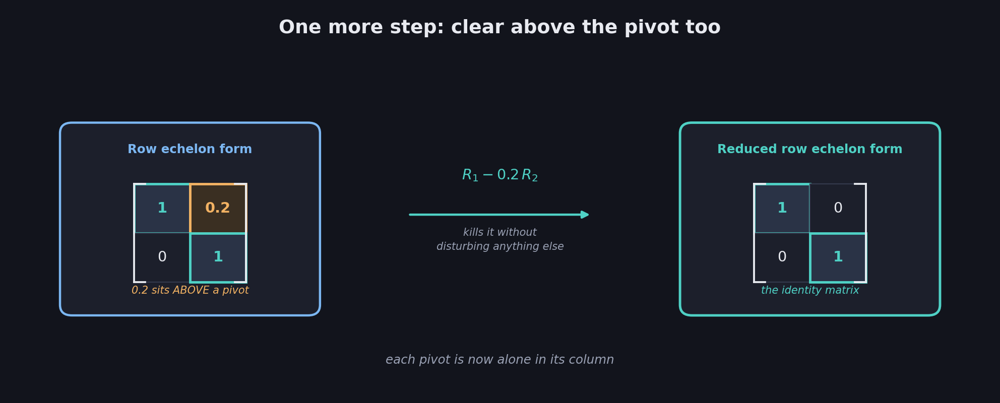
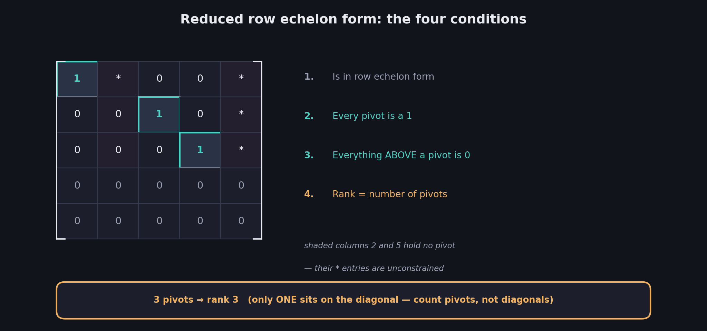
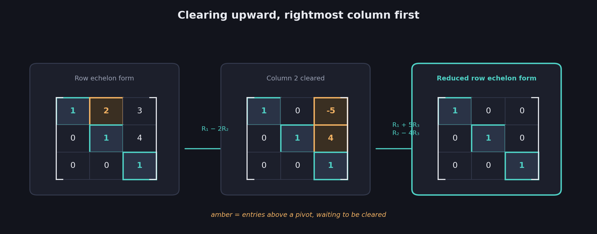
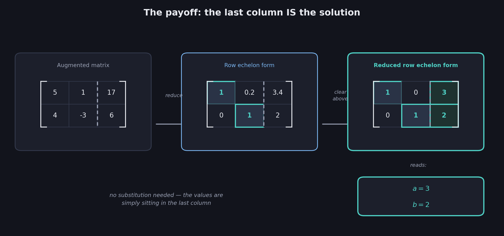

# What You Should Know About Reduced Row Echelon Form

> **Prerequisites:** row echelon form, pivots, and Gaussian elimination are in 10. The three row operations are in 08. Rank is in 09.
>
> **This closes Week 2.** 10 got the matrix into a staircase but left you back-substituting. This file finishes the job, so the answer can simply be read off.

10 ended on an annoyance: echelon form hands you the bottom variable immediately, but every other variable still requires substituting downward results into upper rows. With three variables that's two extra rounds of arithmetic; with ten it's nine. **Reduced row echelon form** removes the step entirely by pushing the row operations further.

These notes cover: the idea of clearing *above* the pivots, the four conditions defining reduced row echelon form, the algorithm, worked 2×2 and 3×3 examples, how the solution reads straight off an augmented matrix, why non-pivot columns can still hold arbitrary values, and a closing synthesis of all of Week 2.

---

# 1. Keep going

Take the echelon form from 10 §3 — rows $[1,0.2]$ and $[0,1]$:

| | |
|---|---|
| 1 | 0.2 |
| 0 | 1 |

The zero *below* the first pivot is what echelon form demanded. But look at the $0.2$ sitting **above** the second pivot. Nothing in 10's definition required clearing that — and it's exactly what forces back-substitution, because row 1 still mentions two variables.

So clear it. Row 2 is $[0,1]$, so subtracting $0.2$ times row 2 from row 1 kills that entry without disturbing anything else:

$$
[1,0.2] - 0.2\,[0,1] = [1,0]
$$

| | |
|---|---|
| 1 | 0 |
| 0 | 1 |

$$
\boxed{\text{Reduced row echelon form reached}}
$$

This is the **diagonal matrix** promised back in 08 §8 — and for a non-singular matrix it comes out as the identity: 1s on the diagonal, 0s everywhere else.

---

# 2. The definition

A matrix is in **reduced row echelon form** when all four conditions hold:

$$
\boxed{\text{1. It is in row echelon form}}
$$

$$
\boxed{\text{2. Every pivot is a } 1}
$$

$$
\boxed{\text{3. Every entry ABOVE a pivot is } 0}
$$

$$
\boxed{\text{4. Rank} = \text{the number of pivots}}
$$

Conditions 2 and 3 are the new requirements; condition 1 carries everything over from 10; condition 4 is the same rank rule as before, restated because it's what you'll actually use the form for.

## Reading it against 10

10 noted that echelon form only *requires* the staircase — pivots could be any nonzero value like $3$ or $-4$, though the algorithm happened to normalize them. RREF removes that freedom: pivots **must** be 1.

$$
\boxed{\text{Echelon form: pivots may be anything nonzero} \qquad \text{Reduced: pivots must be } 1}
$$

## Non-pivot columns are still free

Here is the detail most often misread. RREF does **not** mean "everything except the pivots is zero." Only entries **above a pivot** must vanish. Columns that contain no pivot at all can hold any values:

| | | | | |
|---|---|---|---|---|
| **1** | * | 0 | 0 | * |
| 0 | 0 | **1** | 0 | * |
| 0 | 0 | 0 | **1** | * |
| 0 | 0 | 0 | 0 | 0 |
| 0 | 0 | 0 | 0 | 0 |

Pivots sit in columns 1, 3, and 4 — so the entries above them are cleared to 0. Columns 2 and 5 contain no pivot, so their $*$ entries are unconstrained.

$$
\boxed{\text{Rank } = 3 \text{, because there are 3 pivots}}
$$

Worth noticing: only **one** of those pivots lands on the diagonal, yet the rank is 3. That's the trap from 10 §7 confirmed once more — count pivots, never diagonal entries.

---

# 3. The algorithm

Starting from a matrix already in echelon form (10's job), two steps finish it:

$$
\boxed{\text{1. Divide each row by the value of its pivot, making every pivot } 1}
$$

$$
\boxed{\text{2. Clear upward: subtract multiples of each pivot row from the rows above it}}
$$

Step 2 is worth reading carefully — it works **bottom-up**, the mirror image of 10's top-down clearing. Each pivot row is used to erase everything in its column above it.

## The name

$$
\boxed{\text{Reducing all the way to RREF is GAUSS-JORDAN ELIMINATION}}
$$

The distinction from 10's Gaussian elimination is exactly the back-substitution step:

| Method | Reduce to | Then |
|---|---|---|
| **Gaussian elimination** | Row echelon form | Back-substitute upward |
| **Gauss-Jordan elimination** | Reduced row echelon form | Nothing — read the answer |

Gauss-Jordan does more row-reduction work up front and no substitution afterwards; Gaussian does less reduction and finishes with substitution. Both reach the same answer.

---

# 4. Worked example: 3×3

Start from an echelon form with rows $[1,2,3]$, $[0,1,4]$, $[0,0,1]$. All three pivots are already 1, so step 1 is done — only the clearing remains.

**Clear column 2 above its pivot.** The pivot is row 2's leading 1, and row 1 has a $2$ above it:

$$
[1,2,3] - 2\,[0,1,4] = [1,0,-5]
$$

| | | |
|---|---|---|
| 1 | 0 | -5 |
| 0 | 1 | 4 |
| 0 | 0 | 1 |

**Clear column 3 above its pivot.** Row 3 is the pivot row; rows 1 and 2 both have entries above it.

$$
[1,0,-5] + 5\,[0,0,1] = [1,0,0]
$$

$$
[0,1,4] - 4\,[0,0,1] = [0,1,0]
$$

| | | |
|---|---|---|
| 1 | 0 | 0 |
| 0 | 1 | 0 |
| 0 | 0 | 1 |

$$
\boxed{\text{The identity matrix — three pivots, rank 3, non-singular}}
$$

Notice the clearing happened **rightmost column first**. That ordering matters: clearing column 3 last would have re-dirtied entries you'd already fixed, since row 1's $-5$ only appeared *after* the column-2 step.

---

# 5. The payoff: the solution reads off

Everything so far worked on bare coefficient matrices. Carry the constants along in an augmented matrix (08 §2) and RREF hands you the answer with no work left.

The system $5a+b=17$, $4a-3b=6$ as an augmented matrix:

| | | |
|---|---|---|
| 5 | 1 | 17 |
| 4 | -3 | 6 |

Row-reduce to echelon form (10 §3), carrying the constants:

| | | |
|---|---|---|
| 1 | 0.2 | 3.4 |
| 0 | 1 | 2 |

At this point Gaussian elimination would stop and back-substitute. Instead, clear above the second pivot:

$$
[1,0.2,3.4] - 0.2\,[0,1,2] = [1,0,3]
$$

| | | |
|---|---|---|
| 1 | 0 | 3 |
| 0 | 1 | 2 |

Now translate back to equations. Row 1 reads $1a+0b=3$; row 2 reads $0a+1b=2$:

$$
\boxed{a=3 \qquad b=2}
$$

$$
\boxed{\text{In reduced row echelon form, the last column IS the solution}}
$$

No substitution, no rearranging — the values are simply sitting there. This is the whole reason for doing the extra reduction.

## For singular systems

The same reading works, with the outcomes from 07 §5 appearing as rows:

- A row reading $[0,0\mid 0]$ is $0=0$ — a **free variable**, infinitely many solutions.
- A row reading $[0,0\mid 5]$ is $0=5$ — a **contradiction**, no solutions.

The zero row's constant is the entire difference, exactly as 07 found on the equations and 08 found on the matrix.

---

# 6. A useful fact: RREF is unique

Row echelon form is **not** unique — different orders of operations produce different (equally valid) staircases, with different pivot values.

Reduced row echelon form is different:

$$
\boxed{\text{Every matrix has exactly ONE reduced row echelon form}}
$$

However you get there, you land on the same matrix. That makes RREF a genuine canonical form: two matrices are row-equivalent precisely when their RREFs are identical, which is why it's the standard target in software and proofs alike.

---

# Most Important Definitions and Distinctions to Remember

## Reduced row echelon form

$$
\boxed{\text{In row echelon form} \;+\; \text{every pivot is } 1 \;+\; \text{everything above a pivot is } 0}
$$

---

## Against row echelon form

| | Row echelon form | Reduced row echelon form |
|---|---|---|
| Zeros below pivots | Yes | Yes |
| Zeros above pivots | Not required | **Required** |
| Pivot values | Any nonzero | **Must be 1** |
| Solving needs | Back-substitution | Nothing — read it off |
| Unique? | No | **Yes** |
| Algorithm name | Gaussian elimination | Gauss-Jordan elimination |

---

## The algorithm

$$
\boxed{\text{Divide each row by its pivot, then clear upward from the bottom pivot to the top}}
$$

---

## Non-pivot columns

$$
\boxed{\text{Only entries ABOVE a pivot must be zero. Columns without a pivot may hold any values.}}
$$

---

## Rank, one last time

$$
\boxed{\text{Rank} = \text{the number of pivots}}
$$

Not the number of diagonal 1s — the two agree only when the staircase never skips a column.

---

# Main Rules to Put in Your Notebook

| Step | Action |
|---|---|
| 1 | Row-reduce to echelon form (10) |
| 2 | Divide each row by its pivot so every pivot is 1 |
| 3 | Working from the rightmost pivot leftward, clear all entries above each pivot |
| 4 | Read the answer: with constants carried, the last column holds the solution |

$$
\boxed{\text{Gaussian} = \text{echelon} + \text{back-substitution} \qquad \text{Gauss-Jordan} = \text{reduced echelon} + \text{nothing}}
$$

$$
\boxed{\text{For a non-singular square matrix, the RREF is the identity}}
$$

The biggest idea is:

**Row echelon form leaves entries above the pivots, and those entries are precisely what forces back-substitution. Clear them too — dividing each row by its pivot and then erasing upward — and the matrix reaches reduced row echelon form, where every pivot is a lone 1 in its column. For a non-singular system that means the identity matrix, and with the constants carried along, the final column simply is the solution. Doing this extra work up front is Gauss-Jordan elimination, and it trades substitution afterwards for reduction beforehand.**

---

# Where This Goes Next

| Idea from this file | Where it leads |
|---|---|
| RREF as a canonical form | Proving two matrices are row-equivalent |
| Gauss-Jordan on an augmented identity | Computing the **inverse** of a matrix — the natural next topic |
| Free (non-pivot) columns | Describing the full solution set of a singular system parametrically |
| Rank via pivot counting | The null space and the rank-nullity theorem |

---

# Week 2 in One Page

Week 1 (files 01–06) diagnosed systems. Week 2 solved them, and every file was one step of the same pipeline:

| File | What it added |
|---|---|
| **07** | Elimination on equations: three legal moves, normalize-subtract-back-substitute |
| **08** | Drop the letters — the same moves become row operations, justified by the determinant |
| **09** | Rank: how much independent information survives, and how big the solution set is |
| **10** | Row echelon form: the staircase, pivots, and Gaussian elimination |
| **11** | Reduced row echelon form: clear above too, and the answer reads off |

$$
\boxed{\text{System} \rightarrow \text{Matrix} \rightarrow \text{Echelon form} \rightarrow \text{Reduced echelon form} \rightarrow \text{Solution}}
$$

And the throughline from Week 1 survived intact. Singularity — first met as a sentence repeating itself in 01 — is now three more things: a zero row appearing during elimination, a rank below full, and a missing pivot in the echelon form. Every representation gives the same verdict, because every row operation was chosen precisely so it could never change the answer.
