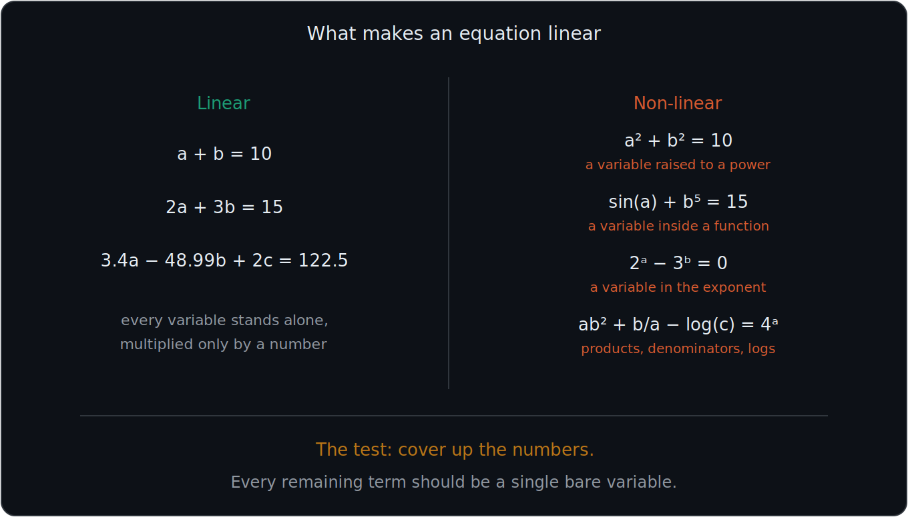
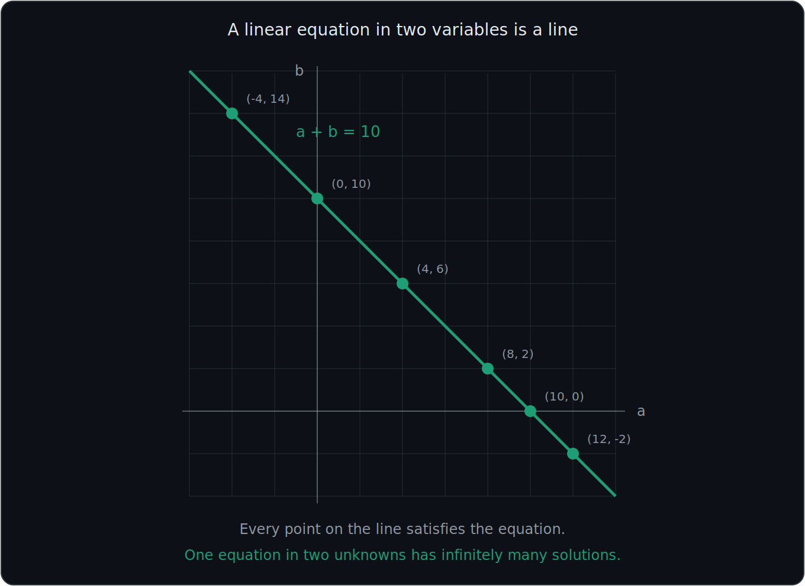
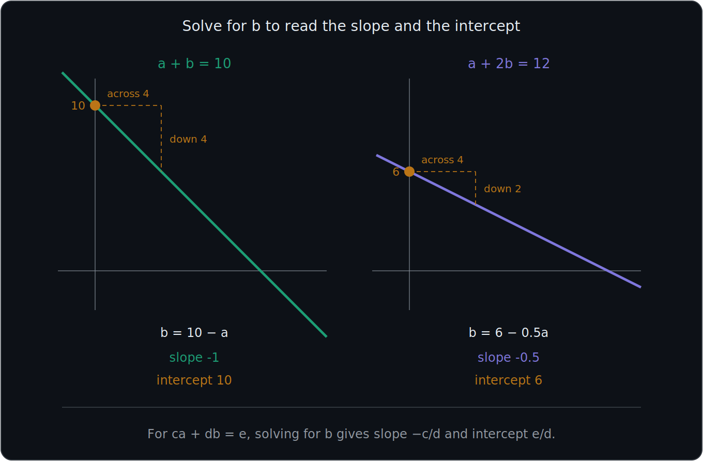
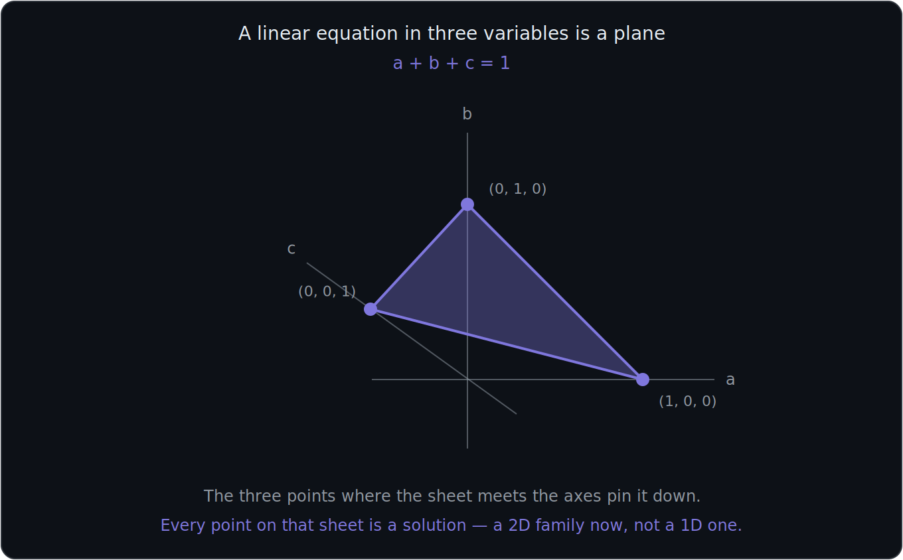
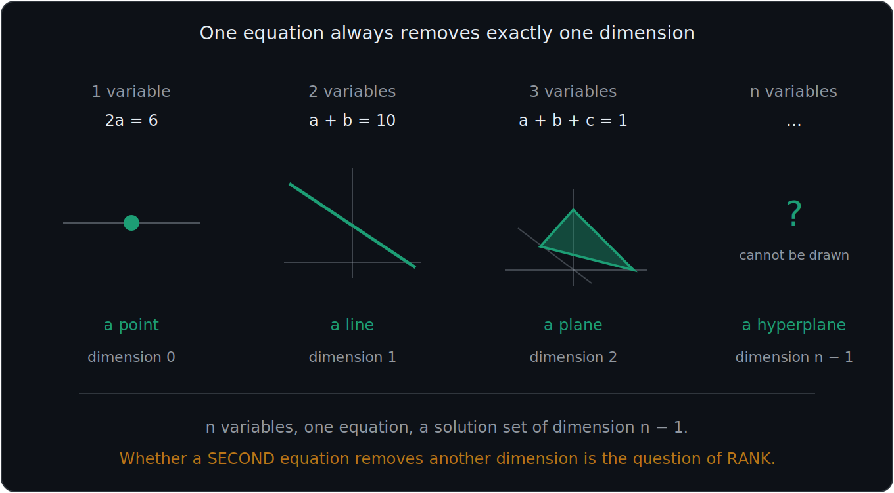

# What You Should Know About Linear Equations

> **This is file 01 of the Linear Algebra set.** It assumes nothing. Everything after it — systems, matrices, dependence, the determinant — is built on the idea defined here.
>
> Figures live in the shared `figures/` folder with an `la-` prefix so they cannot collide with the statistics figures.

These notes cover: why linear algebra matters for machine learning, what makes an equation **linear**, the four things that break linearity, why a linear equation in two variables draws a **line** and in three draws a **plane**, and the pattern that connects them.

---

# 1. Why any of this matters

A neural network doing image recognition — deciding whether a photo of a busy New York street contains a face — is not doing something exotic at each step. It is doing this:

$$
\text{input} \rightarrow \boxed{\text{matrix}} \rightarrow \boxed{\text{matrix}} \rightarrow \boxed{\text{matrix}} \rightarrow \text{"yes, it's a face"}
$$

Every layer is a **matrix operation**. A matrix is a compact way of writing a system of linear equations. So the machinery that solves systems of linear equations is the machinery that runs the model.

$$
\boxed{\text{Linear algebra is the arithmetic that machine learning runs on.}}
$$

That is the whole reason this comes before anything else.

---

# 2. What makes an equation linear

An equation is **linear** when every variable appears in the simplest possible way: multiplied by a plain number, and added to the others.

## The three things you are allowed to do

1. Multiply a variable by a number
2. Add the terms together
3. Set the total equal to a number

That is the complete list. Written generally:

$$
\boxed{c_1x_1 + c_2x_2 + \cdots + c_nx_n = d}
$$

where every $c_i$ and $d$ is a **number** and every $x_i$ is a **variable**. Nothing else is permitted.

## Examples that qualify

$$
a + b = 10
$$

$$
2a + 3b = 15
$$

$$
3.4a - 48.99b + 2c = 122.5
$$

The last one looks intimidating, but the coefficients being ugly decimals changes nothing. **The numbers can be anything.** What matters is that $a$, $b$ and $c$ each stand alone.

---

# 3. The four ways to break it

| Non-linear example | What breaks it |
|---|---|
| $a^2 + b^2 = 10$ | A variable raised to a **power** |
| $\sin(a) + b^5 = 15$ | A variable inside a **function** |
| $2^a - 3^b = 0$ | A variable in an **exponent** |
| $ab^2 + \dfrac{b}{a} - \dfrac{3}{b} - \log(c) = 4^a$ | Variables **multiplied together**, a variable in a **denominator**, a log, and a variable exponent |

Collapsed into four rules, an equation stops being linear the moment a variable is:

1. Raised to a power — $a^2$, $b^5$
2. Multiplied by another variable — $ab$
3. Put inside a function — $\sin(a)$, $\log(c)$
4. Placed in an exponent or a denominator — $2^a$, $\dfrac{b}{a}$

## The quickest test

$$
\boxed{\text{Cover up the numbers. Every remaining term should be a single bare variable.}}
$$

In $3.4a - 48.99b + 2c = 122.5$, hiding the coefficients leaves $a$, $b$, $c$ — all bare. Linear.

In $ab^2 + \frac{b}{a}$, hiding the numbers leaves $ab^2$ and $\frac{b}{a}$ — neither is a bare variable. Not linear.

---

# 4. A linear equation in two variables is a line

Take:

$$
a + b = 10
$$

Any pair of numbers adding to 10 satisfies it. Plot them and they fall on a straight line.

| $a$ | $-4$ | $0$ | $4$ | $8$ | $10$ | $12$ |
|---|---|---|---|---|---|---|
| $b$ | $14$ | $10$ | $6$ | $2$ | $0$ | $-2$ |

Every one of those points is a solution, and so is every other point on the line — including the ones with fractions.

$$
\boxed{\text{One equation, two unknowns} \rightarrow \text{infinitely many solutions}}
$$

## The observation that matters later

One equation is **not enough information** to pin down two unknowns. You get a whole line of candidates rather than a single answer.

That shortfall is the seed of everything in files 02 and 03: how many equations do you need, and what happens when the ones you have do not carry enough information between them.

---

# 5. Reading the slope and the intercept

Solve for $b$ and the line's shape falls out immediately.

## First line

$$
a + b = 10 \quad\Longrightarrow\quad b = 10 - a
$$

$$
\text{slope} = -1 \qquad \text{intercept} = 10
$$

Move 4 to the right and the line drops by 4.

## Second line

$$
a + 2b = 12 \quad\Longrightarrow\quad 2b = 12 - a \quad\Longrightarrow\quad b = 6 - \frac{a}{2}
$$

$$
\text{slope} = -0.5 \qquad \text{intercept} = 6
$$

Move 4 to the right and the line drops by only 2 — a shallower line.

## The general rule

For any linear equation in two variables:

$$
ca + db = e \quad\Longrightarrow\quad b = \frac{e}{d} - \frac{c}{d}a
$$

$$
\boxed{\text{slope} = -\frac{c}{d} \qquad \text{intercept} = \frac{e}{d}}
$$

## Why the slope is the important half

Two lines with **different slopes** must cross exactly once. Two lines with the **same slope** either never meet or lie on top of each other.

That single fact decides whether a system has one solution, none, or infinitely many — which is the entire subject of file 02. The two lines above have slopes $-1$ and $-0.5$, so they cross exactly once, at $(8, 2)$:

$$
8 + 2 = 10 \qquad\checkmark \qquad 8 + 2(2) = 12 \qquad\checkmark
$$

---

# 6. A linear equation in three variables is a plane

Add a third variable and the picture gains a dimension:

$$
a + b + c = 1
$$

The solution set is no longer a line — it is a flat **sheet** floating in three-dimensional space.

The easiest points to find are where the sheet meets each axis, obtained by setting the other two variables to zero:

$$
1+0+0=1 \quad\Rightarrow\quad (1,0,0)
$$

$$
0+1+0=1 \quad\Rightarrow\quad (0,1,0)
$$

$$
0+0+1=1 \quad\Rightarrow\quad (0,0,1)
$$

Three points fix a plane, so those three pin the whole sheet down. And as with the line, **every** point on the sheet is a solution — now a two-dimensional family of them.

---

# 7. The pattern

| Variables | One equation gives | Dimension of the solution set |
|---|---|---|
| 1 | a point | $0$ |
| 2 | a line | $1$ |
| 3 | a plane | $2$ |
| $n$ | a **hyperplane** | $n-1$ |

$$
\boxed{\text{One linear equation carves out a flat of dimension } n-1}
$$

A **hyperplane** is just the name for this object when $n > 3$ and you can no longer draw it. Nothing about the algebra changes — only your ability to picture it.

## The question this raises

One equation removes one dimension. Two equations should remove two, leaving a smaller solution set — and with two equations in two unknowns you would expect a single point.

But that only works if the second equation **says something new**. If it repeats the first in disguise, it removes nothing at all.

$$
\boxed{\text{How much information a set of equations actually carries is the question of RANK.}}
$$

That is where files 02 and 03 go next.

---

# 8. Why "linear" is worth caring about in machine learning

**Linear regression is linear in the parameters, not the features.** The model

$$
\hat{y} = w_1x_1 + w_2x_2 + \cdots + w_nx_n + b
$$

is a linear equation where the **weights** are what you solve for. You can feed it $x^2$ or $\log x$ as a feature and it is still linear regression, because it is still linear in the $w$'s. This confuses people constantly.

**A fitted linear model is a hyperplane.** Training is choosing which hyperplane best fits the data.

**Neural networks add non-linearity on purpose.** Each layer is a linear map followed by a non-linear activation. The activation is not decoration — without it, stacking linear maps just produces another linear map, and a hundred layers would have exactly the power of one.

$$
\boxed{\text{Linear composed with linear is still linear. That is why activations exist.}}
$$

---

# Most Important Definitions and Distinctions to Remember

## Linear equation

Every variable multiplied by a number, then added:

$$
\boxed{c_1x_1 + \cdots + c_nx_n = d}
$$

No powers, no products of variables, no functions, no variables in exponents or denominators.

## The test

$$
\boxed{\text{Cover the numbers. Every term should be a bare variable.}}
$$

## Slope and intercept

For $ca + db = e$:

$$
\boxed{b = \frac{e}{d} - \frac{c}{d}a \qquad \text{slope} = -\frac{c}{d} \qquad \text{intercept} = \frac{e}{d}}
$$

## Geometry by variable count

$$
\boxed{2 \text{ variables} \rightarrow \text{line} \qquad 3 \rightarrow \text{plane} \qquad n \rightarrow \text{hyperplane of dimension } n-1}
$$

## Solutions of a single equation

$$
\boxed{\text{One equation in two or more unknowns has infinitely many solutions.}}
$$

---

# Main Rules to Put in Your Notebook

| Concept | Rule |
|---|---|
| Linear | Variables multiplied by numbers and added, nothing else |
| Breaks linearity | Powers, products of variables, functions, exponents, denominators |
| General form | $c_1x_1+\cdots+c_nx_n=d$ |
| 2 variables | A line |
| 3 variables | A plane |
| $n$ variables | A hyperplane of dimension $n-1$ |
| Slope of $ca+db=e$ | $-\dfrac{c}{d}$ |
| Intercept of $ca+db=e$ | $\dfrac{e}{d}$ |
| Different slopes | The lines cross exactly once |
| Same slope | Parallel, or the same line |

The biggest idea is:

$$
\boxed{\text{A linear equation is the simplest possible relationship between variables, and it always draws a flat.}}
$$

So in plain English:

**An equation is linear when each variable is only ever multiplied by a number and added to the others. Drawn out, it is a line in two variables, a plane in three, and a flat of one dimension less than the variable count in general. A single equation never pins down more than one unknown, which is why the interesting questions start when you have several of them at once.**

---

# Where This Goes Next

| Idea from this file | Where it is used |
|---|---|
| A linear equation is a line | **02 — Systems of Equations**: two lines, and how they can meet |
| Slope decides whether lines cross | **02**: unique, infinite, or no solution |
| Infinitely many solutions from one equation | **03**: what "not enough information" means |
| The coefficients $c_1,\ldots,c_n$ | **04 — Systems as Matrices**: these become the matrix entries |
| One equation removes one dimension | **05** and **06**: dependence, and when an equation adds nothing |
