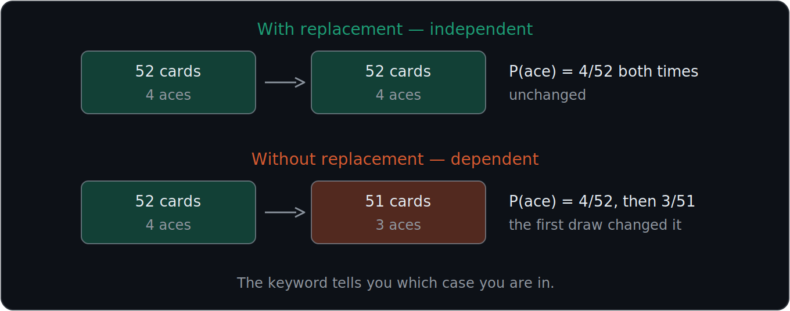
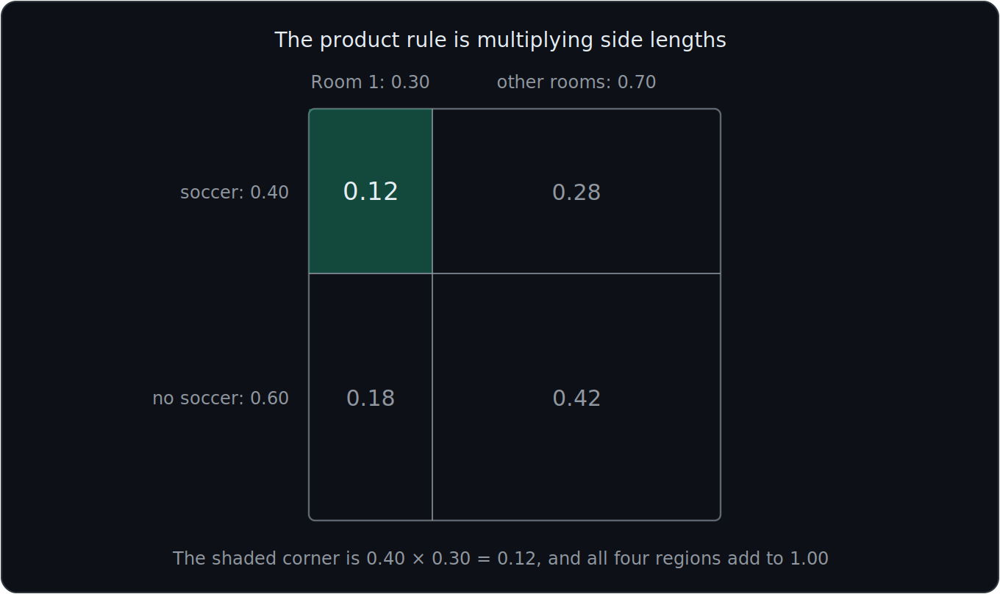
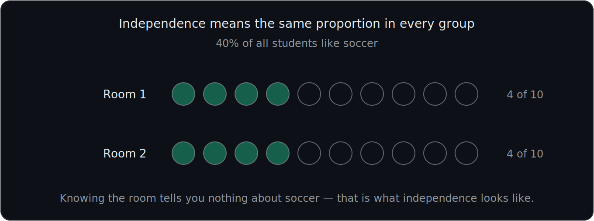
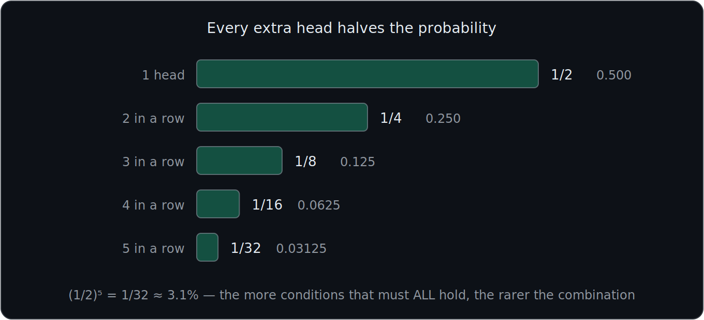
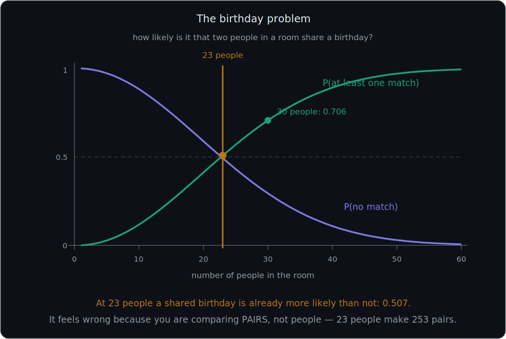
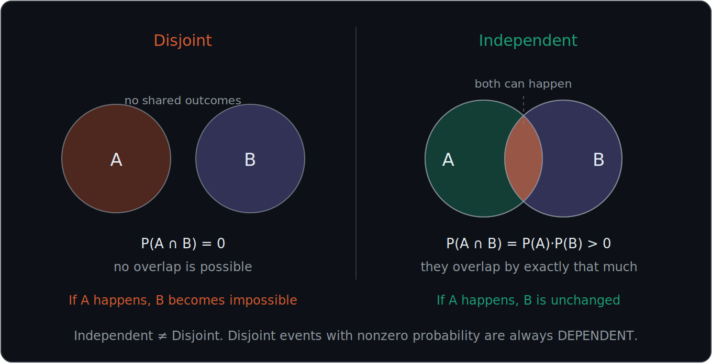

# What You Should Know About Independence

> **Set notation ($\cup$, $\cap$, $A^c$, $\varnothing$) is defined in 01 — Events and Set Notation.** This file assumes it and does not redefine it.

These notes cover **seven important ideas**: what independence means, how independent events differ from dependent events, how to calculate the probability of independent events happening together, how the product rule works for repeated events, the two ways to test for independence, why independent is not the same as disjoint, and what conditional independence means.

---

# 1. Independent events do not affect each other's probabilities

Two events are **independent** when the occurrence of one event does **not change the probability** of the other event occurring.

In simple terms:

**Knowing that Event A happened gives you no new information about whether Event B will happen.**

For independent events:

$$
\boxed{\text{A happening does not affect the probability of B}}
$$

and:

$$
\boxed{\text{B happening does not affect the probability of A}}
$$

### Example: Coin flips

Suppose you flip a fair coin twice.

The probability of heads on the first flip is:

$$
P(H_1)=\frac{1}{2}
$$

The probability of heads on the second flip is still:

$$
P(H_2)=\frac{1}{2}
$$

Even if the first flip was heads, the second flip still has:

$$
P(H_2)=\frac{1}{2}
$$

The first flip does not change the probability of the second flip.

Therefore, the flips are **independent**.

---

# 2. Dependent events do affect each other

Events are **dependent** when the occurrence of one event changes the probability of another event occurring.

In simple terms:

$$
\boxed{\text{A happening affects the probability of B}}
$$

### Example

The slides use chess as an intuitive example.

What happens on one move can affect what happens on the next move.

The later move depends on the earlier state of the game.

Therefore, those events are **not independent**.

Another common example is drawing cards **without replacement**.

Suppose a deck contains 52 cards.

The probability of drawing an ace first is:

$$
\frac{4}{52}
$$

If you draw an ace and do not replace it, there are now:

$$
3
$$

aces remaining out of:

$$
51
$$

cards.

So the probability of another ace becomes:

$$
\frac{3}{51}
$$

The first event changed the probability of the second event.

Therefore, the events are **dependent**.

### The keyword to watch for

**With replacement** → the situation resets each time → **independent**

**Without replacement** → the pool changes → **dependent**

---

# 3. Independent versus dependent events

This is the first major distinction to remember.

| | Independent Events | Dependent Events |
|---|---|---|
| Does A affect B? | No | Yes |
| Does B's probability change after A? | No | Yes |
| Example | Separate coin flips | Drawing cards without replacement |
| Probabilities stay the same? | Yes | Not necessarily |

Remember:

$$
\boxed{\text{Independent}=\text{probabilities do not affect each other}}
$$

$$
\boxed{\text{Dependent}=\text{one event changes another's probability}}
$$

---

# 4. For independent events, multiply probabilities

Recall from 01 that $A\cap B$ means **A AND B**.

The main formula in this file is the **Product Rule for Independent Events**.

If A and B are independent:

$$
\boxed{
P(A\cap B)=P(A)\cdot P(B)
}
$$

In words:

$$
\boxed{
\text{Probability of A AND B}
= P(A)\times P(B)
}
$$

This is one of the most important formulas to remember.

### Key word

When the events are independent and the question asks for:

**A AND B**

you usually **multiply**.

### The rule extends to any number of events

The events do not need to have the same probability. If $A$, $B$, and $C$ are all independent:

$$
\boxed{
P(A\cap B\cap C)=P(A)P(B)P(C)
}
$$

and so on for any number of independent events.

### Important limitation

This shortcut **only** works when the events are independent. For dependent events you must use the General Product Rule, covered in 03:

$$
P(A\cap B)=P(A)P(B\mid A)
$$

---

# 5. Soccer and Room 1 example

Suppose:

$$
P(S)=0.40
$$

where:

$$
S=\text{student likes soccer}
$$

and:

$$
P(R_1)=0.30
$$

where:

$$
R_1=\text{student is in Room 1}
$$

Suppose soccer preference and room assignment are independent.

We want:

$$
P(S\cap R_1)
$$

This means:

**Probability that a student likes soccer AND is in Room 1.**

Use the independent-event product rule:

$$
P(S\cap R_1)
= P(S)\cdot P(R_1)
$$

Substitute:

$$
P(S\cap R_1)
= 0.40(0.30)
$$

$$
=\boxed{0.12}
$$

Therefore:

$$
\boxed{P(S\cap R_1)=0.12}
$$

---

# 6. Independence means the same proportion appears in each group

The school examples help visualize what independence means.

Suppose:

**40%**

of all students like soccer.

If room assignment is independent of whether students like soccer, then we would expect approximately:

**40%**

of students in each room to like soccer as well.

### Example

Suppose Room 1 contains:

$$
30
$$

students.

If:

**40%**

like soccer, then:

$$
30(0.40)=12
$$

students in Room 1 would like soccer.

Therefore:

$$
\boxed{12\text{ students}}
$$

This matches the idea of independence:

**Being assigned to Room 1 does not change the proportion of students who like soccer.**

This is the intuition behind the second independence test in section 13: the proportion inside the group equals the proportion overall.

---

# 7. Independent events can happen together

Do not confuse **independent** with **unable to happen together**.

Independent events can absolutely occur at the same time.

For example:

$$
A=\text{first coin flip is heads}
$$

$$
B=\text{second coin flip is heads}
$$

The events are independent.

But both can happen:

$$
A\cap B=\text{Heads, Heads}
$$

Therefore:

$$
P(A\cap B)>0
$$

In fact:

$$
P(A\cap B)
= \frac12\cdot\frac12
$$

$$
=\boxed{\frac14}
$$

So:

**Independent does NOT mean the events cannot happen together.**

Section 12 makes this distinction fully.

---

# 8. Coin-flip example: Heads five times

Suppose you flip a fair coin five times.

The probability of heads on one flip is:

$$
P(H)=\frac12
$$

Each flip is independent.

To get heads five times, you need:

$$
H\cap H\cap H\cap H\cap H
$$

Therefore:

$$
P(\text{5 heads})
= \frac12
\cdot
\frac12
\cdot
\frac12
\cdot
\frac12
\cdot
\frac12
$$

This can be written more simply as:

$$
P(\text{5 heads})
= \left(\frac12\right)^5
$$

Calculate:

$$
\left(\frac12\right)^5
= \frac{1}{32}
$$

Therefore:

$$
\boxed{
P(\text{5 heads})=\frac{1}{32}
}
$$

or approximately:

**3.125%**

---

# 9. Repeated independent events use exponents

If the same independent event occurs repeatedly and has the same probability each time, you can use an exponent.

Suppose one event has probability:

$$
p
$$

and you want it to occur:

$$
n
$$

times in a row.

Then:

$$
\boxed{
P(\text{event occurs every time})=p^n
}
$$

This is just a shortcut for multiplying:

$$
p\cdot p\cdot p\cdots p
$$

a total of $n$ times.

So instead of writing:

$$
\frac12
\cdot
\frac12
\cdot
\frac12
\cdot
\frac12
\cdot
\frac12
$$

you write:

$$
\left(\frac12\right)^5
$$

## Why this makes probabilities smaller

When multiplying probabilities between 0 and 1, the result generally becomes smaller.

For example:

$$
\frac12\cdot\frac12
= \frac14
$$

and:

$$
\frac12\cdot\frac12\cdot\frac12
= \frac18
$$

This makes intuitive sense.

Getting one head is easier than getting:

- Two heads in a row
- Three heads in a row
- Five heads in a row

The more independent conditions that must **all** happen, the less likely the combined event becomes.

Therefore:

$$
\boxed{\text{More required successes}\rightarrow\text{smaller probability}}
$$

---

# 10. Dice examples: two sixes and ten sixes

For one fair six-sided die:

$$
P(6)=\frac16
$$

## Rolling two sixes

Suppose we roll two independent dice and want:

**Die 1 = 6 AND Die 2 = 6**

Use the product rule:

$$
P(6,6)
= \frac16\cdot\frac16
= \boxed{\frac{1}{36}}
$$

### Sanity check

Rolling two dice creates:

$$
6\times6=36
$$

equally likely ordered outcomes.

Only one outcome is:

$$
(6,6)
$$

Therefore:

$$
P(6,6)=\frac1{36}
$$

which confirms the product rule.

## Rolling ten sixes

Suppose you roll a fair die ten independent times. Using the exponent rule with $p=\frac16$ and $n=10$:

$$
\boxed{
P(\text{10 sixes})=
\left(\frac16\right)^{10}
}
$$

The probability becomes extremely small because you are requiring the same event to occur repeatedly.

---

# 11. The birthday problem

This is the classic showcase for everything above: the product rule, the $p^n$ idea, and the complement rule from 01, all in one question.

> **In a room of 30 people, is it more likely that two share a birthday, or that nobody does?**

Almost everyone guesses nobody. The answer is that a shared birthday is far more likely — about **70 percent**.

## Step 1: flip to the complement

"At least two people share a birthday" is a sprawling event — one pair, two pairs, three people all matching, and so on. Its opposite is a single clean scenario, so use the complement rule from 01:

$$
P(\text{at least one match}) = 1 - P(\text{everyone different})
$$

## Step 2: fill the seats one at a time

Ignore leap years and assume all 365 days are equally likely. Seat the people one by one, and ask each to have a birthday nobody before them has taken:

- The 1st person can have any birthday: $\dfrac{365}{365}$
- The 2nd must avoid 1 taken day: $\dfrac{364}{365}$
- The 3rd must avoid 2 taken days: $\dfrac{363}{365}$
- The $n$-th must avoid $n-1$ taken days: $\dfrac{365-(n-1)}{365}$

## Step 3: multiply

Each step is conditional on the ones before it, so this is really the general product rule from 03 rather than plain independence. Multiplying the chain:

$$
\boxed{P(\text{everyone different}) = \frac{365}{365}\times\frac{364}{365}\times\cdots\times\frac{365-n+1}{365}}
$$

For $n=4$:

$$
\frac{365}{365}\times\frac{364}{365}\times\frac{363}{365}\times\frac{362}{365} = 0.9836
$$

so with 4 people a match has probability $1-0.9836 = 0.0164$.

## The numbers

| People | $P(\text{everyone different})$ | $P(\text{at least one match})$ |
|---|---|---|
| 5 | $0.973$ | $0.027$ |
| 10 | $0.883$ | $0.117$ |
| 20 | $0.589$ | $0.411$ |
| **23** | $0.493$ | **$0.507$** |
| 30 | $0.294$ | $0.706$ |
| 50 | $0.030$ | $0.970$ |
| 100 | $0.0000003$ | $0.9999997$ |

$$
\boxed{\text{At 23 people a shared birthday becomes more likely than not.}}
$$

## Why the answer feels wrong

Most people silently answer a different question: *does anyone here share MY birthday?* That one really is unlikely — it involves only 29 comparisons.

The actual question compares **every pair**. With $n$ people the number of pairs is:

$$
\binom{n}{2} = \frac{n(n-1)}{2}
$$

For 23 people that is $\dfrac{23\times22}{2} = 253$ pairs, and for 30 people it is $435$. The number of pairs grows roughly with $n^2$, not with $n$, which is why the probability climbs far faster than intuition expects.

$$
\boxed{\text{You are not comparing people. You are comparing pairs.}}
$$

## Why this matters beyond parties

The same arithmetic governs **hash collisions**. A hash function with $N$ possible outputs starts colliding after roughly $\sqrt{N}$ items, not $N$ — so a 64-bit hash begins colliding around 4 billion items rather than 18 quintillion. It is called the **birthday bound** for exactly this reason.

---

# 12. Independence versus disjoint events

This is one of the easiest probability concepts to confuse.

**Independent events and disjoint events are NOT the same thing.**

They answer completely different questions:

> **Independent** asks: *does one event change the probability of the other?*
>
> **Disjoint** asks: *can both events happen at all?*

### Independent events

One event does not affect the probability of the other.

For independent events:

$$
\boxed{
P(A\cap B)=P(A)P(B)
}
$$

They **can happen together**.

### Disjoint events

Disjoint events cannot happen together (see 01).

For disjoint events:

$$
\boxed{
P(A\cap B)=0
}
$$

### Example of independent events

Flip a coin twice.

Let:

$$
A=\text{first flip is heads}
$$

$$
B=\text{second flip is heads}
$$

A and B are independent.

They can both happen.

### Example of disjoint events

Roll one die.

Let:

$$
A=\text{roll a 2}
$$

$$
B=\text{roll a 5}
$$

The same die roll cannot be both 2 and 5.

Therefore, they are disjoint.

### Disjoint events are actually dependent

Here is the part that makes the distinction click.

If A and B are disjoint and you learn that A happened, then you now know B is **impossible**. Learning about A changed the probability of B from something to zero.

That is the definition of dependence.

Therefore:

$$
\boxed{\text{Disjoint events with nonzero probability are always dependent}}
$$

### Comparison

| | Independent | Disjoint |
|---|---|---|
| Can both events happen? | Yes | No |
| Does one affect the other? | No | If one happens, the other cannot |
| $P(A\cap B)$ | $P(A)P(B)$ | $0$ |
| Relationship | Unrelated | Strongly dependent |
| Example | Heads on two separate flips | Roll 2 or 5 on one die |

### Remember

$$
\boxed{\text{Independent}\neq\text{Disjoint}}
$$

---

# 13. Two ways to test for independence

There are two equivalent tests. Use whichever matches the information you are given.

## Test 1: The multiplication test

$$
\boxed{
A\text{ and }B\text{ are independent when } P(A\cap B)=P(A)P(B)
}
$$

Use this when the problem gives you all three probabilities.

## Test 2: The conditional test

$$
\boxed{
A\text{ and }B\text{ are independent when } P(A\mid B)=P(A)
}
$$

and equivalently:

$$
P(B\mid A)=P(B)
$$

Use this when the problem asks whether knowing one event **changes** the other. The vertical bar means "given that," and conditional probability is covered fully in 03.

## Why the two tests are the same

The conditional probability formula is:

$$
P(A\mid B)=\frac{P(A\cap B)}{P(B)}
$$

If A and B are independent, substitute $P(A\cap B)=P(A)P(B)$:

$$
P(A\mid B)=\frac{P(A)P(B)}{P(B)}=P(A)
$$

The $P(B)$ terms cancel. So the two tests always agree, and the derivation is developed further in 03.

## Example: independent

Suppose:

$$
P(A)=0.50
\qquad
P(B)=0.40
\qquad
P(A\cap B)=0.20
$$

Calculate:

$$
P(A)P(B)
= 0.50(0.40)
=0.20
$$

Since:

$$
P(A\cap B)=P(A)P(B)
$$

the events are **independent**.

## Example: not independent

Suppose instead:

$$
P(A)=0.50
\qquad
P(B)=0.40
\qquad
P(A\cap B)=0.30
$$

Calculate:

$$
P(A)P(B)=0.50(0.40)=0.20
$$

But:

$$
P(A\cap B)=0.30\neq0.20
$$

Therefore the events are **dependent**. Checking with the conditional test:

$$
P(A\mid B)=\frac{0.30}{0.40}=0.75
$$

which does not equal $P(A)=0.50$. Knowing B raised the probability of A from 50% to 75%, so B carries information about A.

---

# 14. Conditional independence

Independence can hold **inside a group** even when it does not hold overall. This is called **conditional independence**, and it is written:

$$
\boxed{
P(A\cap B\mid C)=P(A\mid C)\,P(B\mid C)
}
$$

In words:

> **Once you already know C, learning about A tells you nothing more about B.**

### Example

Consider email, with:

$$
A=\text{contains "lottery"}
\qquad
B=\text{contains "winning"}
\qquad
C=\text{the email is spam}
$$

Across all email, these two words appear together far more often than chance would predict, so A and B are **dependent** overall.

But once you already know an email is spam, the assumption is that the two words no longer carry information about each other. That is conditional independence given the class.

### The critical warning

$$
\boxed{\text{Conditional independence does NOT imply independence}}
$$

$$
\boxed{\text{Independence does NOT imply conditional independence}}
$$

These are two separate claims. One can be true while the other is false.

### Why this matters

This assumption is exactly what makes Naive Bayes "naive," and it is the reason that classifier can handle hundreds of features at once. It is developed fully in 13.

---

# 15. AND versus OR

Before you multiply, check what the question is actually asking.

| Question asks | Symbol | Operation |
|---|---|---|
| A **AND** B | $A\cap B$ | Multiply, if independent |
| A **OR** B | $A\cup B$ | Addition rule, see 01 |

For independent events:

$$
\boxed{
P(A\cap B)=P(A)P(B)
}
$$

### The mistake to avoid

Do not automatically multiply just because two events appear in the same problem.

First determine whether the question is asking for **AND** or **OR**. Then, if it is AND, check whether the events are actually independent before using the shortcut.

---

# Most Important Definitions and Distinctions to Remember

## Independent events

Independent events are events where one event occurring does not change the probability of the other.

$$
\boxed{\text{Independent}=\text{one event does not affect the other}}
$$

For independent events:

$$
\boxed{
P(A\cap B)=P(A)P(B)
}
$$

---

## Dependent events

Dependent events are events where one event occurring changes the probability of another event.

$$
\boxed{
\text{Dependent}=\text{one event affects the probability of another}
}
$$

---

## Product rule for independent events

$$
\boxed{
P(A\cap B)=P(A)\cdot P(B)
}
$$

and for any number of independent events:

$$
\boxed{
P(A\cap B\cap C)=P(A)P(B)P(C)
}
$$

---

## Repeated independent events

If an event with probability $p$ must occur independently $n$ times:

$$
\boxed{
P(\text{event every time})=p^n
}
$$

For example:

$$
P(\text{5 heads})
= \left(\frac12\right)^5
$$

and:

$$
P(\text{10 sixes})
= \left(\frac16\right)^{10}
$$

---

## The two independence tests

$$
\boxed{
P(A\cap B)=P(A)P(B)
}
$$

$$
\boxed{
P(A\mid B)=P(A)
}
$$

These are equivalent.

---

## Conditional independence

$$
\boxed{
P(A\cap B\mid C)=P(A\mid C)P(B\mid C)
}
$$

Independence **within** a group. It does not imply, and is not implied by, ordinary independence.

---

## Independent versus dependent

| | Independent | Dependent |
|---|---|---|
| Does one affect the other? | No | Yes |
| Probability changes after first event? | No | Usually yes |
| Example | Separate coin flips | Cards without replacement |
| Basic idea | Probabilities stay unchanged | Probabilities can change |

---

## Independent versus disjoint

| | Independent | Disjoint |
|---|---|---|
| Can both events happen? | Yes | No |
| Does one affect the other? | No | If one happens, the other cannot |
| Intersection probability | $P(A)P(B)$ | $0$ |
| Example | Heads on two separate flips | Roll 2 or 5 on one die |

Remember:

$$
\boxed{\text{Independent}\neq\text{Disjoint}}
$$

In fact, disjoint events with nonzero probability are always **dependent**.

---

# Main Rules to Put in Your Notebook

$$
\boxed{
\text{Independent}=
\text{one event does not change another's probability}
}
$$

$$
\boxed{
\text{Dependent}=
\text{one event changes another's probability}
}
$$

For independent events:

$$
\boxed{
P(A\cap B)=P(A)\cdot P(B)
}
$$

For repeated independent events:

$$
\boxed{
P(\text{same event }n\text{ times})=p^n
}
$$

To test independence:

$$
\boxed{
P(A\cap B)=P(A)P(B)
\qquad\text{or}\qquad
P(A\mid B)=P(A)
}
$$

For conditional independence:

$$
\boxed{
P(A\cap B\mid C)=P(A\mid C)P(B\mid C)
}
$$

For five heads:

$$
\boxed{
P(\text{5 heads})
= \left(\frac12\right)^5
= \frac1{32}
}
$$

For two sixes:

$$
\boxed{
P(6,6)
= \frac16\cdot\frac16
= \frac1{36}
}
$$

For ten sixes:

$$
\boxed{
P(\text{10 sixes})
= \left(\frac16\right)^{10}
}
$$

And most importantly:

$$
\boxed{
\text{Independent}\neq\text{Disjoint}
}
$$

The biggest idea is:

**Independent events do not change each other's probabilities. When independent events must happen together, multiply their probabilities. If the same independent event must happen repeatedly, multiply the probability by itself, which can be written using an exponent. Before multiplying, always confirm the events are actually independent.**

---

# Where This Goes Next

| Idea from this file | Where it is used |
|---|---|
| $P(A\cap B)=P(A)P(B)$ | **03 — Conditional Probability**: the special case of the General Product Rule |
| $P(A\mid B)=P(A)$ | **03 — Conditional Probability**: where this form is derived |
| Independent trials | **08 — Bernoulli and Binomial**: independence is what allows $p^x(1-p)^{n-x}$ |
| $p^n$ | **08 — Bernoulli and Binomial**: the success and failure portions of the PMF |
| Conditional independence | **13 — Naive Bayes**: the "naive" assumption itself |
