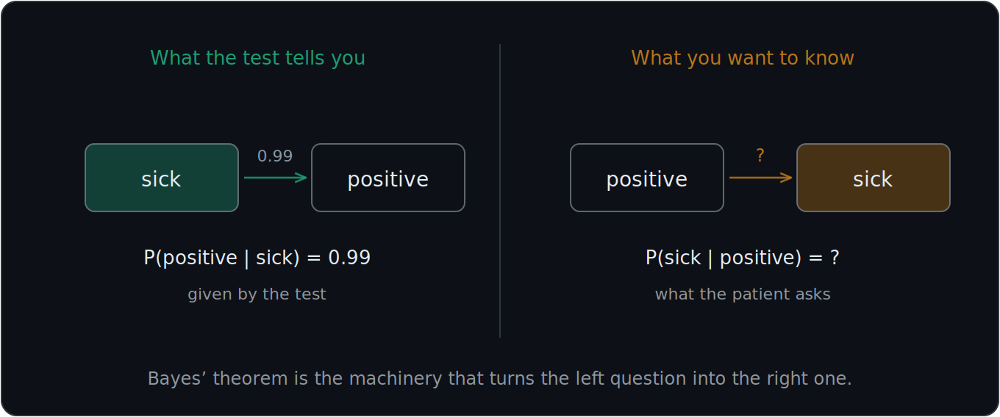
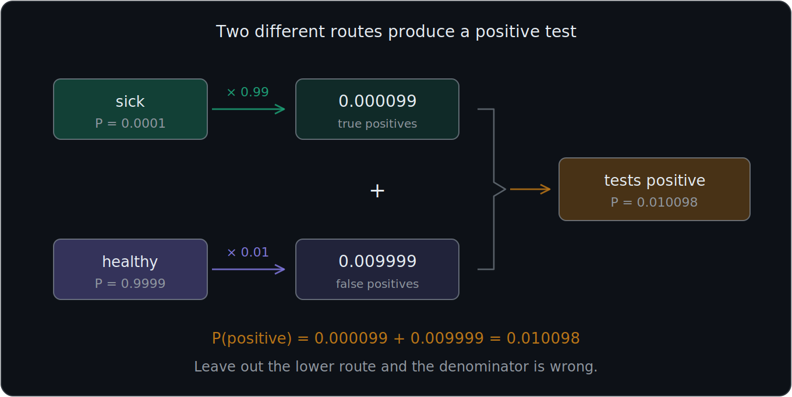
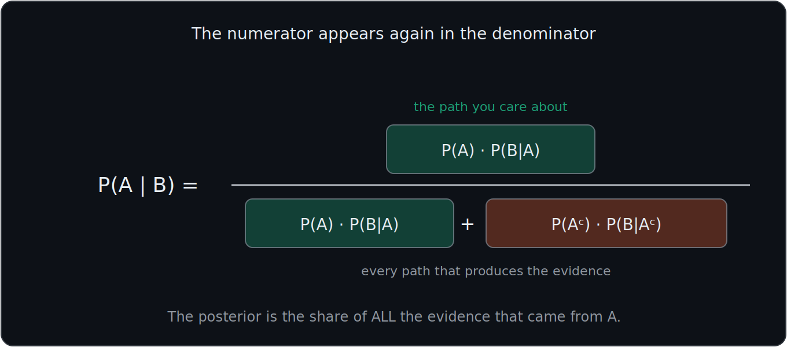
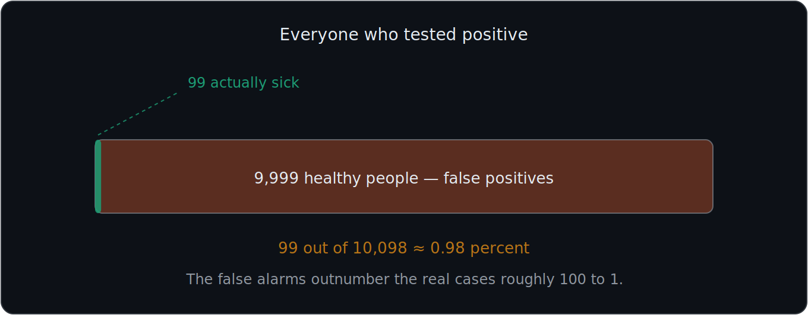
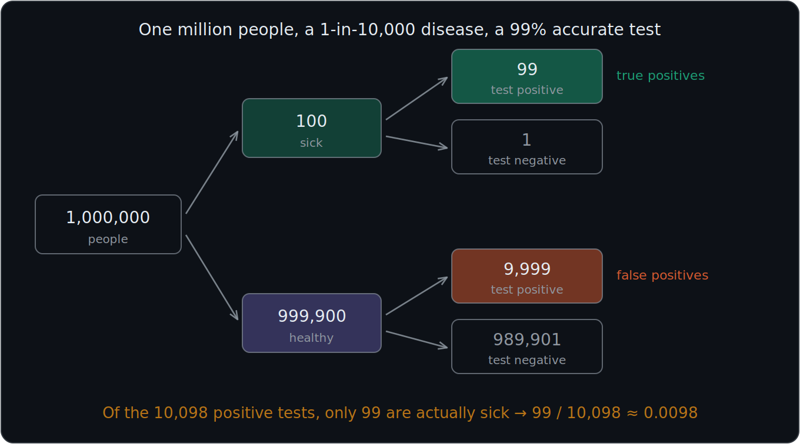

# What You Should Know About Bayes' Theorem

> **Prerequisites:** the complement rule is in 01, and the general product rule and Law of Total Probability are in 03. This file uses them rather than rederiving them.
>
> **The diagnostic-testing material** — true/false positives, sensitivity, specificity, and base-rate neglect — has its own file, 05.

Bayes' theorem is used to **update a probability after receiving new evidence**.

More specifically, it allows you to reverse the direction of a conditional probability.

You may know:

$$
P(B\mid A)
$$

but want:

$$
P(A\mid B)
$$

The most important ideas are:

- Prior probability
- Evidence
- Likelihood
- Posterior probability
- Reversing conditional probability
- The Bayes formula

---

# 1. Bayes reverses the direction of conditioning

This is the main reason Bayes' theorem is useful.

Recall from 03 that the vertical bar means "given that," and that:

$$
P(A\mid B) = \frac{P(A\cap B)}{P(B)}
$$

Recall also that the two directions are not interchangeable:

$$
\boxed{P(A\mid B)\neq P(B\mid A)}
$$

Suppose you know:

$$
P(B\mid A)
$$

but you want:

$$
P(A\mid B)
$$

Bayes' theorem gives you a way to calculate one direction using information about the other.

Therefore:

$$
\boxed{\text{Bayes' theorem reverses conditional probability}}
$$

---

# 2. Medical-test example

Let:

$$
A=\text{sick}
$$

and:

$$
B=\text{tested positive}
$$

Suppose the question asks:

**What is the probability that you are actually sick GIVEN that you tested positive?**

We want:

$$
P(A\mid B)
$$

or:

$$
P(\text{sick}\mid\text{positive})
$$

But the test information usually gives us something like:

$$
P(\text{positive}\mid\text{sick})
$$

That is the opposite direction.

Bayes' theorem allows us to reverse it.

---

# 3. Prior probability, also called the base rate

The **prior probability** is the probability of A before considering the new evidence.

It is written:

$$
P(A)
$$

In the medical example:

$$
P(\text{sick})=\frac{1}{10{,}000}=0.0001
$$

or:

**0.01%**

Therefore:

$$
\boxed{P(A)=\text{prior probability}}
$$

Think of the prior as:

**What was the probability before seeing the new evidence?**

## Base rate is another name for the same thing

The prior is also commonly called the **base rate**:

$$
\boxed{\text{Base rate}=\text{how common A is before observing B}}
$$

In this example the disease is extremely rare. That fact will turn out to dominate the final answer, which is the subject of 05.

## The complement

You will also need the probability that A does **not** happen. From the complement rule in 01:

$$
P(A^c)=1-P(A)=1-0.0001=0.9999
$$

so:

$$
P(\text{not sick})=0.9999
$$

---

# 4. Likelihood

The **likelihood** describes how likely the evidence B is if A is true.

It is:

$$
P(B\mid A)
$$

In the medical example:

$$
P(\text{positive}\mid\text{sick})=0.99
$$

This means:

**If someone is actually sick, there is a 99 percent probability that the test says positive.**

Therefore:

$$
\boxed{P(B\mid A)=\text{likelihood}}
$$

## The alternative likelihood

Bayes also needs to know how often the evidence appears when A is **false**:

$$
P(B\mid A^c)
$$

In the medical example:

$$
P(\text{positive}\mid\text{not sick})=0.01
$$

These two numbers are the true positive rate and the false positive rate, and they are named and compared in detail in 05. For the Bayes calculation itself, all you need is that both paths exist.

---

# 5. The numerator represents A AND B

Bayes' theorem needs:

$$
P(A\cap B)
$$

The general product rule from 03 gives:

$$
P(A\cap B) = P(A)P(B\mid A)
$$

In the medical example:

$$
P(\text{sick AND positive}) = P(\text{sick})\,P(\text{positive}\mid\text{sick})
$$

Substitute:

$$
= 0.0001(0.99) = 0.000099
$$

Therefore:

$$
\boxed{P(\text{sick AND positive})=0.000099}
$$

This is the group you care about: people who are both sick **and** testing positive.

---

# 6. The denominator must include every way the evidence can happen

The denominator:

$$
P(B)
$$

must include **every path that produces the evidence B**.

A positive test can occur in two different ways:

| Path | Who they are | Probability |
|---|---|---|
| 1 | Sick and tests positive | $P(A)P(B\mid A)$ |
| 2 | Healthy and tests positive | $P(A^c)P(B\mid A^c)$ |

Because $A$ and $A^c$ form a partition, these two paths do not overlap and leave no gaps. This is exactly the **Law of Total Probability** from 03:

$$
\boxed{P(B) = P(A)P(B\mid A) + P(A^c)P(B\mid A^c)}
$$

In the medical example:

$$
\boxed{\text{All positive tests} = \text{true positives} + \text{false positives}}
$$

Ignoring the second path would produce the wrong answer. This is the single most common place Bayes problems go wrong.

---

# 7. Bayes' theorem

The standard Bayes formula is:

$$
\boxed{P(A\mid B) = \frac{P(A)P(B\mid A)}{P(B)}}
$$

In words:

$$
\boxed{\text{Posterior} = \frac{\text{Prior}\times\text{Likelihood}}{\text{Probability of the Evidence}}}
$$

This is the central Bayes formula.

## Where it comes from

Bayes is not a new rule. Recall from 03 that the product rule works in both directions:

$$
P(A\cap B) = P(A)P(B\mid A) = P(B)P(A\mid B)
$$

Take the two right-hand expressions and divide both sides by $P(B)$:

$$
P(A\mid B) = \frac{P(A)P(B\mid A)}{P(B)}
$$

That is the entire derivation. Bayes' theorem is the product rule, rearranged.

---

# 8. Expanded Bayes formula

If A and its complement are the two possible underlying cases, substitute the Law of Total Probability into the denominator:

$$
\boxed{P(A\mid B) = \frac{P(A)P(B\mid A)}{P(A)P(B\mid A) + P(A^c)P(B\mid A^c)}}
$$

This is the version used in the medical-test example, and the one you will use most often.

Notice the structure: **the numerator is one of the terms in the denominator.** The posterior is asking what fraction of all the evidence came from the path you care about.

## The denominator is a normalizing constant

The denominator does not depend on which hypothesis you are asking about — it is the same number for A and for $A^c$. Its only job is to make the results add to 1.

Therefore, if you only need to know **which** hypothesis is more likely, you can compare numerators and skip the denominator entirely:

$$
P(A\mid B) \propto P(A)P(B\mid A)
$$

where $\propto$ means "is proportional to." This shortcut matters a great deal in 13, where the denominator is expensive and the goal is only to pick the winning class.

## More than two hypotheses

If $A_1, A_2, \ldots, A_k$ form a partition instead of just $A$ and $A^c$, the general form is:

$$
\boxed{P(A_i\mid B) = \frac{P(A_i)P(B\mid A_i)}{\sum_{j=1}^{k} P(A_j)P(B\mid A_j)}}
$$

The denominator is still just the Law of Total Probability, now summed over all the cases.

---

# 9. Posterior probability

The answer produced by Bayes' theorem is called the **posterior probability**.

The prior is:

$$
P(A)
$$

The posterior is:

$$
P(A\mid B)
$$

Therefore:

$$
\boxed{\text{Prior} \xrightarrow{\text{new evidence}} \text{Posterior}}
$$

In words:

**Start with what you believed before the evidence and update it after observing the evidence.**

## The four pieces together

| Piece | Symbol | Question it answers |
|---|---|---|
| Prior | $P(A)$ | How likely was A before any evidence? |
| Likelihood | $P(B\mid A)$ | If A were true, how likely is this evidence? |
| Evidence | $P(B)$ | How likely is this evidence overall, any cause? |
| Posterior | $P(A\mid B)$ | How likely is A now that I have seen the evidence? |

---

# 10. Solve the medical-test example

Suppose:

$$
P(\text{sick})=0.0001
$$

$$
P(\text{not sick})=0.9999
$$

$$
P(\text{positive}\mid\text{sick})=0.99
$$

$$
P(\text{positive}\mid\text{not sick})=0.01
$$

We want:

$$
P(\text{sick}\mid\text{positive})
$$

Use:

$$
P(A\mid B) = \frac{P(A)P(B\mid A)}{P(A)P(B\mid A) + P(A^c)P(B\mid A^c)}
$$

Substitute:

$$
P(\text{sick}\mid\text{positive}) = \frac{0.0001(0.99)}{0.0001(0.99)+0.9999(0.01)}
$$

Calculate the true-positive path:

$$
0.0001(0.99)=0.000099
$$

Calculate the false-positive path:

$$
0.9999(0.01)=0.009999
$$

Add to get all positive tests:

$$
0.000099+0.009999 = 0.010098
$$

Now divide:

$$
P(\text{sick}\mid\text{positive}) = \frac{0.000099}{0.010098} \approx 0.0098
$$

Therefore:

$$
\boxed{P(\text{sick}\mid\text{positive}) \approx 0.0098}
$$

## This answer should surprise you

The test is correct 99 percent of the time, yet a positive result means slightly less than a 1 percent chance of being sick. The prior went from 0.01% up to 0.98% — the evidence multiplied the probability by about 98, but it started so small that it is still low.

Why this happens, and why it is not a trick, is the subject of 05.

---

# 11. Natural-frequency interpretation

The Bayes result becomes much easier to understand if you stop using decimals and imagine a concrete population of:

$$
1{,}000{,}000
$$

people.

Since the disease occurs in 1 out of 10,000 people, the number of sick people is:

$$
100
$$

Of those 100 sick people, 99 percent test positive:

$$
100(0.99)=99 \quad\text{true positives}
$$

The remaining healthy people number:

$$
1{,}000{,}000-100 = 999{,}900
$$

Of those, 1 percent test positive incorrectly:

$$
999{,}900(0.01)=9{,}999 \quad\text{false positives}
$$

Therefore, total positive tests equal:

$$
99+9{,}999=10{,}098
$$

Only 99 of those people are actually sick. Therefore:

$$
P(\text{sick}\mid\text{positive}) = \frac{99}{10{,}098} \approx 0.0098
$$

which matches the formula exactly.

## Why this version is worth learning

The counting version and the formula version are the same calculation, but the counting version makes the answer feel obvious rather than paradoxical. If a Bayes problem ever seems confusing, translate it into a population of whole people and count.

$$
\boxed{\text{Confused by a Bayes problem? Count actual people.}}
$$

---

# 12. Bayes problem-solving recipe

Most Bayes problems of this type can be solved using the same nine steps.

### Step 1: Identify what you want

Find:

$$
P(A\mid B)
$$

---

### Step 2: Identify the prior

Find:

$$
P(A)
$$

---

### Step 3: Find the complement

$$
P(A^c)=1-P(A)
$$

---

### Step 4: Identify the likelihood

Find:

$$
P(B\mid A)
$$

---

### Step 5: Identify the alternative likelihood

Find:

$$
P(B\mid A^c)
$$

---

### Step 6: Calculate the A path

$$
P(A)P(B\mid A)
$$

---

### Step 7: Calculate the alternative path

$$
P(A^c)P(B\mid A^c)
$$

---

### Step 8: Add the paths

$$
P(B) = P(A)P(B\mid A) + P(A^c)P(B\mid A^c)
$$

---

### Step 9: Divide

$$
P(A\mid B) = \frac{P(A)P(B\mid A)}{P(B)}
$$

A useful memory shortcut is:

$$
\boxed{\text{Prior}\times\text{Likelihood} \rightarrow \text{sum all evidence paths} \rightarrow \text{divide}}
$$

## The most common mistakes

- Forgetting Step 5 and Step 7, which drops the false-positive path entirely
- Using $P(A\mid B)$ where the problem gave you $P(B\mid A)$
- Putting only the numerator's path in the denominator

---

# 13. Bayes is not only for medical tests

Bayes' theorem applies whenever new evidence changes what we should believe about an event.

## Monty Hall

Suppose you initially choose Door 1.

Before seeing any new information:

$$
P(E_1)=P(E_2)=P(E_3)=\frac13
$$

where:

$$
E_i=\text{car is behind Door }i
$$

Then the host opens Door 3 and reveals a goat.

That new information changes the probabilities. The Bayes calculation gives:

$$
P(E_2\mid B)=\frac23
\qquad\text{while}\qquad
P(E_1\mid B)=\frac13
$$

Therefore, switching to Door 2 gives the larger probability.

This is a three-hypothesis problem, so it uses the general form from section 8, with the three doors as the partition.

## Other applications

The same structure appears in:

- **Spam filtering** — prior that an email is spam, updated by the words it contains (see 13)
- **Machine learning classification** — prior class probability, updated by the observed features
- **Search and diagnosis** — any situation where you observe a symptom and want to infer a cause

The important lesson is that the structure never changes:

$$
\boxed{\text{Prior}\times\text{Likelihood} \rightarrow \text{Total Probability} \rightarrow \text{Posterior}}
$$

---

# Most Important Definitions and Distinctions to Remember

## Prior

Probability before observing the evidence, also called the base rate:

$$
\boxed{P(A)=\text{prior}}
$$

---

## Likelihood

Probability of observing the evidence if A is true:

$$
\boxed{P(B\mid A)=\text{likelihood}}
$$

---

## Evidence

The event that was observed, and its overall probability:

$$
\boxed{B=\text{evidence} \qquad P(B)=\text{probability of the evidence}}
$$

---

## Posterior

Updated probability after observing the evidence:

$$
\boxed{P(A\mid B)=\text{posterior}}
$$

---

## Total probability

$$
\boxed{P(B) = P(A)P(B\mid A) + P(A^c)P(B\mid A^c)}
$$

---

## Bayes' theorem

$$
\boxed{P(A\mid B) = \frac{P(A)P(B\mid A)}{P(B)}}
$$

Expanded:

$$
\boxed{P(A\mid B) = \frac{P(A)P(B\mid A)}{P(A)P(B\mid A) + P(A^c)P(B\mid A^c)}}
$$

---

# Most Important Distinctions

| Concept | Meaning |
|---|---|
| $P(A)$ | Prior probability, or base rate |
| $P(B\mid A)$ | Likelihood |
| $P(B)$ | Overall probability of the evidence |
| $P(A\mid B)$ | Posterior probability |
| $A^c$ | Opposite or complement of A |

Most importantly:

$$
\boxed{P(A\mid B)\neq P(B\mid A)}
$$

For medical testing:

$$
\boxed{P(\text{positive}\mid\text{sick}) \neq P(\text{sick}\mid\text{positive})}
$$

---

# Main Rules to Put in Your Notebook

$$
\boxed{P(A^c)=1-P(A)}
$$

$$
\boxed{P(A\cap B)=P(A)P(B\mid A)}
$$

$$
\boxed{P(B) = P(A)P(B\mid A) + P(A^c)P(B\mid A^c)}
$$

$$
\boxed{P(A\mid B) = \frac{P(A)P(B\mid A)}{P(B)}}
$$

or:

$$
\boxed{P(A\mid B) = \frac{P(A)P(B\mid A)}{P(A)P(B\mid A) + P(A^c)P(B\mid A^c)}}
$$

For more than two cases:

$$
\boxed{P(A_i\mid B) = \frac{P(A_i)P(B\mid A_i)}{\sum_j P(A_j)P(B\mid A_j)}}
$$

For comparing hypotheses only:

$$
\boxed{P(A\mid B) \propto P(A)P(B\mid A)}
$$

Remember:

$$
\boxed{\text{Prior} \xrightarrow{\text{Evidence}} \text{Posterior}}
$$

$$
\boxed{P(A\mid B)\neq P(B\mid A)}
$$

And the easiest Bayes recipe to remember is:

$$
\boxed{\text{Prior}\times\text{Likelihood} \rightarrow \text{add all ways the evidence can happen} \rightarrow \text{divide}}
$$

The biggest idea is:

**Bayes' theorem updates a prior probability after new evidence is observed. It uses how common the event was beforehand, how likely the evidence is under each possible explanation, and then determines what proportion of all cases producing that evidence came from the event you care about.**

---

# Where This Goes Next

| Idea from this file | Where it is used |
|---|---|
| $P(\text{sick}\mid\text{positive})\approx0.0098$ | **05 — Test Accuracy and Base Rates**: why this is not a trick |
| $P(B\mid A)$ vs $P(B\mid A^c)$ | **05**: these are the true positive and false positive rates |
| The posterior $P(A\mid B)$ | **05**: this quantity is precision, also called PPV |
| Prior, likelihood, posterior | **13 — Naive Bayes**: the same three pieces, with many features |
| $P(A\mid B)\propto P(A)P(B\mid A)$ | **13**: why a classifier can skip the denominator |
| The 9-step recipe | **13**: the spam calculation follows these steps exactly |
