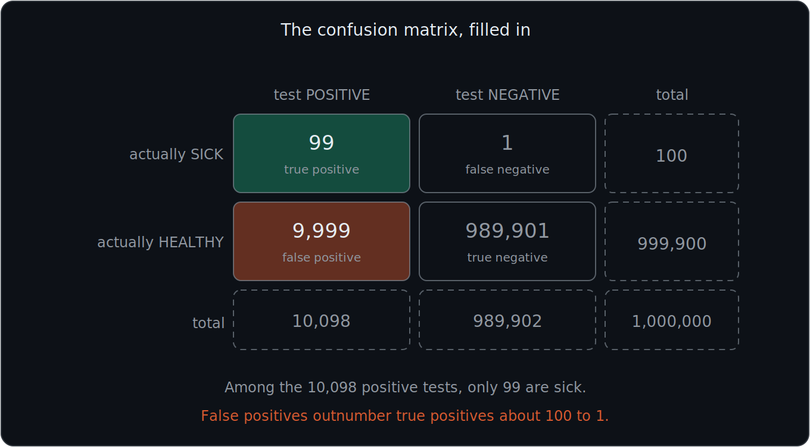
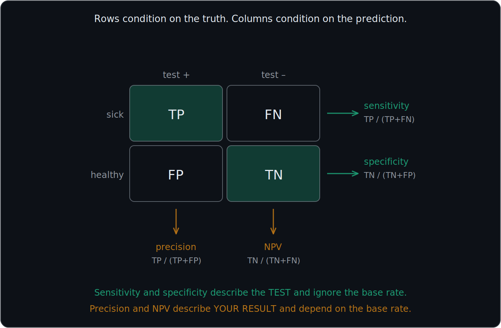
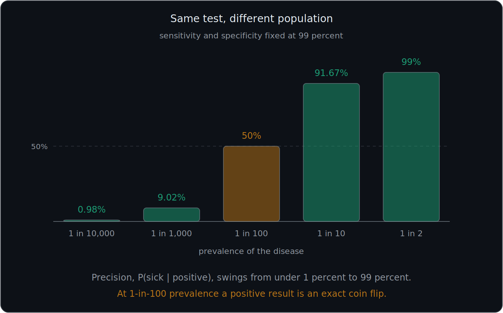
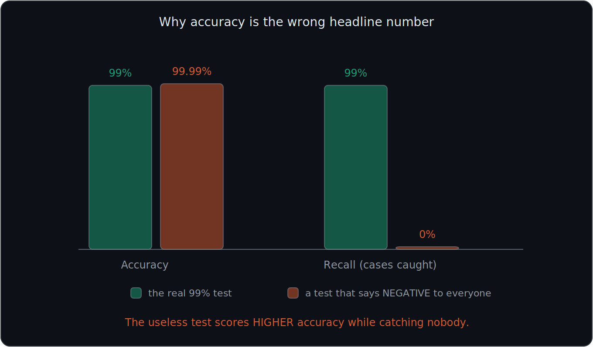
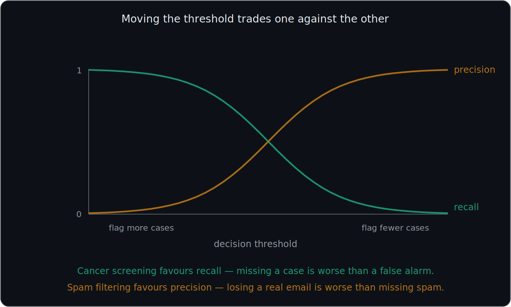

# What You Should Know About Test Accuracy and Base Rates

> **Prerequisites:** conditional probability and $P(A\mid B)\neq P(B\mid A)$ are in 03. The medical-test calculation this file analyses is worked in 04.
>
> This file was split out of the Bayes notes because it is the direct ancestor of **precision, recall, and the confusion matrix** in machine learning. Everything here is one idea applied repeatedly: *a rate means nothing until you know what it is conditioned on.*

These notes cover **six important ideas**: the four possible test outcomes, the two families of accuracy rates, why a 99 percent accurate test can still be wrong almost every time, why base rates dominate rare events, why plain accuracy is a misleading number, and how all of this maps onto machine-learning vocabulary.

---

# 1. Know the four possible test outcomes

Any yes/no test compared against a yes/no reality produces four possible combinations.

| Actual Condition | Test Result | Name |
|---|---|---|
| Sick | Positive | True Positive |
| Sick | Negative | False Negative |
| Healthy | Positive | False Positive |
| Healthy | Negative | True Negative |

### True Positive

Actually sick and correctly tests positive.

### False Negative

Actually sick but incorrectly tests negative. The test **missed** it.

### False Positive

Actually healthy but incorrectly tests positive. A **false alarm**.

### True Negative

Actually healthy and correctly tests negative.

## Reading the names

The naming is more systematic than it looks:

- The **second** word is what the **test said**: positive or negative
- The **first** word says whether the test was **right**: true or false

So a "false negative" is a test that said negative and was wrong.

## The confusion matrix

Arranged as a grid, these four counts are called the **confusion matrix**:

| | Test says POSITIVE | Test says NEGATIVE |
|---|---|---|
| **Actually SICK** | True Positive (TP) | False Negative (FN) |
| **Actually HEALTHY** | False Positive (FP) | True Negative (TN) |

Every single case falls into exactly one cell, so the four cells form a **partition** of the population, in the sense of 01.

The two cells most important for the Bayes calculation are:

$$
\boxed{\text{True Positives} \qquad\text{and}\qquad \text{False Positives}}
$$

because both groups appear among the people who tested positive.

---

# 2. Fill in the confusion matrix with real counts

Use the population from 04: one million people, a disease affecting 1 in 10,000, a test that is 99 percent accurate in both directions.

$$
\text{sick} = 100 \qquad \text{healthy} = 999{,}900
$$

Of the 100 sick people, 99 percent test positive:

$$
TP = 99 \qquad FN = 1
$$

Of the 999,900 healthy people, 99 percent correctly test negative:

$$
TN = 989{,}901 \qquad FP = 9{,}999
$$

The completed matrix:

| | Test POSITIVE | Test NEGATIVE | Row total |
|---|---|---|---|
| **Actually SICK** | 99 | 1 | 100 |
| **Actually HEALTHY** | 9,999 | 989,901 | 999,900 |
| **Column total** | 10,098 | 989,902 | 1,000,000 |

Look at the top-left corner against the cell below it. Among everyone who tested positive, only 99 out of 10,098 are actually sick. **The false positives outnumber the true positives by about 100 to 1.**

Every rate in the rest of this file is just a ratio taken from this table.

---

# 3. Rates that condition on the TRUTH

These rates ask: *given what the person actually is, how often does the test get it right?* They read **across the rows** of the matrix.

## True positive rate

$$
P(\text{positive}\mid\text{sick})
$$

is the **true positive rate**, also called **sensitivity**:

$$
\boxed{\text{Sensitivity} = \text{TPR} = P(\text{positive}\mid\text{sick}) = \frac{TP}{TP+FN}}
$$

In the example:

$$
\frac{99}{99+1} = \frac{99}{100} = 0.99
$$

Sensitivity answers: **of the people who are sick, how many does the test catch?**

## False negative rate

$$
\boxed{\text{FNR} = P(\text{negative}\mid\text{sick}) = \frac{FN}{TP+FN} = 1 - \text{sensitivity}}
$$

In the example:

$$
\frac{1}{100} = 0.01
$$

## True negative rate

$$
\boxed{\text{Specificity} = \text{TNR} = P(\text{negative}\mid\text{healthy}) = \frac{TN}{TN+FP}}
$$

In the example:

$$
\frac{989{,}901}{999{,}900} = 0.99
$$

Specificity answers: **of the people who are healthy, how many does the test correctly clear?**

## False positive rate

$$
\boxed{\text{FPR} = P(\text{positive}\mid\text{healthy}) = \frac{FP}{FP+TN} = 1 - \text{specificity}}
$$

In the example:

$$
\frac{9{,}999}{999{,}900} = 0.01
$$

This represents healthy people who incorrectly receive a positive result.

Do not confuse this with the true positive rate. Both are conditional probabilities of a **positive test**, but they condition on opposite groups.

## The row pairs each add to 1

$$
\text{sensitivity} + \text{FNR} = 1
\qquad\qquad
\text{specificity} + \text{FPR} = 1
$$

because a sick person must test either positive or negative, and likewise for a healthy person.

---

# 4. Rates that condition on the TEST RESULT

These rates ask the reversed question: *given what the test said, how often is it right?* They read **down the columns**.

## Positive predictive value

$$
\boxed{\text{Precision} = \text{PPV} = P(\text{sick}\mid\text{positive}) = \frac{TP}{TP+FP}}
$$

In the example:

$$
\frac{99}{99+9{,}999} = \frac{99}{10{,}098} \approx 0.0098
$$

PPV answers: **if the test says positive, how worried should I be?**

## Negative predictive value

$$
\boxed{\text{NPV} = P(\text{healthy}\mid\text{negative}) = \frac{TN}{TN+FN}}
$$

In the example:

$$
\frac{989{,}901}{989{,}902} \approx 0.999999
$$

A negative result on this test is almost perfectly reassuring, even though a positive result is nearly meaningless. That asymmetry is entirely due to the base rate.

---

# 5. The two families answer different questions

This is the central idea of the file.

| | Conditions on | Reads | Question |
|---|---|---|---|
| Sensitivity, Specificity, FPR, FNR | The **truth** | Rows | How good is the test? |
| Precision (PPV), NPV | The **test result** | Columns | What does my result mean? |

The same population produces wildly different numbers depending on the direction:

$$
P(\text{positive}\mid\text{sick}) = 0.99
\qquad\text{but}\qquad
P(\text{sick}\mid\text{positive}) \approx 0.0098
$$

These are reversed conditional probabilities, and 03 already told you they need not be equal. Here you can see just how unequal they can be.

## The crucial practical difference

$$
\boxed{\text{Sensitivity and specificity do not depend on the base rate. Precision does.}}
$$

Sensitivity is a property of the **test**. Take the same test to a different population and sensitivity stays at 99 percent.

Precision is a property of the **test plus the population**. Take the same test to a different population and precision changes completely, as section 8 shows.

## Bayes is the bridge between the families

Bayes' theorem is precisely the machinery for converting a truth-conditioned rate into a result-conditioned one:

$$
\underbrace{P(\text{sick}\mid\text{positive})}_{\text{precision}} = \frac{P(\text{sick})\,\overbrace{P(\text{positive}\mid\text{sick})}^{\text{sensitivity}}}{P(\text{sick})\,P(\text{positive}\mid\text{sick}) + P(\text{healthy})\,\underbrace{P(\text{positive}\mid\text{healthy})}_{\text{FPR}}}
$$

Therefore:

$$
\boxed{\text{The Bayes posterior IS precision}}
$$

The 0.98 percent answer computed in 04 and the precision computed in section 4 are the same number arrived at two ways.

---

# 6. Why a 99 percent effective test does not mean a 99 percent chance of being sick

This is one of the most important distinctions in the entire topic.

The statement:

$$
P(\text{positive}\mid\text{sick})=0.99
$$

does **not** mean:

$$
P(\text{sick}\mid\text{positive})=0.99
$$

In this example:

$$
P(\text{positive}\mid\text{sick})=0.99
$$

but:

$$
P(\text{sick}\mid\text{positive})\approx0.0098
$$

Therefore:

$$
\boxed{P(A\mid B)\neq P(B\mid A)}
$$

The phrase "99 percent accurate" is doing something sneaky here. It describes the test's behaviour on people whose status is already known. It says nothing directly about what your own positive result means, because that depends on how many people like you were tested in the first place.

---

# 7. Why base rates matter

The disease is extremely rare:

$$
P(\text{sick})=0.0001 \qquad P(\text{healthy})=0.9999
$$

So even though only 1 percent of healthy people produce false positives, there are so many healthy people that the false-positive count becomes very large.

The example produces:

$$
99 \text{ true positives} \qquad\text{but}\qquad 9{,}999 \text{ false positives}
$$

A small error rate applied to a huge group beats a large success rate applied to a tiny group.

Therefore:

$$
\boxed{\text{A very large population can make a small false-positive rate produce many false positives}}
$$

This is why Bayes' theorem must consider the **base rate**.

## The rule of thumb

$$
\boxed{\text{Compare the false positive rate against the base rate, not against 100 percent}}
$$

Here the false positive rate is 1 percent and the base rate is 0.01 percent. The error rate is **100 times larger** than the thing being detected, so false alarms must dominate. You can see the answer will be bad before doing any arithmetic.

---

# 8. The same test at different base rates

Nothing about the test changes in this table. Sensitivity stays at 99 percent and specificity stays at 99 percent. Only the prevalence of the disease changes.

| Prevalence | $P(\text{sick})$ | Precision, $P(\text{sick}\mid\text{positive})$ |
|---|---|---|
| 1 in 10,000 | 0.0001 | 0.98% |
| 1 in 1,000 | 0.001 | 9.02% |
| 1 in 100 | 0.01 | 50.00% |
| 1 in 10 | 0.1 | 91.67% |
| 1 in 2 | 0.5 | 99.00% |

Read the 1-in-100 row carefully. With a 99 percent accurate test and a 1 percent disease, a positive result is an exact **coin flip**.

Only when the disease is as common as the test's error rate does the test start to be informative, and only when the disease is common does precision approach the headline accuracy figure.

$$
\boxed{\text{Same test, different population, completely different meaning}}
$$

This is why screening the general population is a different problem from testing people who already have symptoms. Symptoms raise the prior before the test is even run.

---

# 9. Base-rate neglect

A common mistake is to focus only on the accuracy of the evidence and ignore how common the original event was.

For example, someone might think:

> The test is 99 percent accurate, so a positive result must mean there is a 99 percent chance of disease.

That ignores:

$$
P(\text{sick})
$$

the prior, or base rate. This error is so common it has a name: **base-rate neglect**.

Bayes' theorem prevents this mistake by combining:

- The prior
- The likelihood
- The false-positive path

Therefore:

$$
\boxed{\text{Do not ignore the prior when interpreting evidence}}
$$

## How to catch yourself doing it

Whenever you are handed an accuracy figure and asked what a result means, ask:

1. What is the base rate?
2. How many of the *other* group are there?
3. How many false alarms does that group generate?

If you skipped straight from "99 percent accurate" to "99 percent likely," you have neglected the base rate.

---

# 10. Why plain accuracy is misleading

**Accuracy** is the fraction of all predictions that were correct:

$$
\boxed{\text{Accuracy} = \frac{TP+TN}{TP+TN+FP+FN}}
$$

For our test:

$$
\frac{99 + 989{,}901}{1{,}000{,}000} = \frac{990{,}000}{1{,}000{,}000} = 0.99
$$

That sounds excellent. Now consider a completely useless test that simply says **negative to everyone**, never examining the patient at all:

$$
TP=0 \qquad FN=100 \qquad FP=0 \qquad TN=999{,}900
$$

Its accuracy is:

$$
\frac{0 + 999{,}900}{1{,}000{,}000} = 0.9999
$$

The useless test scores **higher accuracy than the real test**. It catches nobody, but it is right more often, because "healthy" is almost always the correct answer.

Therefore:

$$
\boxed{\text{On rare events, accuracy is dominated by the majority class and tells you almost nothing}}
$$

This is called the **accuracy paradox**, and it is one of the first traps in applied machine learning. A fraud detector, a disease screen, or a defect classifier can all report 99 percent accuracy while being worthless. Report precision and recall instead.

---

# 11. The machine-learning vocabulary map

Medicine, statistics, and machine learning developed these ideas separately and gave them different names. They are the same quantities.

| Statistical name | ML name | Formula | Conditional probability |
|---|---|---|---|
| Sensitivity, TPR | **Recall** | $\dfrac{TP}{TP+FN}$ | $P(\text{positive}\mid\text{sick})$ |
| Specificity, TNR | Specificity | $\dfrac{TN}{TN+FP}$ | $P(\text{negative}\mid\text{healthy})$ |
| False positive rate | Fall-out | $\dfrac{FP}{FP+TN}$ | $P(\text{positive}\mid\text{healthy})$ |
| Positive predictive value | **Precision** | $\dfrac{TP}{TP+FP}$ | $P(\text{sick}\mid\text{positive})$ |
| Negative predictive value | NPV | $\dfrac{TN}{TN+FN}$ | $P(\text{healthy}\mid\text{negative})$ |
| Prevalence, base rate | Class prior | $\dfrac{TP+FN}{\text{total}}$ | $P(\text{sick})$ |

The two you will use constantly:

$$
\boxed{\text{Recall} = \text{sensitivity} = P(\text{predicted positive}\mid\text{actually positive})}
$$

$$
\boxed{\text{Precision} = \text{PPV} = P(\text{actually positive}\mid\text{predicted positive})}
$$

Notice that precision and recall are **reversed conditionals of each other**. Everything in 03 about $P(A\mid B)\neq P(B\mid A)$ applies directly.

---

# 12. The precision-recall tradeoff

Most classifiers do not output a hard yes or no. They output a score, and you choose a **threshold** above which you call the result positive.

Moving that threshold trades the two rates against each other:

| Threshold | Effect | Recall | Precision |
|---|---|---|---|
| Lower | Flag more cases | Goes up | Goes down |
| Higher | Flag fewer cases | Goes down | Goes up |

Lower the threshold and you catch more of the true cases, but you also collect more false alarms. Raise it and your positives become more trustworthy, but you miss more real cases.

Which side you favour depends on the cost of each error:

- **Missing a case is worse** (cancer screening, fraud) → favour **recall**
- **A false alarm is worse** (spam filtering a real email into the junk folder) → favour **precision**

## Combining the two

The **F1 score** is the harmonic mean of precision and recall, used when you want a single number:

$$
\boxed{F_1 = \frac{2 \times \text{precision} \times \text{recall}}{\text{precision} + \text{recall}}}
$$

The harmonic mean is used rather than an ordinary average because it punishes imbalance. Our test has recall 99% and precision 0.98%, giving:

$$
F_1 \approx 0.0194
$$

An ordinary average would have reported about 50 percent and hidden the problem completely.

---

# Most Important Definitions and Distinctions to Remember

## The four outcomes

| | Test POSITIVE | Test NEGATIVE |
|---|---|---|
| **Actually SICK** | True Positive | False Negative |
| **Actually HEALTHY** | False Positive | True Negative |

Second word = what the test said. First word = whether it was right.

---

## Rates conditioned on the truth

$$
\boxed{\text{Sensitivity} = \text{Recall} = \frac{TP}{TP+FN} = P(\text{positive}\mid\text{sick})}
$$

$$
\boxed{\text{Specificity} = \frac{TN}{TN+FP} = P(\text{negative}\mid\text{healthy})}
$$

$$
\boxed{\text{FPR} = 1 - \text{specificity} \qquad \text{FNR} = 1 - \text{sensitivity}}
$$

These are properties of the **test** and do not change with the base rate.

---

## Rates conditioned on the test result

$$
\boxed{\text{Precision} = \text{PPV} = \frac{TP}{TP+FP} = P(\text{sick}\mid\text{positive})}
$$

$$
\boxed{\text{NPV} = \frac{TN}{TN+FN} = P(\text{healthy}\mid\text{negative})}
$$

These depend on the **base rate** as well as the test.

---

## Base rate

$$
\boxed{\text{Base rate} = \text{prevalence} = \text{class prior} = P(\text{sick})}
$$

---

## Accuracy

$$
\boxed{\text{Accuracy} = \frac{TP+TN}{\text{total}}}
$$

Unreliable whenever one class is rare.

---

## The distinction that matters most

$$
\boxed{P(\text{positive}\mid\text{sick}) \neq P(\text{sick}\mid\text{positive})}
$$

$$
\boxed{\text{Recall} \neq \text{Precision}}
$$

They are reversed conditionals, and Bayes' theorem is what converts between them.

---

# Main Rules to Put in Your Notebook

| Quantity | Formula | Conditions on |
|---|---|---|
| Sensitivity / Recall | $\dfrac{TP}{TP+FN}$ | Truth |
| Specificity | $\dfrac{TN}{TN+FP}$ | Truth |
| FPR | $\dfrac{FP}{FP+TN}$ | Truth |
| Precision / PPV | $\dfrac{TP}{TP+FP}$ | Prediction |
| NPV | $\dfrac{TN}{TN+FN}$ | Prediction |
| Accuracy | $\dfrac{TP+TN}{\text{total}}$ | Everything |
| $F_1$ | $\dfrac{2PR}{P+R}$ | Both |

$$
\boxed{\text{sensitivity} + \text{FNR} = 1 \qquad \text{specificity} + \text{FPR} = 1}
$$

$$
\boxed{\text{Sensitivity and specificity ignore the base rate. Precision does not.}}
$$

$$
\boxed{\text{Compare the false positive rate against the base rate, not against 100 percent}}
$$

$$
\boxed{\text{Accuracy is meaningless when one class is rare}}
$$

$$
\boxed{P(A\mid B)\neq P(B\mid A)}
$$

The biggest idea is:

**A test statistic means nothing until you know which direction it conditions on. Sensitivity and specificity describe the test. Precision describes what your result actually means, and it depends on how common the condition was to begin with. When the base rate is tiny, false positives from the huge healthy group swamp the true positives from the tiny sick group, so even a very accurate test can produce a positive result that is almost always wrong.**

---

# Where This Goes Next

| Idea from this file | Where it is used |
|---|---|
| Precision is the Bayes posterior | **04 — Bayes' Theorem**: the 0.98% calculation |
| Class prior | **13 — Naive Bayes**: $P(\text{spam})$ is a base rate |
| Precision vs recall | **13 — Naive Bayes**: how to evaluate the spam classifier |
| Thresholds and tradeoffs | **13 — Naive Bayes**: the decision rule on the posterior |
| Rates as proportions of a group | **08 — Bernoulli and Binomial**: counting successes in trials |
