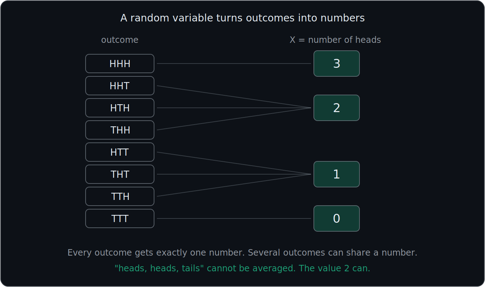
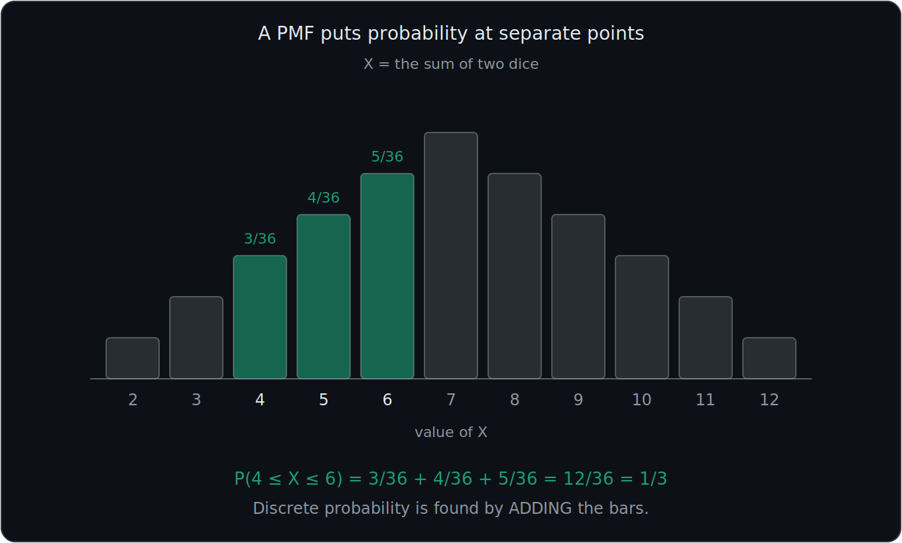
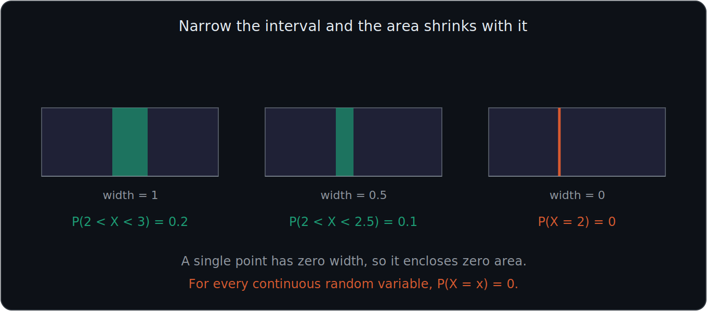
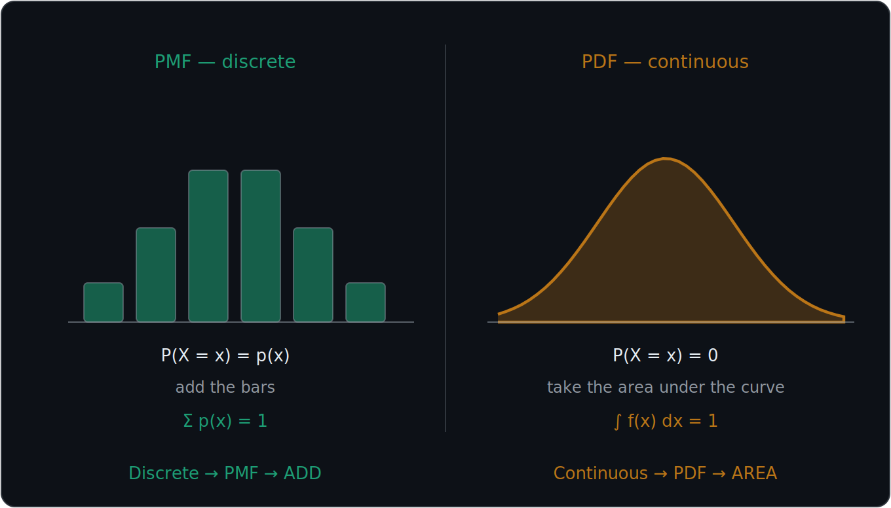
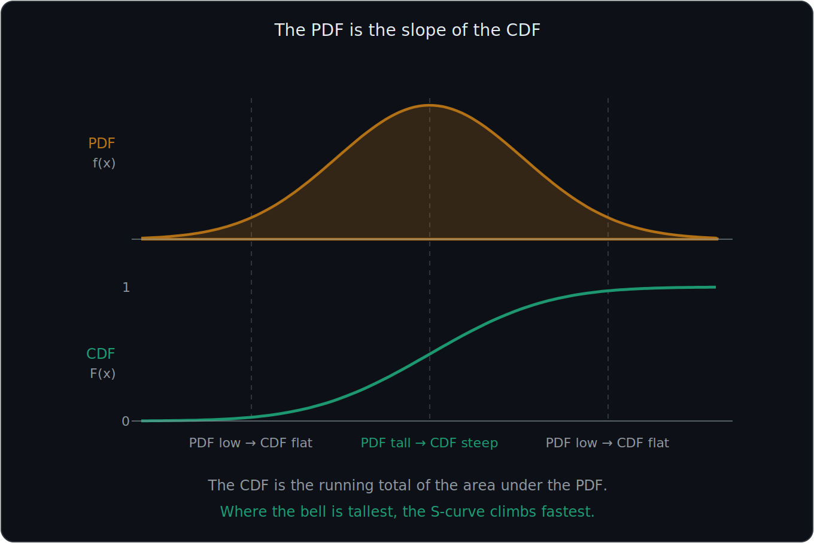

# What You Should Know About Random Variables, PMF, PDF, and CDF

> **This file is the home for all general CDF properties.** The distribution files (09, 10) give only their own specific CDF formula and reference this one for the rules that apply to every CDF.
>
> Set notation is in 01. This file is where probability stops being about *events* and starts being about *numbers*.

These notes teach what a random variable is, the difference between **discrete and continuous** random variables, how **PMFs and PDFs represent probability**, how the **CDF accumulates probability**, and how all three are connected.

---

# 1. What a random variable actually is

Everything in 01 through 05 was about **events** — sets of outcomes like "rolled an even number." A **random variable** is the tool that converts outcomes into **numbers** so that we can do arithmetic with them.

A random variable is a rule that assigns a number to every outcome of a random experiment.

## It is not a variable in the algebra sense

In algebra, $x$ is an unknown you solve for. A random variable is different — it is a **rule**, and it does not have one fixed value.

## Example

Flip a coin three times. The sample space is:

$$
\{HHH, HHT, HTH, THH, HTT, THT, TTH, TTT\}
$$

Define:

$$
X = \text{number of heads}
$$

Then $X$ assigns a number to each outcome:

| Outcome | $X$ |
|---|---|
| $HHH$ | 3 |
| $HHT$, $HTH$, $THH$ | 2 |
| $HTT$, $THT$, $TTH$ | 1 |
| $TTT$ | 0 |

The outcome "heads, heads, tails" is not a number and cannot be averaged or added. The value $2$ can. That is the entire purpose of a random variable.

## Capital $X$ versus lowercase $x$

This distinction is used constantly and is easy to mix up.

$$
\boxed{X = \text{the random variable, meaning the rule itself}}
$$

$$
\boxed{x = \text{one particular value that } X \text{ can take}}
$$

So $X = x$ means "the random variable $X$ takes the particular value $x$," and:

$$
P(X = x)
$$

means "the probability that the random variable comes out equal to that particular number."

For the coin example, $X$ is "the number of heads" and $x = 2$ is the specific case of exactly two heads.

---

# 2. Discrete versus continuous random variables

Before PMF, PDF, and CDF make sense, you need to know whether the random variable is **discrete** or **continuous**.

## Discrete random variable

A discrete random variable can take a **finite or countable number of separate values**.

Examples:

- Number of heads in 5 coin flips
- Number rolled on a die
- Number of customers
- Number of goals scored

For example:

$$
X=\text{number of heads in 5 coin flips}
$$

can only take:

$$
X=0,1,2,3,4,5
$$

You cannot get $X=2.4$ heads.

Discrete random variables use a:

$$
\boxed{\text{PMF}}
$$

## Continuous random variable

A continuous random variable can take **any value within an interval**.

Examples:

- Waiting time
- Height
- Weight
- Temperature
- Distance

For waiting time, values could include:

$$
1,\quad1.01,\quad1.274,\quad2,\quad2.43,\ldots
$$

There are infinitely many possible values between any two measurements.

Continuous random variables use a:

$$
\boxed{\text{PDF}}
$$

## The quick test

Ask: **can I list the possible values, or must I describe a range?**

Counting things gives discrete. Measuring things gives continuous.

---

# 3. PMF — Probability Mass Function

A **Probability Mass Function (PMF)** is used for:

$$
\boxed{\text{Discrete random variables}}
$$

The PMF is written:

$$
p_X(x)
$$

and means:

$$
\boxed{p_X(x)=P(X=x)}
$$

In words:

> **The PMF gives the probability that a discrete random variable equals exactly $x$.**

## Example: the sum of two dice

Let:

$$
X=\text{sum of two fair six-sided dice}
$$

From 01, rolling two dice produces $6\times6=36$ equally likely ordered outcomes. Counting how many produce each sum gives the PMF:

| $x$ | 2 | 3 | 4 | 5 | 6 | 7 | 8 | 9 | 10 | 11 | 12 |
|---|---|---|---|---|---|---|---|---|---|---|---|
| $p_X(x)$ | $\frac{1}{36}$ | $\frac{2}{36}$ | $\frac{3}{36}$ | $\frac{4}{36}$ | $\frac{5}{36}$ | $\frac{6}{36}$ | $\frac{5}{36}$ | $\frac{4}{36}$ | $\frac{3}{36}$ | $\frac{2}{36}$ | $\frac{1}{36}$ |

So, for example:

$$
p_X(7)=P(X=7)=\frac{6}{36}=\frac16
$$

Graphed, a PMF is a set of **separate bars or points**, one for each possible value. There is nothing in between them, because there is nothing in between the values.

---

# 4. The two main PMF rules

A valid PMF must satisfy two conditions.

## Rule 1: Probabilities cannot be negative

$$
\boxed{p_X(x)\geq0}
$$

Every probability must be zero or positive.

## Rule 2: All probabilities must add to 1

$$
\boxed{\sum_x p_X(x)=1}
$$

For the two-dice example:

$$
\frac{1+2+3+4+5+6+5+4+3+2+1}{36} = \frac{36}{36} = 1
$$

Therefore:

$$
\boxed{\text{Discrete: sum of all probability masses}=1}
$$

This is the same idea as a partition from 01. The possible values of $X$ do not overlap and leave no gaps, so their probabilities must total 1.

---

# 5. Probability with a PMF comes from adding

Suppose you want:

$$
P(4\leq X\leq6)
$$

For a discrete variable, add the probabilities:

$$
P(4\leq X\leq6)=P(X=4)+P(X=5)+P(X=6)
$$

Using PMF notation:

$$
P(4\leq X\leq6)=p_X(4)+p_X(5)+p_X(6)
$$

Substituting from the dice table:

$$
\frac{3}{36}+\frac{4}{36}+\frac{5}{36} = \frac{12}{36} = \frac13
$$

Or more generally:

$$
\boxed{P(a\leq X\leq b)=\sum_{x=a}^{b}p_X(x)}
$$

So remember:

$$
\boxed{\text{PMF probability}=\text{sum of probability masses}}
$$

---

# 6. PDF — Probability Density Function

A **Probability Density Function (PDF)** is used for:

$$
\boxed{\text{Continuous random variables}}
$$

The PDF is written:

$$
f_X(x)
$$

The important distinction is that:

$$
\boxed{f_X(x)=\text{density}}
$$

It is **not** the probability that $X=x$.

Density is the rate at which probability accumulates around each point. Think of it the way you think about physical density: density is not mass, but mass follows from density once you specify a volume. Here, density is not probability, but probability follows once you specify an interval.

---

# 7. Probability for a continuous variable comes from area

For a PDF:

$$
\boxed{\text{Area under the curve}=\text{probability}}
$$

Therefore:

$$
P(a<X<b)
$$

is the area underneath the PDF between $a$ and $b$.

Mathematically:

$$
\boxed{P(a<X<b)=\int_a^b f_X(x)\,dx}
$$

The integral sign is doing the same job the summation sign did for the PMF. Discrete probability adds up separate masses; continuous probability accumulates area across a range.

---

# 8. PDF height is NOT probability

This is the **most important PDF distinction**.

Suppose the PDF has some height at $x=2$. That height:

$$
f_X(2)
$$

does **not** mean:

$$
P(X=2)
$$

Instead:

$$
\boxed{\text{PDF height}=\text{density}}
$$

while:

$$
\boxed{\text{Area under the PDF}=\text{probability}}
$$

A density can even be **greater than 1**, which would be impossible for a probability. A very narrow, very tall PDF can have a height of 5 and still enclose a total area of exactly 1.

---

# 9. For a continuous variable, an exact value has probability 0

Ask: what is the probability that you wait **exactly** one minute?

The answer is:

$$
\boxed{0}
$$

For every continuous random variable:

$$
\boxed{P(X=x)=0}
$$

Why? A single point has:

$$
\text{width}=0
$$

so the area underneath that individual point is:

$$
0
$$

The same is true of $P(\text{exactly 2 minutes})=0$, or exactly any other single value.

## A useful consequence

Because single points contribute no probability, it does not matter whether the endpoints are included:

$$
\boxed{P(a<X<b) = P(a\leq X\leq b)}
$$

for continuous variables. This is **not** true for discrete variables, where the endpoints carry real mass.

---

# 10. Intervals DO have probability for continuous variables

Although:

$$
P(X=2)=0
$$

an interval such as:

$$
P(2<X<3)
$$

can have a positive probability, because the interval has width.

In the waiting-time example:

$$
P(2<X<3)=\frac{1}{5}
$$

and a smaller interval:

$$
P(2<X<2.5)=0.1
$$

Halving the width halved the probability, because the density was constant across that region.

For a **constant density**, this can be thought of as:

$$
\boxed{\text{Probability}=\text{density}\times\text{interval width}}
$$

For a curved PDF, the more general rule is:

$$
\boxed{\text{Probability}=\text{area under the PDF}}
$$

---

# 11. The three main PDF rules

A valid PDF must satisfy:

## Rule 1: Density cannot be negative

$$
\boxed{f_X(x)\geq0}
$$

## Rule 2: Total area equals 1

$$
\boxed{\int_{-\infty}^{\infty}f_X(x)\,dx=1}
$$

Contrast this with the discrete case: **discrete probabilities sum to 1, while continuous probability is represented by total area equal to 1.**

## Rule 3: Probability comes from area over an interval

$$
\boxed{P(a<X<b)=\int_a^b f_X(x)\,dx}
$$

---

# 12. PMF versus PDF

This is one of the biggest distinctions to memorize.

| Feature | PMF | PDF |
|---|---|---|
| Full name | Probability Mass Function | Probability Density Function |
| Used for | Discrete variables | Continuous variables |
| Notation | $p_X(x)$ | $f_X(x)$ |
| Exact value | $P(X=x)=p_X(x)$ | $P(X=x)=0$ |
| Probability | Add probability masses | Find area under the density curve |
| Total | Sum of masses = 1 | Total area = 1 |
| Can it exceed 1? | No | Yes, density can |
| Graph | Separate bars/points | Continuous curve |

The easiest rule to remember is:

$$
\boxed{\text{Discrete}\rightarrow\text{PMF}\rightarrow\text{ADD}}
$$

$$
\boxed{\text{Continuous}\rightarrow\text{PDF}\rightarrow\text{AREA}}
$$

---

# 13. CDF — Cumulative Distribution Function

The **Cumulative Distribution Function (CDF)** tells you how much probability has accumulated **up to a particular value**.

It is written:

$$
F_X(x)
$$

and defined as:

$$
\boxed{F_X(x)=P(X\leq x)}
$$

In words:

> **The CDF gives the probability that $X$ is less than or equal to $x$.**

Note the capital $F$ for the CDF against the lowercase $f$ for the PDF. They are different functions and the case is the only thing distinguishing them.

## What a CDF value means

Suppose:

$$
F_X(2)=0.50
$$

This means:

$$
P(X\leq2)=0.50
$$

Therefore:

> There is a **50 percent probability that $X$ is 2 or less**.

Graphically, this says the area to the left of $x=2$ underneath the density curve is exactly half of the total.

---

# 14. CDF properties

## It works for BOTH discrete and continuous variables

This is an important distinction. A CDF is **not another version of the PDF**. It can be used for:

$$
\boxed{\text{Discrete AND continuous random variables}}
$$

| Variable | Probability function | CDF? |
|---|---|---|
| Discrete | PMF | Yes |
| Continuous | PDF | Yes |

Therefore:

$$
\boxed{\text{PMF = discrete only} \qquad \text{PDF = continuous only} \qquad \text{CDF = both}}
$$

## It always runs from 0 to 1

Before any possible outcomes have occurred:

$$
F_X(x)=0
$$

After all possible probability has accumulated:

$$
F_X(x)=1
$$

Therefore:

$$
\boxed{0\leq F_X(x)\leq1}
$$

## It never decreases

Because probability is being **accumulated**, moving farther to the right can:

- Add probability
- Leave probability unchanged

but it cannot remove probability. Therefore:

$$
\boxed{F_X(x)\text{ never decreases}}
$$

A CDF that went down would mean negative probability existed somewhere, which Rule 1 of both the PMF and the PDF forbids.

---

# 15. Discrete CDF versus continuous CDF

A discrete and continuous CDF follow the same definition:

$$
F_X(x)=P(X\leq x)
$$

but their graphs look different.

## Discrete CDF

A discrete CDF looks like a:

$$
\boxed{\text{step function}}
$$

Each possible outcome causes the accumulated probability to jump upward. Between the possible values nothing happens, so the graph is flat.

## Continuous CDF

A continuous CDF usually looks like a:

$$
\boxed{\text{smooth increasing curve}}
$$

because probability accumulates continuously rather than in jumps.

Side by side: the discrete version rises in steps, whereas the continuous version rises smoothly.

---

# 16. How the CDF relates to the PMF and PDF

The PDF and CDF are not two unrelated objects. They are **the same information in two forms**: one is the rate, the other is the running total.

## Going forward, from PMF or PDF to CDF

For a discrete variable, the CDF is the running sum of the PMF:

$$
\boxed{F_X(x)=\sum_{t\leq x} p_X(t)}
$$

For a continuous variable, the CDF is the accumulated area under the PDF:

$$
\boxed{F_X(x)=\int_{-\infty}^{x} f_X(t)\,dt}
$$

## Going backward, from CDF to PMF or PDF

For a discrete variable, the PMF is the **size of each jump** in the step function.

For a continuous variable, the PDF is the **slope** of the CDF:

$$
\boxed{f_X(x)=\frac{d}{dx}F_X(x)}
$$

## Summary of the relationship

| | PMF/PDF $\rightarrow$ CDF | CDF $\rightarrow$ PMF/PDF |
|---|---|---|
| Discrete | Add up the masses | Height of each jump |
| Continuous | Integrate, take the area | Differentiate, take the slope |

## The visual intuition

$$
\boxed{\text{Where the PDF is tall, the CDF rises steeply}}
$$

$$
\boxed{\text{Where the PDF is near zero, the CDF is nearly flat}}
$$

This single fact explains a great deal. A constant PDF must produce a straight-line CDF, because a constant rate of accumulation gives constant slope — which is exactly what happens with the uniform distribution in 09. A bell-shaped PDF produces an S-shaped CDF that is steepest in the middle, which is what happens with the normal distribution in 10.

## The two answer different questions

$$
f_X(x) \rightarrow \boxed{\text{density around }x}
$$

$$
F_X(x) \rightarrow \boxed{\text{total probability accumulated up to }x}
$$

---

# 17. Finding probability between two values using the CDF

Because:

$$
F_X(b)=P(X\leq b) \qquad\text{and}\qquad F_X(a)=P(X\leq a)
$$

the probability between two points can be obtained by subtracting cumulative probabilities:

$$
\boxed{P(a<X\leq b)=F_X(b)-F_X(a)}
$$

In words:

$$
\boxed{\text{Probability between}=\text{upper CDF}-\text{lower CDF}}
$$

The logic is simple: everything up to $b$, minus everything up to $a$, leaves the part in between. This is the same double-counting fix as the addition rule in 01 — you remove the portion that was included but not wanted.

This formula is why CDF tables exist. Rather than integrating a PDF every time, you look up two cumulative values and subtract, which is exactly the procedure used with z-tables in 11.

---

# 18. PMF, PDF, and CDF answer different questions

This is the simplest way to distinguish all three.

### PMF

> What is the probability of **exactly this discrete value**?

$$
\boxed{p_X(x)=P(X=x)}
$$

### PDF

> Where is probability **densely concentrated**, and what is the probability over an interval?

$$
\boxed{P(a<X<b)=\text{area under }f_X(x)}
$$

### CDF

> What is the probability of being **at or below this value**?

$$
\boxed{F_X(x)=P(X\leq x)}
$$

---

# Most Important Definitions and Distinctions to Remember

## Random variable

A rule that assigns a number to every outcome of a random experiment.

$$
\boxed{X = \text{the rule} \qquad x = \text{a particular value}}
$$

---

## PMF

A **Probability Mass Function** is used for discrete random variables.

$$
\boxed{p_X(x)=P(X=x)}
$$

Probability is obtained by **adding probability masses**.

$$
\boxed{\sum_x p_X(x)=1}
$$

---

## PDF

A **Probability Density Function** is used for continuous random variables.

$$
\boxed{f_X(x)=\text{density at }x}
$$

Probability is represented by **area under the PDF**. For an interval:

$$
\boxed{P(a<X<b)=\int_a^b f_X(x)\,dx}
$$

For an exact continuous value:

$$
\boxed{P(X=x)=0}
$$

---

## CDF

A **Cumulative Distribution Function** works for both discrete and continuous variables.

$$
\boxed{F_X(x)=P(X\leq x)}
$$

It measures **accumulated probability** and always satisfies:

$$
\boxed{0\leq F_X(x)\leq1}
$$

The CDF never decreases.

---

## The connection between them

$$
\boxed{F_X(x)=\int_{-\infty}^{x} f_X(t)\,dt \qquad f_X(x)=\frac{d}{dx}F_X(x)}
$$

The PDF is the rate. The CDF is the running total.

---

# Main Rules to Put in Your Notebook

$$
\boxed{\text{Discrete}\rightarrow\text{PMF} \qquad \text{Continuous}\rightarrow\text{PDF} \qquad \text{Both}\rightarrow\text{CDF}}
$$

$$
\boxed{p_X(x)=P(X=x)}
$$

$$
\boxed{\sum_x p_X(x)=1}
$$

$$
\boxed{f_X(x)\geq0}
$$

$$
\boxed{\text{Total area under a PDF}=1}
$$

$$
\boxed{P(X=x)=0\quad\text{for continuous }X}
$$

$$
\boxed{P(a<X<b)=\int_a^b f_X(x)\,dx}
$$

$$
\boxed{F_X(x)=P(X\leq x)}
$$

$$
\boxed{0\leq F_X(x)\leq1}
$$

$$
\boxed{P(a<X\leq b)=F_X(b)-F_X(a)}
$$

$$
\boxed{F_X(x)=\int_{-\infty}^{x} f_X(t)\,dt \qquad f_X(x)=F_X'(x)}
$$

And the **single biggest idea** to remember is:

$$
\boxed{\text{PMF}=\text{probability at discrete values}}
$$

$$
\boxed{\text{PDF}=\text{density; area gives probability}}
$$

$$
\boxed{\text{CDF}=\text{probability accumulated up to }x}
$$

So in plain English:

**A random variable turns outcomes into numbers. PMF = exact discrete probability, PDF = continuous density where area gives probability, CDF = the running total of probability. The PDF is the rate at which the CDF climbs, and the CDF is the accumulated area under the PDF.**

---

# Where This Goes Next

| Idea from this file | Where it is used |
|---|---|
| $p_X(x)$ and $\sum p_X(x)=1$ | **07 — Expectation and Variance**: $E[X]=\sum x\,p_X(x)$ |
| $f_X(x)$ and total area 1 | **07**: $E[X]=\int x f_X(x)\,dx$ |
| $X$ versus $x$ | **08 — Bernoulli and Binomial**: $P(X=x)$ for a specific count |
| PMF | **08**: the binomial PMF is a specific $p_X(x)$ |
| Constant PDF $\rightarrow$ linear CDF | **09 — Uniform Distribution** |
| Bell PDF $\rightarrow$ S-shaped CDF | **10 — Normal Distribution** |
| $P(a<X\leq b)=F_X(b)-F_X(a)$ | **11 — Z-Scores**: exactly how z-tables are used |
| General CDF properties | **09, 10**: those files give only their specific formula |
