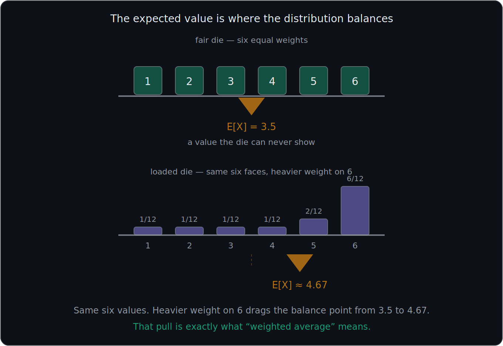
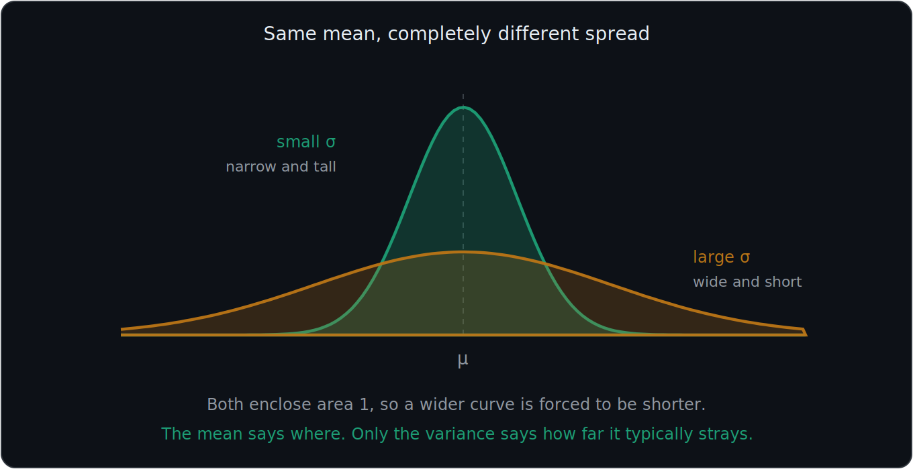
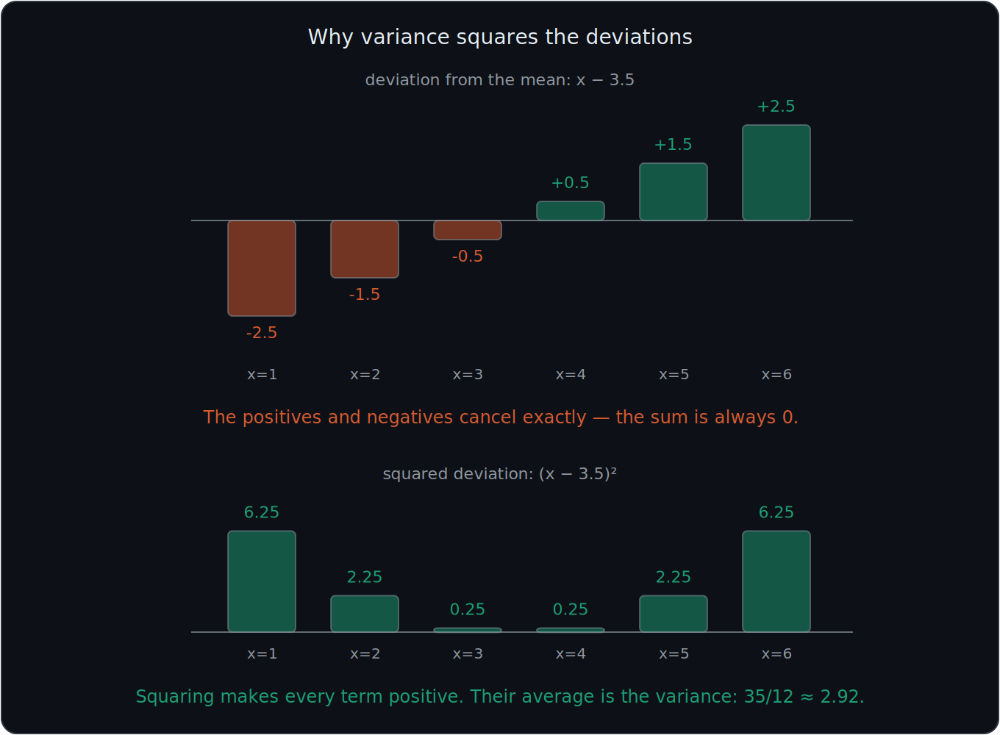
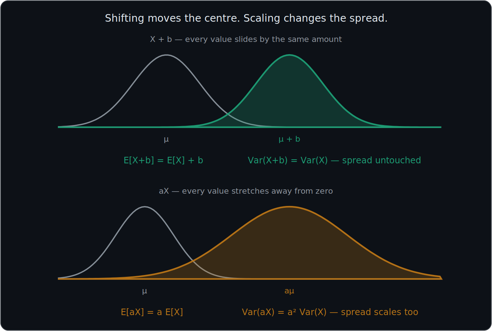
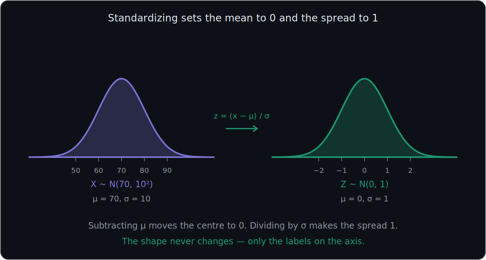

# What You Should Know About Expectation and Variance

> **This file is the home for $\mu$, $\sigma$, $\sigma^2$, and $E[X]$.** The distribution files (08, 09, 10) state their own mean and variance and reference this file for what those quantities mean.
>
> **Prerequisites:** PMF and PDF are in 06. Independence is in 02.

A distribution tells you everything about a random variable, but it is a whole table or a whole curve. Often you want **two numbers** instead: where the values sit, and how spread out they are. Those two numbers are the **expected value** and the **variance**.

These notes cover: what expectation means, how to compute it for discrete and continuous variables, what variance measures and why it is defined with a square, how standard deviation differs from variance, what happens under linear transformations, the difference between population and sample notation, and the mean and variance of every distribution in these notes.

---

# 1. Expected value is a weighted average

The **expected value** of a random variable, also called its **mean**, is written:

$$
E[X] \qquad\text{or}\qquad \mu
$$

It is the average value of $X$, where each possible value is weighted by how likely it is.

## Discrete definition

$$
\boxed{E[X]=\mu=\sum_x x\,p_X(x)}
$$

Each value $x$ is multiplied by its probability mass $p_X(x)$, and the results are added.

## Example: one die

Let $X$ be the number rolled on a fair six-sided die. Every value has probability $\frac16$:

$$
E[X]=1\left(\tfrac16\right)+2\left(\tfrac16\right)+3\left(\tfrac16\right)+4\left(\tfrac16\right)+5\left(\tfrac16\right)+6\left(\tfrac16\right)
$$

$$
E[X]=\frac{1+2+3+4+5+6}{6}=\frac{21}{6}=3.5
$$

When every outcome is equally likely, the expected value is just the ordinary average. The weights only start to matter when the probabilities differ.

## Example: the sum of two dice

Using the PMF from 06:

$$
E[X]=\sum_{x=2}^{12} x\,p_X(x) = \frac{2(1)+3(2)+4(3)+\cdots+11(2)+12(1)}{36} = \frac{252}{36}=7
$$

Here the probabilities are **not** all equal, so this is a genuinely weighted average. The value 7 pulls the most weight because it has the largest mass.

---

# 2. Expected value for continuous variables

For a continuous random variable, replace the sum with an integral and the mass with the density, exactly as in 06:

$$
\boxed{E[X]=\int_{-\infty}^{\infty} x\,f_X(x)\,dx}
$$

The idea has not changed. Each value is still weighted by how likely it is; the only difference is that likelihood now comes from density over an interval instead of mass at a point.

$$
\boxed{\text{Discrete: weight by }p_X(x)\text{ and add} \qquad \text{Continuous: weight by }f_X(x)\text{ and integrate}}
$$

---

# 3. What "expected" actually means

This term is misleading, so be careful with it.

$$
\boxed{E[X]\text{ is not the value you expect to see}}
$$

The die has $E[X]=3.5$, but you will never roll a 3.5. The expected value does not have to be a possible outcome at all.

What it really means is:

> **The long-run average if you repeated the experiment many times.**

Roll a die 10,000 times and average the results, and you will get something very close to 3.5.

## The balance-point interpretation

If you drew the PMF as physical weights sitting on a number line, $E[X]$ is the point where the line would balance. This is why it is called the **center** of the distribution.

That interpretation is what section 9 relies on: shifting every value shifts the balance point by the same amount.

---

# 4. Variance measures spread

The expected value tells you where the distribution sits, but not how wide it is. Two distributions can have the same mean and look nothing alike.

Variance answers: **how far from the mean are the values, typically?**

## A first attempt that fails

The obvious idea is to average the distance from the mean, $E[X-\mu]$. But this is always zero:

$$
E[X-\mu]=E[X]-\mu=\mu-\mu=0
$$

Values above the mean and values below it cancel exactly. That is true of every distribution, so it measures nothing.

## The fix: square the deviations

Squaring makes every deviation positive, so nothing cancels:

$$
\boxed{\text{Var}(X)=\sigma^2=E\left[(X-\mu)^2\right]}
$$

In words:

$$
\boxed{\text{Variance}=\text{the average squared distance from the mean}}
$$

Written out:

$$
\text{Var}(X)=\sum_x (x-\mu)^2 p_X(x) \qquad\text{(discrete)}
$$

$$
\text{Var}(X)=\int_{-\infty}^{\infty}(x-\mu)^2 f_X(x)\,dx \qquad\text{(continuous)}
$$

---

# 5. The computational formula for variance

Working from the definition is tedious, because you must first find $\mu$, then subtract it from every value, then square. There is a shortcut:

$$
\boxed{\text{Var}(X)=E[X^2]-\left(E[X]\right)^2}
$$

In words:

$$
\boxed{\text{Variance} = \text{the mean of the squares} - \text{the square of the mean}}
$$

## Where it comes from

Expand the definition:

$$
E\left[(X-\mu)^2\right]=E\left[X^2-2\mu X+\mu^2\right]
$$

$$
=E[X^2]-2\mu E[X]+\mu^2
$$

Since $E[X]=\mu$:

$$
=E[X^2]-2\mu^2+\mu^2 = E[X^2]-\mu^2
$$

## Example: one die

We already have $E[X]=3.5$. Now find $E[X^2]$ by squaring each value first:

$$
E[X^2]=\frac{1+4+9+16+25+36}{6}=\frac{91}{6}\approx15.1667
$$

Apply the shortcut:

$$
\text{Var}(X)=\frac{91}{6}-(3.5)^2 = 15.1667-12.25 = \frac{35}{12}\approx2.9167
$$

## The order matters

$$
\boxed{E[X^2]\neq \left(E[X]\right)^2}
$$

Squaring first and averaging second is not the same as averaging first and squaring second. In this example one gives $15.17$ and the other gives $12.25$. The gap between them **is** the variance.

---

# 6. Standard deviation

Variance is measured in **squared units**, which is awkward. If $X$ is measured in dollars, then $\text{Var}(X)$ is in dollars squared, which means nothing physically.

The fix is to take the square root:

$$
\boxed{\sigma=\text{SD}(X)=\sqrt{\text{Var}(X)}}
$$

For the die:

$$
\sigma=\sqrt{\frac{35}{12}}\approx1.708
$$

So a typical roll sits about 1.7 away from 3.5, which matches intuition for values running 1 to 6.

---

# 7. Standard deviation versus variance

Standard deviation and variance are closely related, but they are **not the same thing**.

### Standard deviation

$$
\sigma
$$

Measured in the **same units as the original data**. This is the one you interpret and report.

### Variance

$$
\sigma^2
$$

The square of the standard deviation, in squared units. This is the one you calculate with.

Therefore:

$$
\sigma^2=\text{variance} \qquad\text{and}\qquad \sigma=\sqrt{\sigma^2}
$$

### Example

Suppose:

$$
\sigma^2=25
$$

Then:

$$
\sigma=\sqrt{25}=5
$$

So variance is 25 and standard deviation is 5.

## Why keep variance at all, if standard deviation is more readable?

Because **variance adds and standard deviation does not**. If $X$ and $Y$ are independent (see 02):

$$
\boxed{\text{Var}(X+Y)=\text{Var}(X)+\text{Var}(Y)}
$$

Standard deviations cannot simply be added. This additivity is the reason variance is the working quantity in almost every derivation.

## Check it with the dice

One die has variance $\frac{35}{12}$. Two independent dice should therefore give:

$$
\frac{35}{12}+\frac{35}{12}=\frac{35}{6}\approx5.833
$$

Computing the variance of the two-dice PMF directly also gives $\frac{35}{6}$. The rule holds.

Note the requirement: **independence**. If the variables are related, this rule needs an extra covariance term, which is a later topic.

$$
\boxed{\text{Variance adds for independent variables. Standard deviation does not.}}
$$

---

# 8. Linear transformations

Suppose you rescale or shift a random variable, producing $aX+b$ for constants $a$ and $b$. Then:

$$
\boxed{E[aX+b]=a\,E[X]+b}
$$

$$
\boxed{\text{Var}(aX+b)=a^2\,\text{Var}(X)}
$$

$$
\boxed{\text{SD}(aX+b)=|a|\,\text{SD}(X)}
$$

## Why the constant $b$ disappears from the variance

Adding $b$ slides every value along by the same amount. The whole distribution moves, but the values do not become any more or less spread out relative to each other. Spread is unaffected by a shift.

## Why the variance scales by $a^2$ and not $a$

Variance is built from **squared** deviations, so multiplying the variable by $a$ multiplies each squared deviation by $a^2$. Taking the square root at the end brings standard deviation back down to a factor of $|a|$, which is why SD scales by $|a|$ but variance scales by $a^2$.

## The application: why z-scores have mean 0 and SD 1

A z-score is defined as:

$$
Z=\frac{X-\mu}{\sigma}
$$

Rewrite it in the $aX+b$ form:

$$
Z=\left(\frac{1}{\sigma}\right)X-\frac{\mu}{\sigma}
\qquad\text{so}\qquad
a=\frac{1}{\sigma},\quad b=-\frac{\mu}{\sigma}
$$

Now apply the two rules:

$$
E[Z]=\frac{1}{\sigma}\mu-\frac{\mu}{\sigma}=0
$$

$$
\text{Var}(Z)=\left(\frac{1}{\sigma}\right)^2\sigma^2=1
$$

Therefore:

$$
\boxed{\text{Every z-score has mean }0\text{ and standard deviation }1}
$$

This is not a coincidence or a convention — it falls straight out of the two rules above. Standardization is the subject of 11.

---

# 9. Population versus sample notation

The same quantities get different symbols depending on whether you are describing a whole population or a sample drawn from it.

| Quantity | Population (parameter) | Sample (statistic) |
|---|---|---|
| Mean | $\mu$ | $\bar{x}$ |
| Variance | $\sigma^2$ | $s^2$ |
| Standard deviation | $\sigma$ | $s$ |

Greek letters describe the population. Roman letters describe the sample.

## The formulas differ in the denominator

Population variance, over all $N$ members:

$$
\sigma^2=\frac{1}{N}\sum_{i=1}^{N}(x_i-\mu)^2
$$

Sample variance, over $n$ observations:

$$
\boxed{s^2=\frac{1}{n-1}\sum_{i=1}^{n}(x_i-\bar{x})^2}
$$

## Why $n-1$ instead of $n$

The sample deviations are measured from $\bar{x}$, not from the true $\mu$. Since $\bar{x}$ is itself computed from the same data, it sits closer to the data than $\mu$ does, so the squared deviations come out slightly too small. Dividing by $n-1$ rather than $n$ compensates.

This is called **Bessel's correction**, and it matters most when $n$ is small. With $n=1000$ the difference is negligible; with $n=5$ it is not.

## A practical warning

Software does not agree on the default. In Python, `numpy.var()` divides by $n$ by default, while `pandas.Series.var()` divides by $n-1$. Both expose a `ddof` parameter to control it. If two tools report different variances for the same data, this is usually why.

---

# 10. Mean and variance of the common distributions

Every distribution in these notes has a mean and a variance. Rather than rederiving them each time, collect them here.

| Distribution | Notation | Mean $\mu$ | Variance $\sigma^2$ | File |
|---|---|---|---|---|
| Bernoulli | $\text{Bernoulli}(p)$ | $p$ | $p(1-p)$ | 08 |
| Binomial | $\text{Binomial}(n,p)$ | $np$ | $np(1-p)$ | 08 |
| Continuous uniform | $U(a,b)$ | $\dfrac{a+b}{2}$ | $\dfrac{(b-a)^2}{12}$ | 09 |
| Normal | $N(\mu,\sigma^2)$ | $\mu$ | $\sigma^2$ | 10 |

## Three things worth noticing

**The binomial is just $n$ Bernoullis.** A binomial counts successes across $n$ independent trials, so both its mean and its variance are $n$ times the Bernoulli values. The variance multiplies cleanly only because the trials are independent — this is the additivity rule from section 7 doing the work.

**The uniform mean is the midpoint**, which is obvious for a symmetric flat distribution. The $12$ in the variance is not obvious and simply has to be memorized.

**The normal is the special case where the parameters *are* the mean and variance.** Writing $N(\mu,\sigma^2)$ tells you both answers directly, with no calculation. No other distribution here is labelled that way.

---

# Most Important Definitions and Distinctions to Remember

## Expected value

$$
\boxed{E[X]=\mu=\sum_x x\,p_X(x) \qquad\text{or}\qquad \int_{-\infty}^{\infty}x f_X(x)\,dx}
$$

A weighted average, and the long-run average over many repetitions. It need not be a possible value.

---

## Variance

$$
\boxed{\text{Var}(X)=\sigma^2=E\left[(X-\mu)^2\right]=E[X^2]-\left(E[X]\right)^2}
$$

The average squared distance from the mean. Squared so that deviations do not cancel.

---

## Standard deviation

$$
\boxed{\sigma=\sqrt{\text{Var}(X)}}
$$

| | Variance | Standard deviation |
|---|---|---|
| Symbol | $\sigma^2$ | $\sigma$ |
| Units | Squared | Original |
| Use it to | Calculate | Interpret and report |
| Adds for independent variables? | Yes | No |

---

## Linear transformations

$$
\boxed{E[aX+b]=aE[X]+b \qquad \text{Var}(aX+b)=a^2\text{Var}(X)}
$$

Shifting does not change spread. Scaling changes variance by the square of the factor.

---

## Population versus sample

$$
\boxed{\mu,\ \sigma^2,\ \sigma \text{ describe a population} \qquad \bar{x},\ s^2,\ s \text{ describe a sample}}
$$

Sample variance divides by $n-1$, not $n$.

---

# Main Rules to Put in Your Notebook

$$
\boxed{E[X]=\sum_x x\,p_X(x)}
$$

$$
\boxed{E[X]=\int_{-\infty}^{\infty}x f_X(x)\,dx}
$$

$$
\boxed{\text{Var}(X)=E\left[(X-\mu)^2\right]}
$$

$$
\boxed{\text{Var}(X)=E[X^2]-\left(E[X]\right)^2}
$$

$$
\boxed{\sigma=\sqrt{\sigma^2}}
$$

$$
\boxed{E[aX+b]=aE[X]+b}
$$

$$
\boxed{\text{Var}(aX+b)=a^2\text{Var}(X)}
$$

For independent $X$ and $Y$:

$$
\boxed{\text{Var}(X+Y)=\text{Var}(X)+\text{Var}(Y)}
$$

Sample variance:

$$
\boxed{s^2=\frac{1}{n-1}\sum(x_i-\bar{x})^2}
$$

Distribution summary:

| Distribution | Mean | Variance |
|---|---|---|
| $\text{Bernoulli}(p)$ | $p$ | $p(1-p)$ |
| $\text{Binomial}(n,p)$ | $np$ | $np(1-p)$ |
| $U(a,b)$ | $\dfrac{a+b}{2}$ | $\dfrac{(b-a)^2}{12}$ |
| $N(\mu,\sigma^2)$ | $\mu$ | $\sigma^2$ |

The biggest idea is:

**Expected value is where the distribution balances, and variance is how far it typically strays from there. The mean is a weighted average of the values; the variance is a weighted average of the squared distances from that mean. Standard deviation converts the variance back into the original units so it can actually be interpreted.**

---

# Where This Goes Next

| Idea from this file | Where it is used |
|---|---|
| $\mu=np$, $\sigma^2=np(1-p)$ | **08 — Bernoulli and Binomial**: stated and explained there |
| Variance adds for independent variables | **08**: why the binomial variance is $n$ times the Bernoulli variance |
| $\mu=\dfrac{a+b}{2}$, $\sigma^2=\dfrac{(b-a)^2}{12}$ | **09 — Uniform Distribution** |
| $\mu$ as center, $\sigma$ as spread | **10 — Normal Distribution**: these two parameters define the curve |
| $E[aX+b]$ and $\text{Var}(aX+b)$ | **11 — Z-Scores**: why standardizing gives mean 0 and SD 1 |
| $\mu=np$ and $\sigma=\sqrt{np(1-p)}$ | **12 — Normal Approximation to the Binomial** |
