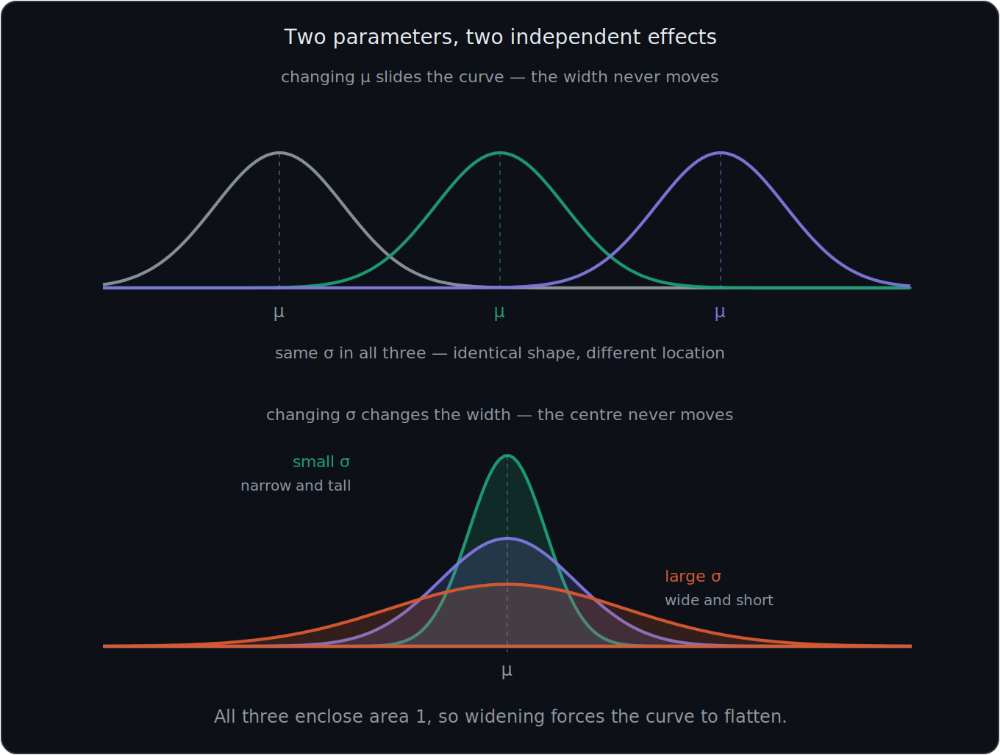
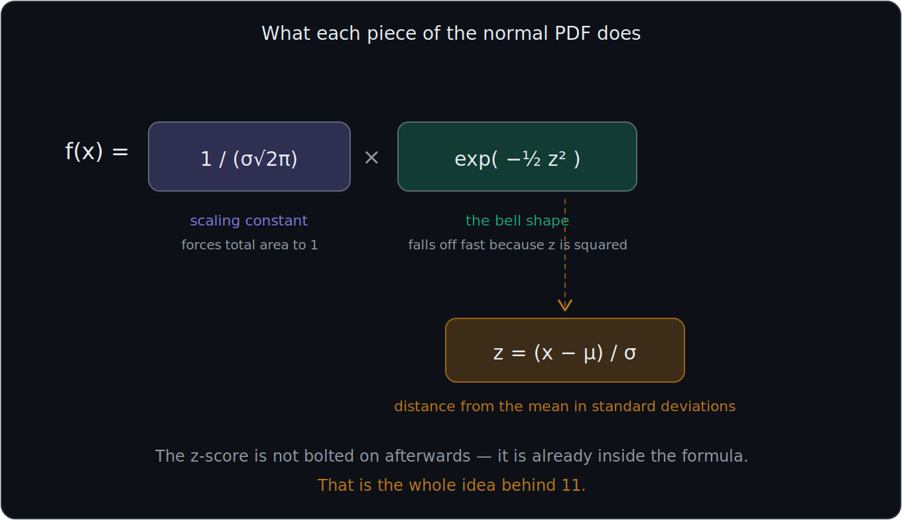
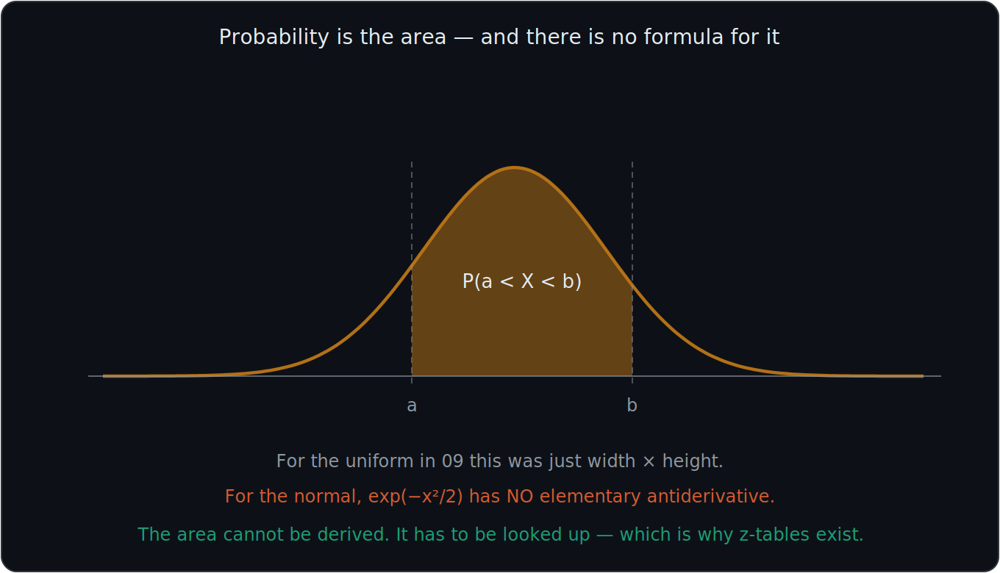
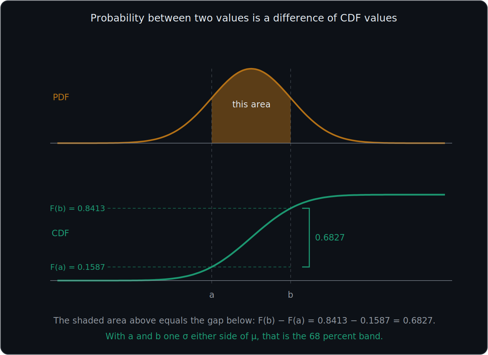
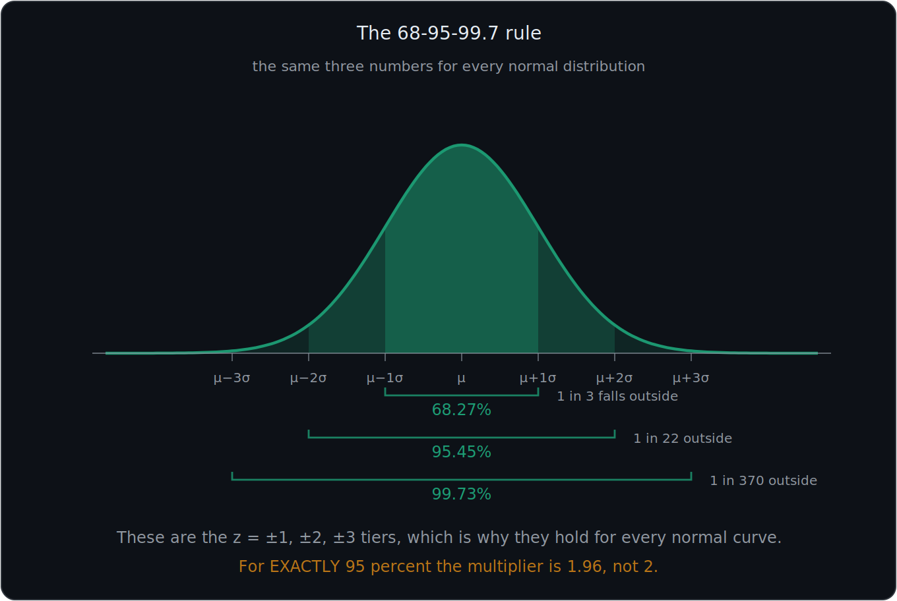

# What You Should Know About the Normal Distribution

> **Prerequisites:** PDF, CDF, and their relationship are in 06. Mean, variance, and standard deviation are in 07.
>
> **Two topics have their own files.** Standardization and z-scores are in 11. The normal approximation to the binomial is in 12. This file covers the curve itself.

These notes teach what a normal distribution is, how $\mu$ and $\sigma$ shape it, what the PDF formula does, how probability is read off it, and the 68-95-99.7 rule.

---

# 1. A normal distribution is a symmetric bell-shaped distribution

A **normal distribution** is a continuous, symmetric, bell-shaped probability distribution.

A normal distribution:

- Has most observations near the center
- Has fewer observations as you move farther from the center
- Is symmetric: the left and right sides mirror each other
- Extends across all real numbers
- Has a total area of **1**

Because the total area equals 1, areas under the curve represent probabilities (see 06).

$$
\text{Total area under the curve}=1
$$

For a perfectly normal distribution:

$$
\text{Mean}=\text{Median}=\text{Mode}
$$

All three are located at the center of the curve.

Because the distribution is symmetric, exactly half of the area lies on each side of the mean:

$$
P(X<\mu)=0.50 \qquad\text{and}\qquad P(X>\mu)=0.50
$$

## It is defined by exactly two numbers

Fix $\mu$ and $\sigma$ and the entire curve is determined — every probability, every height, everything. As noted in 07, the normal is the one distribution in these notes whose **parameters are its mean and variance**. No calculation is needed to recover them.

---

# 2. The mean controls the center

The population mean is written:

$$
\mu
$$

The mean determines where the **center and peak** of the normal distribution are located.

If $\mu=0$, the curve is centered at 0. If $\mu=2$, the curve is centered at 2.

Changing $\mu$:

- Moves the curve left or right
- Changes the location of the center
- Does **not** change the width of the curve
- Does **not** change the overall bell shape

Therefore:

$$
\boxed{\mu=\text{center of the distribution}}
$$

This is the shifting rule from 07: adding a constant moves the mean and leaves the spread alone.

---

# 3. Standard deviation controls the spread

The population standard deviation is written:

$$
\sigma
$$

Standard deviation measures how spread out the values are around the mean. Therefore:

$$
\boxed{\sigma=\text{spread of the distribution}}
$$

### Small standard deviation

A small $\sigma$ produces a:

- Narrower curve
- Taller peak
- More concentrated distribution
- Greater concentration of values near the mean

### Large standard deviation

A large $\sigma$ produces a:

- Wider curve
- Shorter peak
- More spread-out distribution

For example, $\sigma=1$ produces a relatively narrow curve, while $\sigma=3$ produces a wider one.

## Why wider always means shorter

The total area remains $1$ in both cases, because that is required of every PDF. So making the curve wider **forces** it to become shorter — there is a fixed amount of area to distribute, and stretching it sideways means it cannot also stay tall.

---

# 4. Mean versus standard deviation

The mean and standard deviation control different properties of the normal distribution.

| Parameter | Meaning | Effect on the Curve |
|---|---|---|
| $\mu$ | Mean | Moves the center left or right |
| $\sigma$ | Standard deviation | Makes the curve narrower or wider |

Remember:

$$
\boxed{\mu=\text{center} \qquad \sigma=\text{spread}}
$$

Changing $\mu$ does **not** change the spread.

Changing $\sigma$ does **not** move the center.

The two parameters are completely independent of each other, which is what makes the normal family so easy to work with.

---

# 5. Know the normal-distribution notation

A normal random variable is commonly written:

$$
\boxed{X\sim N(\mu,\sigma^2)}
$$

This means:

- $X$: random variable
- $\sim$: "is distributed as"
- $N$: normal distribution
- $\mu$: population mean
- $\sigma^2$: population variance

So $X\sim N(\mu,\sigma^2)$ means:

**$X$ follows a normal distribution with mean $\mu$ and variance $\sigma^2$.**

### Example

Suppose:

$$
X\sim N(50,25)
$$

This means $\mu=50$ and $\sigma^2=25$. Because $\sigma=\sqrt{\sigma^2}$:

$$
\sigma=\sqrt{25}=5
$$

Therefore $X\sim N(50,25)$ has mean 50, variance 25, and standard deviation 5.

### Important distinction

The second number in $N(\mu,\sigma^2)$ is normally the **variance**, not the standard deviation.

However, some sources write $N(\mu,\sigma)$ instead. Always check which convention is in use, because mistaking one for the other changes the width of the curve by a square root.

In Python, `scipy.stats.norm(loc=mu, scale=sigma)` takes the **standard deviation** as `scale`, not the variance. So $N(50,25)$ must be written as `norm(loc=50, scale=5)`.

---

# 6. The normal PDF describes density

The **probability density function** for a normal distribution is:

$$
\boxed{f_X(x)= \frac{1}{\sigma\sqrt{2\pi}}\, e^{-\frac{1}{2}\left(\frac{x-\mu}{\sigma}\right)^2}}
$$

You should understand what the pieces mean, but you will usually **not** evaluate this formula by hand.

| Symbol | Meaning |
|---|---|
| $f_X(x)$ | Density of $X$ at $x$ |
| $x$ | Particular value being evaluated |
| $\mu$ | Population mean |
| $\sigma$ | Population standard deviation |
| $\sigma^2$ | Population variance |
| $e$ | Euler's number, approximately 2.718 |
| $\pi$ | Pi, approximately 3.14159 |

## What each part of the PDF does

The expression:

$$
x-\mu
$$

measures how far $x$ is from the mean.

The expression:

$$
\frac{x-\mu}{\sigma}
$$

measures how far $x$ is from the mean in **standard-deviation units**. This quantity is important enough to have its own name — it is the **z-score**, and it is the subject of 11. Notice that it already appears inside the normal PDF, which is a hint that standardization is not an add-on but is built into the distribution itself.

The exponential portion:

$$
e^{-\frac{1}{2}\left(\frac{x-\mu}{\sigma}\right)^2}
$$

creates the bell shape. The squared term makes the curve symmetric, since $+2$ and $-2$ standard deviations give the same value. The negative exponent makes the height fall off as you move away from the mean, and it falls off very fast because the distance is squared.

The expression:

$$
\frac{1}{\sigma\sqrt{2\pi}}
$$

is a **scaling constant**. It adjusts the curve so the total area underneath equals $1$.

Without it, the total area under the exponential portion would equal $\sigma\sqrt{2\pi}$. For example, if $\sigma=3$, the unscaled area would be $3\sqrt{2\pi}$, so multiplying by $\frac{1}{3\sqrt{2\pi}}$ brings the total to exactly 1.

---

# 7. Probability is area, not the curve's height

As established in 06, for any continuous random variable the height of the PDF is density, and probability comes from **area**:

$$
\boxed{\text{PDF height}=\text{density} \qquad \text{Area under the PDF}=\text{probability}}
$$

So for a normal distribution you calculate probability over an **interval**:

$$
P(a<X<b)=\int_a^b f_X(x)\,dx
$$

## The problem specific to the normal distribution

Here is where the normal differs from the uniform in 09. For a uniform, that integral was just width times height and you could do it in your head.

For the normal, the integral **cannot be evaluated in closed form at all**. The function $e^{-x^2/2}$ has no elementary antiderivative — there is no formula you could write down, however clever, that would give you the exact area.

Therefore:

$$
\boxed{\text{Normal probabilities must come from a table or from software}}
$$

This is not a gap in your algebra. It is a genuine mathematical fact, and it is the entire reason **z-tables** exist and why standardization matters. A single table of a single standard normal curve can serve every normal distribution, which is the subject of 11.

---

# 8. The normal CDF is S-shaped

Recall from 06 that the CDF is:

$$
F_X(x)=P(X\leq x)
$$

and that all the general properties — running from 0 to 1, never decreasing — apply here without restatement.

What is specific to the normal is the **shape**:

$$
\boxed{\text{Normal PDF is bell-shaped} \qquad \text{Normal CDF is S-shaped}}
$$

This follows directly from the rule in 06 that the PDF is the slope of the CDF. The bell is tallest at the mean, so the CDF climbs most steeply there. The bell flattens toward both tails, so the CDF flattens out near 0 on the left and near 1 on the right. A bell-shaped rate of accumulation produces an S-shaped total.

## The value at the mean

Because the normal is symmetric, exactly half the area lies below the mean:

$$
\boxed{F_X(\mu)=0.50}
$$

The S-curve passes through its halfway point exactly at the center.

## Finding probability between two values

$$
P(a<X<b)=F_X(b)-F_X(a)
$$

This is the subtraction rule from 06. Since section 7 established that these CDF values must be looked up rather than calculated, this formula is exactly the procedure used with z-tables in 11.

---

# 9. Remember the 68-95-99.7 rule

For an approximately normal distribution, most observations occur within a few standard deviations of the mean. This is called the **68-95-99.7 Rule** or the **Empirical Rule**.

| Within | Interval | Probability | More precisely |
|---|---|---|---|
| $1\sigma$ | $\mu\pm\sigma$ | ≈68% | 68.27% |
| $2\sigma$ | $\mu\pm2\sigma$ | ≈95% | 95.45% |
| $3\sigma$ | $\mu\pm3\sigma$ | ≈99.7% | 99.73% |

Written as probabilities:

$$
P(\mu-\sigma<X<\mu+\sigma)\approx0.68
$$

$$
P(\mu-2\sigma<X<\mu+2\sigma)\approx0.95
$$

$$
P(\mu-3\sigma<X<\mu+3\sigma)\approx0.997
$$

## This rule is really about z-scores

The three tiers are nothing more than the values $z=\pm1$, $z=\pm2$, and $z=\pm3$. That is why the same three percentages work for **every** normal distribution regardless of $\mu$ and $\sigma$ — the rule is stated in standard-deviation units, not in the original units. File 11 makes this explicit.

## The tails

Using the complement rule from 01, the probability of landing **outside** each band is:

| Outside | Probability | Roughly |
|---|---|---|
| $1\sigma$ | 31.7% | 1 in 3 |
| $2\sigma$ | 4.6% | 1 in 22 |
| $3\sigma$ | 0.27% | 1 in 370 |

This is why "a three-sigma event" means something unusual, and why outlier detection often uses a $3\sigma$ cutoff.

## A precision warning

The round numbers are approximations. If you need **exactly** 95 percent, the correct multiplier is $1.96$, not $2$. Similarly, exactly 99 percent requires $2.576$. The value $1.96$ appears constantly in confidence intervals for this reason.

## Example

Suppose $\mu=70$ and $\sigma=10$.

| Within | Calculation | Interval | Probability |
|---|---|---|---|
| $1\sigma$ | $70\pm10$ | $60$ to $80$ | ≈68% |
| $2\sigma$ | $70\pm20$ | $50$ to $90$ | ≈95% |
| $3\sigma$ | $70\pm30$ | $40$ to $100$ | ≈99.7% |

So a value of 95 would be unusual here, since it sits beyond two standard deviations, in a region containing under 5 percent of the distribution.

---

# 10. Where normal distributions appear

Normal distributions may approximately describe measurements influenced by **many small independent factors**.

Examples include:

- Human height within a defined population
- Measurement errors
- Some standardized test scores
- Manufacturing variation
- Communication-system noise
- Sampling distributions

## Why "many small independent factors" keeps producing bells

This is not a coincidence. There is a theorem behind it — the **Central Limit Theorem** — which says that sums and averages of many independent random quantities tend toward a normal distribution, almost regardless of what the individual quantities look like.

That theorem is a later topic, but it is the reason the normal shows up so often, and it is also the reason a large binomial starts to look normal, which is the subject of 12.

## The warning

However, **not every bell-shaped dataset is exactly normal**.

You should not automatically assume data are normally distributed simply because they appear approximately bell-shaped. Real data are often skewed, have heavier tails than a normal, or are bounded in ways a normal is not — human height cannot be negative, but a normal distribution technically extends across all real numbers.

---

# 11. Normality in machine learning

Machine-learning models do **not** universally require every input variable to follow a normal distribution.

Some statistical models instead make assumptions about the distribution of their:

**Errors or residuals**

rather than requiring every original variable to be normally distributed. Linear regression is the standard example: it assumes the residuals are approximately normal, not that the predictors are.

Therefore:

$$
\boxed{\text{Normality is not automatically required for every variable}}
$$

Where normality genuinely matters:

- Many classical hypothesis tests and confidence intervals
- Gaussian Naive Bayes, which models each continuous feature as normal within each class (see 13)
- Some anomaly-detection methods that flag points beyond a few standard deviations

---

# 12. What comes next

Two large topics grow directly out of this file:

**Standardization and z-scores (11).** Section 7 showed that normal probabilities cannot be computed by hand. Standardizing converts any normal distribution into one single reference curve, so that one table can answer every question.

**The normal approximation to the binomial (12).** Section 10 hinted that sums of many independent trials tend toward a bell. A binomial is exactly such a sum, so for large $n$ it can be approximated with a normal using $\mu=np$ and $\sigma=\sqrt{np(1-p)}$ from 08.

---

# Most Important Definitions and Distinctions to Remember

## Normal distribution

A continuous, symmetric, bell-shaped distribution with total area 1, where:

$$
\boxed{\text{Mean}=\text{Median}=\text{Mode}}
$$

---

## Mean

$$
\boxed{\mu=\text{center of the curve}}
$$

Changing it slides the curve left or right without changing its width.

---

## Standard deviation

$$
\boxed{\sigma=\text{spread of the curve}}
$$

Small $\sigma$ gives a narrow, tall curve. Large $\sigma$ gives a wide, short one. The area stays 1 either way.

---

## Variance

$$
\boxed{\sigma^2=\text{variance} \qquad \sigma=\sqrt{\sigma^2}}
$$

Full treatment in 07.

---

## Notation

$$
\boxed{X\sim N(\mu,\sigma^2)}
$$

The second argument is the **variance**. Check the convention before using it.

---

## PDF

$$
\boxed{f_X(x)= \frac{1}{\sigma\sqrt{2\pi}}\, e^{-\frac{1}{2}\left(\frac{x-\mu}{\sigma}\right)^2}}
$$

Height is density, not probability. The integral has no closed form, so probabilities come from tables or software.

---

## CDF

$$
\boxed{F_X(x)=P(X\leq x) \qquad F_X(\mu)=0.50}
$$

Bell-shaped PDF gives an S-shaped CDF.

$$
\boxed{P(a<X<b)=F_X(b)-F_X(a)}
$$

---

## 68-95-99.7 Rule

$$
\boxed{\mu\pm\sigma\approx0.68 \qquad \mu\pm2\sigma\approx0.95 \qquad \mu\pm3\sigma\approx0.997}
$$

These are the $z=\pm1,\pm2,\pm3$ tiers, which is why they hold for every normal distribution.

---

# Main Rules to Put in Your Notebook

| Concept | Rule |
|---|---|
| Notation | $X\sim N(\mu,\sigma^2)$ |
| Mean | $\mu$, the center |
| Standard deviation | $\sigma$, the spread |
| Variance | $\sigma^2$ |
| Total area | $1$ |
| Symmetry | $P(X<\mu)=P(X>\mu)=0.50$ |
| Center | Mean = Median = Mode |
| PDF | $f_X(x)=\dfrac{1}{\sigma\sqrt{2\pi}}e^{-\frac12\left(\frac{x-\mu}{\sigma}\right)^2}$ |
| CDF | $F_X(x)=P(X\leq x)$, S-shaped |
| At the mean | $F_X(\mu)=0.50$ |
| Between two values | $P(a<X<b)=F_X(b)-F_X(a)$ |
| Empirical rule | 68%, 95%, 99.7% at $1$, $2$, $3$ standard deviations |
| Exact 95 percent | $\mu\pm1.96\sigma$ |

The biggest idea is:

**A normal distribution is a symmetric bell defined entirely by its mean and standard deviation. The mean says where it sits, the standard deviation says how wide it is, and the total area is always 1. Probability is area under the curve, and because that area has no closed-form formula, it must be looked up — which is why every normal distribution gets converted to a single standard one.**

---

# Where This Goes Next

| Idea from this file | Where it is used |
|---|---|
| $\dfrac{x-\mu}{\sigma}$ inside the PDF | **11 — Z-Scores**: this quantity gets its own name and table |
| No closed-form integral | **11**: the reason z-tables exist at all |
| $P(a<X<b)=F_X(b)-F_X(a)$ | **11**: the exact procedure for using a z-table |
| The 68-95-99.7 tiers | **11**: these are $z=\pm1,\pm2,\pm3$ |
| Sums of many independent factors | **12 — Normal Approximation to the Binomial** |
| $\mu$ and $\sigma$ of a bell | **12**: supplied by $np$ and $\sqrt{np(1-p)}$ from 08 |
| Modelling a feature as normal | **13 — Naive Bayes**: Gaussian Naive Bayes |
