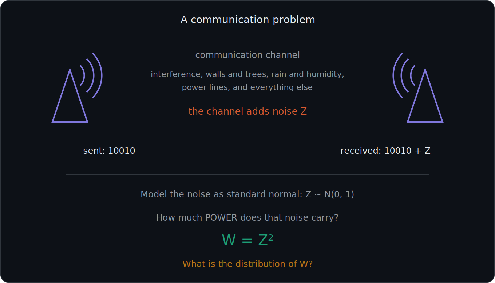
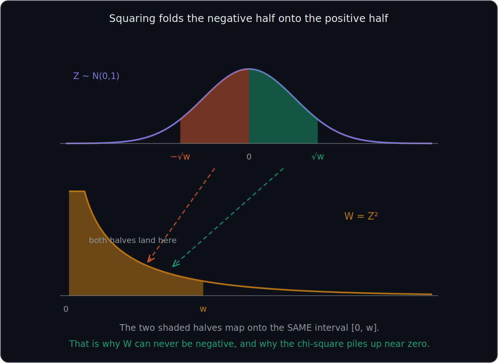
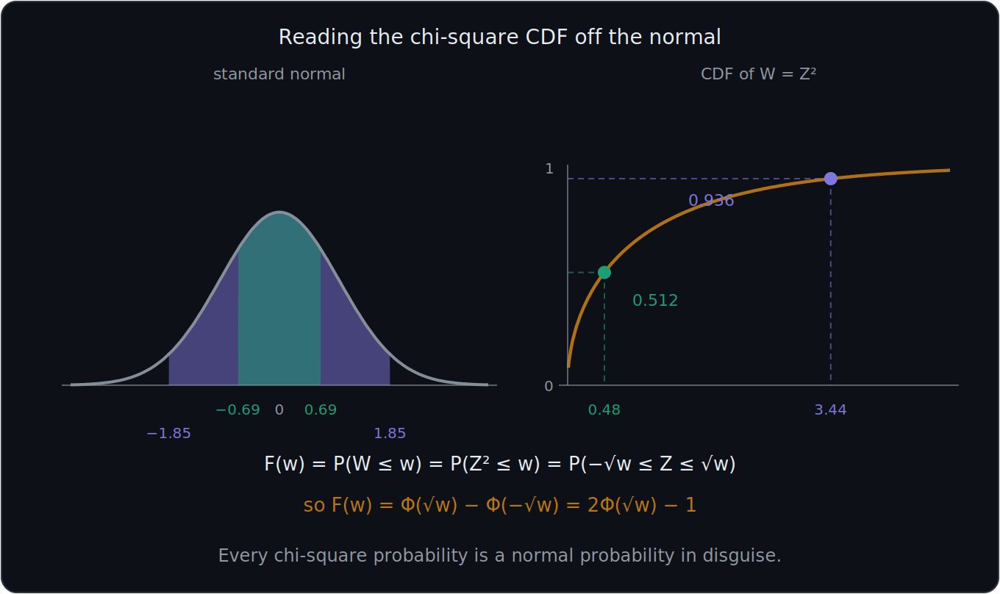
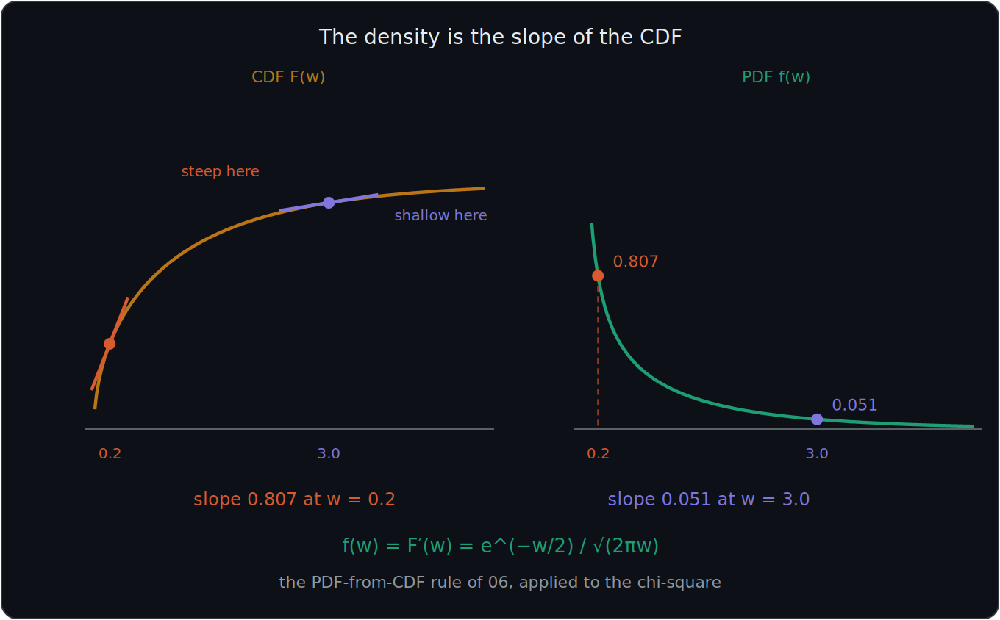
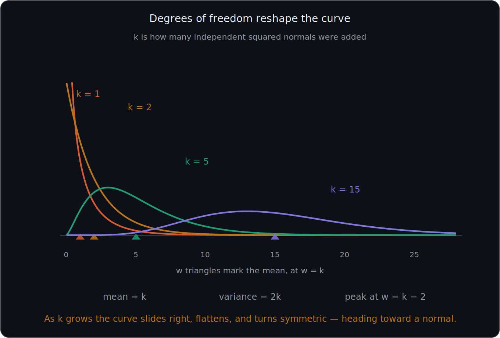

# What You Should Know About the Chi-Square Distribution

> **Prerequisites:** the standard normal and $\Phi$ are in 11. The rule that the PDF is the derivative of the CDF is in 06. Mean and variance are in 07. Independence is in 02.
>
> **Where this sits.** The chi-square is *built out of* the standard normal, so it reads best straight after 11. It is numbered 14 only because it was added after 12 and 13.

These notes cover: why squaring a noise value matters, what happens to the distribution when you square a standard normal, how the chi-square CDF is read off the normal, how differentiating gives the density, what **degrees of freedom** means, and how the shape changes with them.

---

# 1. The problem: how much power is in the noise?

A transmitter sends the message `10010`. A receiver picks up `10010` plus something extra.

That extra is **noise** — interference from other devices, walls and trees, rain and humidity, power lines, and everything else in the channel.

Call the noise $Z$. A standard model is that the channel noise is **standard normal**:

$$
Z\sim N(0,1)
$$

The engineering question is not "how big is the noise" but **how much power does it carry**. Power goes with the *square* of amplitude, so define:

$$
\boxed{W = Z^2}
$$

$$
\boxed{\text{What is the distribution of } W?}
$$

That distribution is the **chi-square**.

---

# 2. Squaring changes the picture in three ways

Before any algebra, notice what $W=Z^2$ must do.

**It can never be negative.** A square is always $\geq 0$, so the chi-square lives on $[0,\infty)$. The normal ran across all real numbers; this one has a hard floor at zero.

**It folds.** Both $z$ and $-z$ give the same $w$. The entire negative half of the normal lands on top of the positive half.

**It piles up near zero.** The normal has most of its mass near $z=0$, and squaring a small number makes it smaller still — $0.3^2 = 0.09$. So the chi-square is densest close to 0.

---

# 3. Deriving the CDF

Everything follows from writing $P(W\leq w)$ in terms of $Z$.

$$
F_W(w) = P(W\leq w)
$$

$$
= P(Z^2\leq w)
$$

$$
= P(\lvert Z\rvert \leq \sqrt{w})
$$

$$
= P(-\sqrt{w}\leq Z\leq \sqrt{w})
$$

Read the chain slowly. $W\leq w$ means $Z^2\leq w$. Taking square roots — legal because $w\geq 0$ — that means $\lvert Z\rvert\leq\sqrt{w}$. And a value whose size is at most $\sqrt{w}$ is a value sitting between $-\sqrt{w}$ and $+\sqrt{w}$.

## Finishing with the z-table

That last line is exactly the "probability between two values" from 11 §9:

$$
F_W(w) = \Phi(\sqrt{w}) - \Phi(-\sqrt{w})
$$

Now use the symmetry rule $\Phi(-z)=1-\Phi(z)$ from 11 §8:

$$
F_W(w) = \Phi(\sqrt{w}) - \left(1-\Phi(\sqrt{w})\right)
$$

$$
\boxed{F_W(w) = 2\Phi(\sqrt{w}) - 1 \qquad w\geq 0}
$$

$$
\boxed{\text{Every chi-square probability is a normal probability in disguise.}}
$$

---

# 4. Worked values

| $w$ | $\sqrt{w}$ | $\Phi(\sqrt{w})$ | $F_W(w)=2\Phi(\sqrt{w})-1$ |
|---|---|---|---|
| $0.48$ | $0.693$ | $0.7558$ | $0.512$ |
| $3.44$ | $1.855$ | $0.9682$ | $0.936$ |

Widening the band on the normal from $\pm0.69$ to $\pm1.85$ raises the accumulated probability from about 51 percent to about 94 percent.

## A connection worth noticing

Put $w=1$ into the formula:

$$
F_W(1) = P(-1\leq Z\leq 1) = 0.6827
$$

That is the 68 percent from the empirical rule in 10 §9. The rest of the rule reappears too:

| $w$ | means | $F_W(w)$ |
|---|---|---|
| $1$ | $\lvert Z\rvert\leq 1$ | $0.6827$ |
| $4$ | $\lvert Z\rvert\leq 2$ | $0.9545$ |
| $9$ | $\lvert Z\rvert\leq 3$ | $0.9973$ |

The 68-95-99.7 tiers land at $w = 1, 4, 9$ — the squares of 1, 2 and 3. This is not a new fact; it is the same fact, seen through $W=Z^2$.

---

# 5. From the CDF to the PDF

From 06 §16, the density is the **derivative** of the CDF:

$$
f_W(w) = F_W'(w)
$$

Differentiate $2\Phi(\sqrt{w})-1$ using the chain rule. The derivative of $\Phi$ is the standard normal density $\varphi$, and the derivative of $\sqrt{w}$ is $\frac{1}{2\sqrt{w}}$:

$$
f_W(w) = 2\,\varphi(\sqrt{w})\cdot\frac{1}{2\sqrt{w}} = \frac{\varphi(\sqrt{w})}{\sqrt{w}}
$$

Substituting $\varphi(z)=\dfrac{e^{-z^2/2}}{\sqrt{2\pi}}$ with $z=\sqrt{w}$:

$$
\boxed{f_W(w) = \frac{1}{\sqrt{2\pi w}}\,e^{-w/2} \qquad w>0}
$$

## Checking it against the graph

| $w$ | slope of the CDF | height of the PDF |
|---|---|---|
| $0.2$ | $0.807$ | $0.807$ |
| $3.0$ | $0.051$ | $0.051$ |

Steep CDF, tall density. Shallow CDF, low density. Exactly the relationship from 06.

## The density is unbounded at zero

Look at what happens as $w\to 0$:

$$
f_W(0.1) = 1.20 \qquad f_W(0.01) = 3.97 \qquad f_W(0.0001) = 39.89
$$

The density grows without limit. This is the point from 09 §4 taken to its extreme: **a density is not a probability**. It can exceed 1, and here it can exceed any number at all, while the total area underneath is still exactly 1.

---

# 6. More transmissions: degrees of freedom

One transmission gives one squared noise value. What about the **accumulated** power over several?

Over two transmissions:

$$
W_2 = Z_1^2 + Z_2^2
$$

Over five:

$$
W_5 = Z_1^2 + Z_2^2 + Z_3^2 + Z_4^2 + Z_5^2
$$

Over $k$:

$$
\boxed{W_k = \sum_{i=1}^{k} Z_i^2}
$$

## The definition

$$
\boxed{\text{The sum of } k \text{ INDEPENDENT squared standard normals is chi-square with } k \text{ degrees of freedom.}}
$$

Independence matters (see 02). The $Z_i$ must be separate, unrelated noise values — one per transmission.

## Notation

$$
\boxed{W \sim \chi^2(k)}
$$

read as "chi-square with $k$ degrees of freedom." The parameter $k$ is often written **df**.

$$
\boxed{\text{df = how many independent squared normals were added}}
$$

---

# 7. Degrees of freedom reshape the curve

The single parameter $k$ controls everything about the shape.

| $k$ | Shape |
|---|---|
| $1$ | Unbounded at 0, falling away steeply |
| $2$ | Starts at $0.5$ and decays; no interior peak |
| $\geq 3$ | Has a genuine peak, at $w = k-2$ |
| large | Slides right, flattens, turns symmetric |

## Where the peak sits

$$
\boxed{\text{mode} = k - 2 \quad (k\geq 2)}
$$

For $k=5$ the peak is at $w=3$; for $k=15$ it is at $w=13$. For $k=1$ and $k=2$ there is no interior peak — the curve is at its highest right at the left edge.

## Why the curve slides right

Each extra transmission adds another squared noise value to the total, and every one of those is non-negative. More terms means more accumulated power, so the whole distribution shifts toward larger $w$.

---

# 8. Mean and variance

$$
\boxed{E[W] = k \qquad \text{Var}(W) = 2k}
$$

## Where the mean comes from

Take one term first. Rearranging the computational formula from 07 §5:

$$
E[Z^2] = \text{Var}(Z) + \left(E[Z]\right)^2 = 1 + 0^2 = 1
$$

A standard normal has variance 1 and mean 0, so each squared term contributes exactly 1. Expectation adds, so across $k$ terms:

$$
E[W_k] = \underbrace{1+1+\cdots+1}_{k} = k
$$

## Where the variance comes from

A single $Z^2$ has variance 2. Variance adds for **independent** variables (07 §7), so:

$$
\text{Var}(W_k) = 2k
$$

That additivity is the second place independence is spent — the mean would survive without it, the variance would not.

---

# 9. The general PDF

For any $k$:

$$
f_W(w) = \frac{1}{2^{k/2}\,\Gamma(k/2)}\, w^{k/2-1}\, e^{-w/2} \qquad w>0
$$

Do not memorize this. Know that it exists, that $\Gamma$ is a function generalizing the factorial, and that putting $k=1$ into it returns exactly the formula derived in section 5:

$$
\frac{1}{2^{1/2}\Gamma(1/2)}w^{-1/2}e^{-w/2} = \frac{1}{\sqrt{2\pi w}}e^{-w/2} \qquad\checkmark
$$

since $\Gamma(1/2)=\sqrt{\pi}$.

---

# 10. As $k$ grows it approaches a normal

$W_k$ is a sum of $k$ independent, identically distributed pieces. That is exactly the setting of the Central Limit Theorem mentioned in 10 §10 and 12 §1.

So for large $k$:

$$
\boxed{\chi^2(k) \approx N(k,\ 2k)}
$$

using the mean and variance from section 8. You can see this beginning in the $k=15$ curve, which is already close to symmetric.

This is the same story as 12: a skewed distribution built from many independent pieces gradually turns into a bell.

---

# 11. Where the chi-square is used

The noise-power example is the cleanest way in, but the distribution shows up wherever **squared** quantities are summed.

- **Goodness-of-fit tests** — comparing observed counts against expected counts, where the test statistic is a sum of squared differences
- **Tests of independence** — the same idea applied to a contingency table, which is the same 2×2 (or larger) grid as the confusion matrix in 05
- **Confidence intervals for a variance** — because a sample variance is built from squared deviations (07 §4)
- **Feature selection** — the `chi2` scoring function in scikit-learn ranks categorical features by exactly this statistic
- **Building other distributions** — the $t$ and $F$ distributions are both defined using chi-square variables

The common thread: whenever you square deviations and add them up, a chi-square is waiting underneath.

---

# Most Important Definitions and Distinctions to Remember

## Chi-square with one degree of freedom

The square of a single standard normal:

$$
\boxed{W = Z^2 \qquad Z\sim N(0,1)}
$$

## Chi-square with $k$ degrees of freedom

The sum of $k$ independent squared standard normals:

$$
\boxed{W_k = \sum_{i=1}^{k} Z_i^2 \qquad W_k\sim\chi^2(k)}
$$

## Support

$$
\boxed{W\geq 0 \text{ always}}
$$

A squared quantity cannot be negative, so the chi-square has a hard floor at zero.

## CDF for one degree of freedom

$$
\boxed{F_W(w) = 2\Phi(\sqrt{w}) - 1}
$$

## PDF for one degree of freedom

$$
\boxed{f_W(w) = \frac{1}{\sqrt{2\pi w}}e^{-w/2}}
$$

## Mean, variance, mode

$$
\boxed{E[W]=k \qquad \text{Var}(W)=2k \qquad \text{mode}=k-2 \ (k\geq2)}
$$

## Degrees of freedom

$$
\boxed{\text{df} = \text{the number of independent squared normals summed}}
$$

---

# Main Rules to Put in Your Notebook

| Concept | Rule |
|---|---|
| Definition | $W_k=\sum_{i=1}^{k}Z_i^2$ with the $Z_i$ independent and standard normal |
| Notation | $W\sim\chi^2(k)$ |
| Range | $W\geq0$ |
| CDF, $k=1$ | $F_W(w)=2\Phi(\sqrt{w})-1$ |
| PDF, $k=1$ | $f_W(w)=\dfrac{1}{\sqrt{2\pi w}}e^{-w/2}$ |
| Mean | $k$ |
| Variance | $2k$ |
| Mode | $k-2$ for $k\geq2$, otherwise at 0 |
| Large $k$ | $\chi^2(k)\approx N(k,2k)$ |
| Empirical rule check | $F_W(1)=0.6827$, $F_W(4)=0.9545$, $F_W(9)=0.9973$ |

The biggest idea is:

$$
\boxed{\text{Square a standard normal and you get a chi-square. Add } k \text{ independent ones and you get } k \text{ degrees of freedom.}}
$$

So in plain English:

**The chi-square is what a normal becomes when you square it. Squaring folds the negative half onto the positive half, so the result can never be negative and piles up near zero. Every chi-square probability can be rewritten as a normal probability over a symmetric band, which is why the CDF is just $2\Phi(\sqrt{w})-1$. Adding more independent squared normals adds degrees of freedom, which slides the peak to the right and gradually turns the curve into a bell.**

---

# Where This Came From

| Idea | Source file |
|---|---|
| $Z\sim N(0,1)$ and $\Phi$ | **11 — Z-Scores and the Standard Normal** |
| $P(a<Z<b)=\Phi(b)-\Phi(a)$ | **11** §9 |
| $\Phi(-z)=1-\Phi(z)$ | **11** §8 |
| $f(w)=F'(w)$ | **06 — Random Variables, PMF, PDF, CDF** §16 |
| A density may exceed 1 | **09 — Uniform Distribution** §4 |
| $E[X^2]=\text{Var}(X)+(E[X])^2$ | **07 — Expectation and Variance** §5 |
| Variance adds for independent variables | **07** §7 |
| Independence of the $Z_i$ | **02 — Independence** |
| Sums of many independent pieces tend to a bell | **10** §10 and **12** §1 |
| The 68-95-99.7 tiers | **10 — Normal Distribution** §9 |
